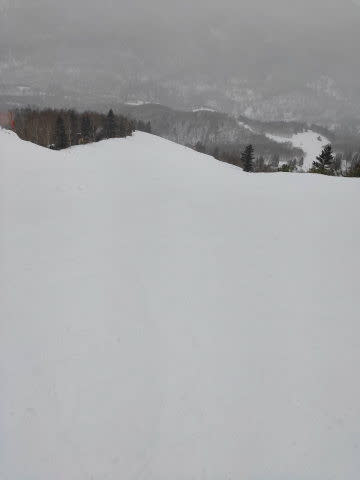

# 2020/1/12(日)3連休中日の志賀高原スキー場は…昨日より雪は悪化，ブッシュ増加（泣）そして混んだよ（涙）相変わらず雪は積もらず

📅 投稿日時: 2020-01-13 01:48:15

🏷️ カテゴリ: [2020スキー滑走日記](c282e9230de179e245c7334eabeb0a3b3.md)

昨日は予想よりコンディションが良く，

ガラガラで良かった志賀高原ですが．

本日は，ブッシュエリアが増加し．

…そして，混みました…（涙）

[金曜深夜の予想](e376484551ca793de2dadbceb6719582c.md)では，

　朝は，運が良ければ10cm

　くらいつもってるかも？？

と書きましたが．

…残念ながら，運が良くなかったようです．

強烈な西風のため，志賀高原には全く雪雲が

届いてません(涙）

夜8時過ぎの志賀高原では，

見事にきれいに月が見えており．

全然雪になる気配もありません…(泣）

憎い…

西風が，憎い！

ってな感じで．

本日の志賀高原ですが…

朝イチは，うっすら太陽の影も

望めたものの，基本的に曇り空で

始まった本日．

あさイチの気温は-8℃と，

-5℃程度の予想だったのに比べると，

冷え冷え！

これは，冷え冷え最高朝イチ

シマシマバーンへ突っ込まないと！！

と，喜び勇んでシマシマバーンへ

飛び込むと…

うむ．

シマシマはシマシマなんだけど…

シマシマがボロボロ崩れて，

コロコロが生産されていくのですが！？？

GSコースはあっという間にコロコロバーンに

なってしまったので．

オリンピックコースを見に行くと…

こちらにはコロコロがなく，

しっかり締まった雪で，いい感じ！

パノラマ-サウスも，まぁまぁ

雪はいいなぁ…

でも．

白樺コースは…

昨日とは打って変わって．

雪が薄く，かなりコース全面に

浮石が…（涙）

昨日までは全くブッシュの気配も

なかったのに．

1日で結構悪化(泣)．

そして．

さらに，午前9時半を過ぎると．

さすがに3連休の中日．

コース上の人口密度も増えていき…

第2高速リフトはすごい列（泣）

第1ゴンドラも列が伸び始めました…

列がそんなに伸びない間にほかの

リフトに逃げたので，写真では

列が短いですが，最終的に10分近く

待ちまで行ったようです（涙）

逃げた第3高速も，3-4分待ち

まで行きました（泣）

さすがに3連休中日…

ガラガラだった昨日とは

えらい違い…（涙）

しかし．

輸送力の高い1ゴンは，昼には

ほぼ待ちなしになってました！

そして，昼になっても意外と

気温は上がらず，雪質は悪くない

感じですが．

GSコースは午後になっても

コロコロが崩れず，

ちょいと楽しい感じじゃないし．

コース上の人口密度は，結構高め…

なので．

読者の皆さんも，いつも焼額レポート

ばっかりだと飽きるでしょうし．

他のスキー場もレポートしなくては…

と．

焼額を愛する私が，仕方なく焼額を

脱出してみました～！←いや，他のスキー場の方が空いているかもと思っただけでしょ

まずは一の瀬ファミリーですが．

リフトは結構ガラガラで．

コース上の人口密度も，それほど高くなかった

ですが…

でも．

正面バーンは，結構下地の硬いのが

出てきた上に，モサモサした雪が

ところどころ溜まっているような，

ちょいと滑りにくい状況…（涙）

そして．

パーフェクターコースは．

入口はまだブッシュだらけで．

ブッシュエリアを迂回するように

迂回用の一本道が作られていましたが…

入口を超えると，コース幅いっぱい

滑れるようになってます．

でも，コースはところどころ結構

硬くて．

うーん．

残念ながら，ちょっと楽しいとは

言いにくい状況…（泣）

そんな中，奥志賀は結構楽し

かったかな～．

ゴンドラ側，ダウンヒルコースは

結構雪質も良く，人も少なめ！

そして，午後はゴンドラもがら空き！

第2高速ペアリフト側，エキスパート

コースも，結構コブコブになって

いたけど…

上に乗っている雪は結構

柔らかくて軽かったので，

一の瀬に比べると滑りよかった

かな～．

当然，第2高速ペアもリフト

待ちはなく．

ダウンヒルのごく一部を除き，

ブッシュも全然出てないので，

奥志賀は比較的いい雪で

楽しめましたね～．

ってな感じで．

他のスキー場の探索を終えたら，

やっぱり焼額へ戻ってくるわけですが．

焼額も，午後3時ごろには，もう

ガラガラになってました～！

やっぱり，ホームゲレンデが落ち着くよね…

と思いながらも．

GSコースの上部，1か所だけ．

わずかに下地がうっすら出てきて，

浮石が見られる場所が…（涙）

あぁ…

雪が．

積雪が欲しい…

と思っていた願いが通じたらしく．

午後になると雪が降り始めました！←いや，雪が降るのは予想通りだから

あぁ…この雪が明日の朝までに

ガンガン積もって，明日コンディション

最高にならないかな…

と，願いながら．

今日もラストゴンドラまで滑りつくした

のでした…

…で．

当然本日もナイターに繰り出します！

今日はサンバレーナイターにやってきました！

ふははは．

昼間リフト待ちが多く．

あまり滑れなかったストレスを，

ナイターで発散するのだ！

見事なシマシマバーン，いただきま～す！！

…と，飛び込んだものの．

うむ？？

なんだ？？

シマシマがボロボロ崩れていく！

コロコロになっていく…っ！！

と，思う間もなく．

あっという間にコース全面，

超絶殺人コロコロ

に覆われた地獄バーンと化し．

「焼額ナイター，最高～！！」

という，焼額ナイターに行った

焼額朝礼メンバーからのLINEメッセージに

涙しながら，コロコロ修行バーンを

ラストまで滑り続けたのでした…

…しかし．

サンバレーナイター

昨年までは7時から9時までだったのに．

今シーズンからは7時から8時半までと，

営業時間30分短縮（涙）

そして，リフト代300円値上げ．

なぜ，営業時間が短くなって，

高くなってるのか…（泣）

焼額ナイターが8時終了じゃなく，

9時までやってくれれば．

宿の夕食を食べてからでも行けるので．

焼額ナイターに行くんだけどなぁ…

焼額ナイター，9時まで営業に

してくれないかな～

（さりげなく焼額スタッフの方にメッセージを送ってみる）

## 💬 コメント一覧

### 💬 コメント by (ほっぽ)
**タイトル**: 1/12　志賀高原
**投稿日**: 2020-01-13 06:00:57

Ｓさん

昨日は板だけ確認しました。(^^;

１５時からラストまでは１ゴン回していましたがお見掛けしませんでしたね。

今日も志賀高原です。お会いできたらよろしくお願いします。

昨日は昼前からサンバレーまで旅に出てきました。

http://www2.tokai.or.jp/nana_hoppo/

### 💬 コメント by (ゆーき)
**タイトル**: Unknown
**投稿日**: 2020-01-13 17:41:27

昨日は、浮気して別に行ってしまいましたが、見る限り、激混みだったようで、、、良かったのかな、、、でも奥志賀は良かったみたいだし

こちらは戸隠という、ウルトラCだったわけですが、ところどころ、石がゴロゴロと、圧雪車も入れないところが結構あって、今年は厳しいですね。。

### 💬 コメント by (musi)
**タイトル**: Unknown
**投稿日**: 2020-01-13 23:21:30

三連休最終日奥志賀のスクールに子供を入れて焼額山探索のつもりが、既に脚に余力が無くなり、またまたSさんを探すも何も一ノ瀬から奥志賀の往路のみ焼額山通過となり、お姿拝見に到りませんでした。湯田中で温泉入って19時過ぎに中野市のイオンで買い物終わらせても、関越に渋滞なく22時丁度には帰宅出来て今片付け終わってビールのみながらなにをするかと思えば、徒然スキーのチェック。ああ楽しい休みはあっという間に過ぎるなぁ。60年ぶりの小雪との事ですが、流石の志賀高原はそこそこゆきが揃い楽しいですね、凄くガスって小雪がまってましたが、積雪は上積みできたのかなぁ。

### 💬 コメント by (ほっぽ)
**タイトル**: 1/13　志賀高原
**投稿日**: 2020-01-14 00:39:38

Ｓさん

今日もすれ違いでしたね。

８時の奥ゴンスタートで、人が少なくコンディションが良いので、

つい爆走してしまいました。

１０本滑って移動したらもうランチ、yamaさんとチウーに入ってご一緒し、

午後は寺小屋滑って１ゴン回していましたが発見できませんでした。

また、週末に戻ってきますので探しますね。

コメント殆ど無しの簡易版の滑走記録をアップしました。

http://www2.tokai.or.jp/nana_hoppo/

### 💬 コメント by (Skier_S)
**タイトル**: 今日は思ったより良かったよ
**投稿日**: 2020-01-14 01:38:34

＞ほっぽさま

今日もお会いしませんでしたね…

私は今日はひたすら1ゴン回していたのですが．

また今週末お会いしましょう！

＞ゆーきさま

あら．浮気しましたか．

ダメですよ，ちゃんと志賀高原で滑らないと(笑)．

戸隠は厳しかったんじゃないでしょうか…

志賀は良かったですよ～！！

＞musiさま

あら…焼額はあんまり滑らなかったのですか．

残念…

今年はかなり小雪ながら，2016シーズンよりは

志賀高原はまともなコンディションだと思います．

焼額や奥志賀は，ほぼ全面滑走可能ですから…

