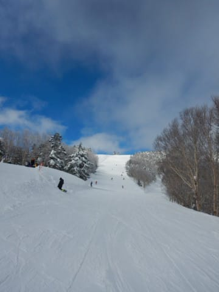
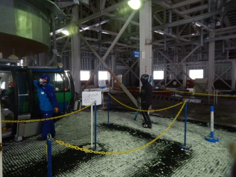
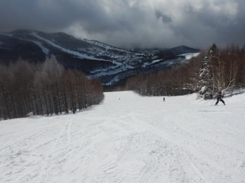
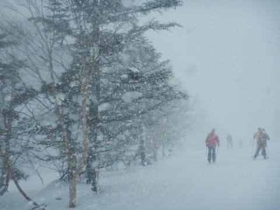

# 2022/2/20(日)の志賀高原スキー場，詳細レポート！…午前は雪はひどくなく快適圧雪バーン，午後は本格雪降りでガラガラだったよ！

📅 投稿日時: 2022-02-22 00:45:33

🏷️ カテゴリ: [2022スキー滑走日記](cc9cb73e4320f6a97af6fccc37587a61a.md)

本日の志賀高原，積もったようですね…！！

特派員情報によると．

なんと．

朝の積雪が70cm！

朝は，圧雪コースも脛パフレベルの

新雪だったようです！

ものすごい積雪で，シャトルバスの

バス停も埋まってます…

そして，気温も-16℃と激冷え！

かつてないレベルで，ゲレンデの

木も埋まってます…

ただ，雪はかなり重かったらしく，

緩斜面ではゴキブリホイホイ状態に

なったようですが…

昼間もひたすら雪が降り続け，

昼間だけでこれくらい積もったようです…

いや．

今シーズンはホントに良く積もる！

そして．

この雪は23日の水曜まで降り続けます…！

昨日の記事で，明日22日（火）の朝の

志賀高原は積雪10cmと書きましたが，

もう少し積もりそう…

そして，朝の気温も-15℃を下回りそうで，

昼間も積もりそうな感じ…

23日も，朝は-15℃くらいで，

朝は10~20cmは積もってそう…

そして，この日も昼間も降り続けます．

ただ．

24日以降は，少なくとも29日までは

雪は全く降らなさそうですね．

今回のドカ雪の後は，しばらく

雪は降らなさそうな感じです…

…ってなことで，本題へ．

日曜の志賀高原の詳細レポートです！

えー．

まず．

昨日のナイター終了後からの積雪は

思ったほどなくて，せいぜい10cm弱．

ナイター中の積雪を合わせれば，

朝までの積雪は，10~15cmってところ．

うーん．もう少し積もると思ったんだけど…

で．

今日も8:30の通常営業開始前から

焼額第1ゴンドラに並ぶわけですが．

待ってる人数は，日曜とすれば

少ないほうかな…

ってなことで．

8:30の朝イチゴンドラで山頂へ上がると…

朝の気温は-6℃と，ここ数日では

かなり高めの気温！

志賀の寒さに慣れると，

「ちょっと暖かいかな？」と感じる

ほどの朝でした．

で．

朝イチの天気は，雪が降ったり止んだり．

山頂付近はちょっとガスで見にくかったのが

残念…（涙）

朝は気温が高い雪が積もって

ゲレンデはモサモサだろう…

という予想はいい方向で外れてくれて，

ゲレンデはシマシマなんだけど．

でも，見えなくてあんまり飛ばせない

のが，すごく惜しい…（泣）

いや，ホントにゲレンデはいい感じの

やわらかシマシマだっただけに．

朝の視界の悪さが，惜しい…

と，思っていたら．

なぜか10時過ぎになってくると．

時折ゲレンデにうっすら日が

射すようになってきましたよ？？

さらに，時折青空が見えるほどに

なってきましたっ！！

なぜ？？

今日は晴れる予想じゃなかったのに！？？

ずっと晴れていたわけじゃなく，

曇ったり時折日が射したり…という

感じだったんだけど．

だけど．

今日は一日雪降りの予想じゃなかったの？？

誰かの予想では，こんな晴れ間があるような

予想じゃなかったんですけど！？？

あぁ…

誰かさん，予想外したな…

しかし．

予想を外して悲しくもあったものの，

モサモサバーンの雪降りを覚悟していた

自分としては．

予想外のきれいな圧雪を，日差しの下

滑れてうれしくもあり．

その嬉しさで滑ってたら，

午前10時から11時くらいまでは，ちょっと

焼額第1ゴンドラは混んだのが残念…（涙）

最大10分待ち近くまで行ったかな？

でも，第2高速リフトは終日待ちゼロ

だったので，1時間ほど第2高速へ

逃げていれば，問題なし！

そして，11時過ぎには，みんなお昼休みに

行ったのか，イチゴンはガラガラ飛び乗りに

なってきました！

ふははははは！

今日は朝イチはガスってイマイチだったけど，

10時以降は天気も良くなってきたし．

バーンもモサモサじゃないし，

これでがら空きなら，意外と今日は

いいんじゃないか？

…と思ったら．

甘かった．

ゴンドラがガラガラになった直後の

11:30ごろからなぜか天気が急変（涙）

視界が悪くなるほどの雪になってきて…

数分前とはうって変わっての

ガン降りの雪になってきました（泣）

惜しい…

ゴンドラが混んでた午前に天気が

良かったのに．

ゴンドラがガラガラになった直後に，

狙ったように天気が悪くなるのは…

なんの嫌がらせだ？？？（涙）

でもまぁ，これは．

午後は私の予想が当たった

ということで，喜んでおこう…←ポジティブシンキング

で．天気が悪くなったせいもあり．

午後もゴンドラは1ゴン，2ゴンとも

ガラガラのまま．

さらに，人が少なかったのもあり，

午後3時ごろには，圧雪バーンにも

雪が積もっていきました…！！

積もった雪はそれほど重くなく．

16時の営業終了の頃には，

圧雪バーンも，5-10cmの軽めの雪が

積もったプチ新雪バーンに！

ってなことで．

朝はガス，午前は曇り時々晴れ間，

午後はガン降り積雪…

と，激しく天気が移り変わった本日でしたが．

まぁ，

モサモサ激重雪を覚悟していたのに

比べれば，午前中は結構楽しめて

良かった…

ということにしておき．

午前の天気の予想を外したことは，

いい方に外したから良し

と，都合がいい解釈をしておこう…

と思った，Skier_Sだったのでした．

## 💬 コメント一覧

### 💬 コメント by (レインボー74)
**タイトル**: Unknown
**投稿日**: 2022-02-22 14:37:13

火曜日の志賀高原情報

朝の湯田中は新雪さらさら3cm。上林-5℃　蓮池-12℃。山は朝から雪です。

ニゴン停止で、イチゴンスタート。まずはGS。さらさら雪が足首パフ。全く浮かないのでトーンダウン。

次いでGSサイド。しめた、踏まれてない。深すぎて前へ進むのが大変だけど、浮く浮く。楽しく完走。次も、次も。

白樺もからまつも足首パフ。まあ当たり前に楽しい。

オリンピックは50新雪さらさら雪。もうすでにぼこぼこになっていたけれど、柔らかいのでぼこぼこを気にせずに滑ったら楽しすぎる。

次も次も。

西かん昼食後のからまつがまた楽しすぎ。新たにさらさら雪が乗っていて、滑る滑る。

こんなに楽しませてもらったけれど、一時に終了。明日もあります。明日もまたパウダーですよね、エス様！なんか申し訳なくて！

### 💬 コメント by (Skier_S)
**タイトル**: ＞レインボー74さま
**投稿日**: 2022-02-23 03:09:35

今日はかなり軽い新雪だったみたいですね…

湯田中は3cmしか積もってなかったんですか！

明日も新雪ですよ～！！

