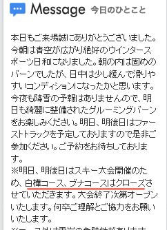

# 今週末も志賀高原…土曜は冷え冷え曇りのカリカリバーン，日曜は晴れて朝はガリガリ，昼に緩むかな…

📅 投稿日時: 2019-02-22 23:37:01

🏷️ カテゴリ: [日記](cc4b5682fb7b8b144980957a978653fb0.md)

ってなことで．

今週末も土日で焼額を滑っている予定ですが．

焼額のHPを見ると．

今日は，昼間はちょっと雪が緩んだようですね…

（[焼額山スキー場HP](http://www2.princehotels.co.jp/ski/shiga/)より）

…でも．この土日，焼額の白樺＆ブナコース．

大会でクローズですか…（ちょっと残念）．

とりあえず．

この土日ですが．

天気の予想は，水曜の予想通り．

土曜は曇り．

そこそこ冷えて，終日アイスバーン祭り（涙）

午後は日が射すタイミングもあるかも．

ただ，昼間も気温が上がらないので，午後は

アイスバーンが磨かれてツルツルになっていくか…

日曜は，朝からすっきり晴れ！

朝はガチガチの硬い斜面（泣）．

でも，昼間には気温が上がるので，日が当たる

斜面は表面が緩んで滑りやすくなるかも…

って感じです．

今週末は，バーンが硬そうなので．

私の板はロングとショートの板2セットとも，

エッジを凶器レベルにまで磨いておきました…

しかし．

冷え冷え踊りが効いて，

22日夜から23日にかけて，

冷える予想になってくれたのはいいけど．

冷えすぎたおかげでアイスバーンになるとは（涙）

…雪がドサドサ降って，アイスバーンを

隠してほしいところだけど．

これから先の天気図を見る限り．

3月2,3日の週末までに．

雪が降ることは無さそうな感じ…（泣）．

なんてこった…

それどころか，26日夜は

また雨の危険も…（激）

なんだか，今シーズンも．

1月上旬以降，太い板の出番が

全く無いのですが（泣）．

2月に一度もパウダーが無いってのは，

一体どうしたもんか…

昨シーズンの，春の雪不足の

悪夢がよみがえる…（戦慄）

これからは．

冷え冷え踊りだけでなく．

降れ降れ踊り

を必死に踊る必要が出てくるのかも…

とりあえず．

あと3時間後に出発です．

今日も3時間眠れなさそう…（泣）．

また土曜の夜，ゲレンデレポートします～！

## 💬 コメント一覧

### 💬 コメント by (ベー)
**タイトル**: Unknown
**投稿日**: 2019-02-23 19:16:18

予想通りアイスバーンの斜面多数でしたね。

奥志賀ゴンドラは長蛇の列で早々に退散。

寒いので西舘まで逃げましたが疲労もあり3時で早退。

明日は晴れてくれ～

### 💬 コメント by (ほっぽ)
**タイトル**: Unknown
**投稿日**: 2019-02-23 23:00:17

今日は高天スタートでヤケビに移動し滑っていましたが、

鼻毛親分さん以外とはお会いしませんでした。

１ゴン山頂から滑り出すｙａｍａさんの背中は見ました。(^^;

今日は全山アイスバーン祭りでしたね。

午後は西館フードを回して最後はＮＨＫで

ＦＢの友人と一緒に滑って終了しました。

明日も朝一で高天からヤケビに移動します。

http://www2.tokai.or.jp/nana_hoppo/

### 💬 コメント by (Skier_S)
**タイトル**: 明日は晴天！
**投稿日**: 2019-02-24 01:00:20

＞べーさま

あら？？

焼額では滑らずに通過のみですか？？

明日は焼額にも立ち寄ってください～！

明日ははれそうですよ～！

＞ほっぽさま

今日もお会いできませんでしたね…

終日焼額1ゴンを回していたのですが…

明日もいつも通り，焼額スタートです～！！

