# 2012年　子連れモルジブ　ダイビング旅行記　その7

📅 投稿日時: 2012-10-16 01:15:26

つーことで．

本日1本目のポイント，ネリバル・ベルへ到着でございます．

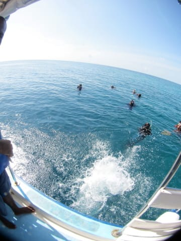

ボートサイドからジャイアントストライドで海へGo!

水温は高いけど…

透明度はちょいと低いかなぁ．

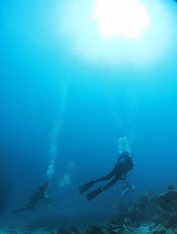

…この写真だと透明度よさそうに見えるけど…透視度15m程度かな？

こーんな感じで，キンギョハナダイが舞っている中を進んでいきますが…

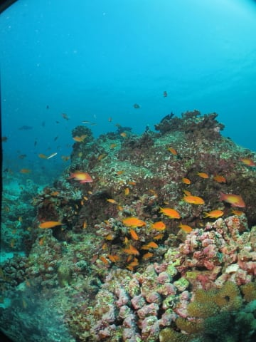

やっぱりコモドと比べると，ちょいと珊瑚の元気さとカラフルさが…

まぁ，コモドはすごすぎたか…

って考えつつ．

マンタのクリーニングポイントへ近づくと…

なんか．いきなり出ました．

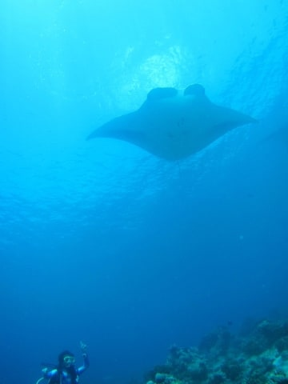

マンタが1枚．

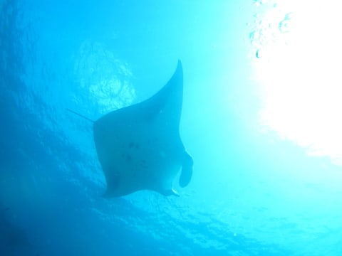

10mちょいのクリーニングステーションの上から，ダイバーの上までぐるぐる回ってくれます．

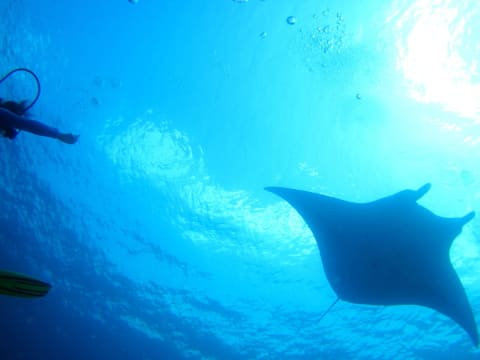

結構近づいてくれますね～．

って思っていたら．

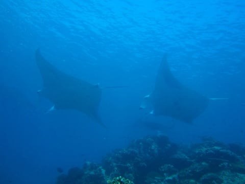

2枚マンタがクリーニングステーションにやってきて…

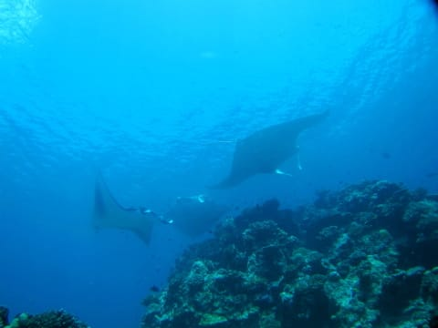

3枚のマンタがクリーニングステーション上をぐるぐると．

それぞれ結構大きなマンタだなぁ…

と思っていたら．

知らぬ間に．

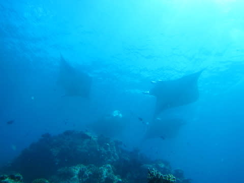

4枚に増えてるんですけど…

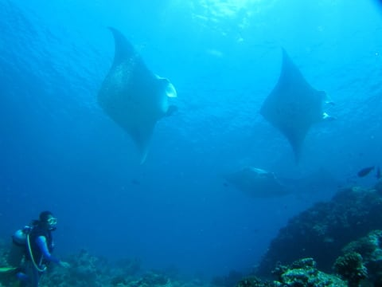

4枚マンタの乱舞をしばらく眺めていると…

また1枚増えて今度は5枚に？？

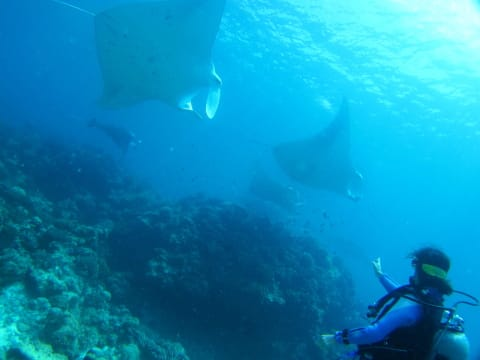

そしてまたマンタが横からやってきて…

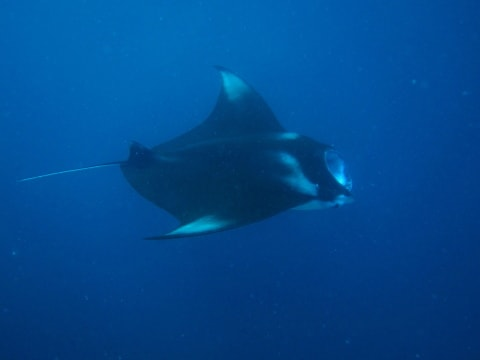

えーっと．6枚？一体何枚いるんだ！？？

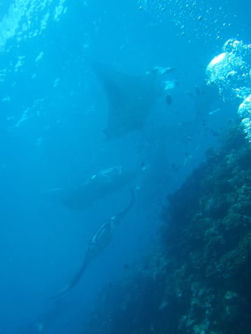

今日…なんか，マンタ祭りとかがあって，地元のマンタさんがいっぱい集まる日なんでしょうか．

それとも，一緒に潜ったダイバーの中に，マンタを引き寄せるパワーのある人がいるのか？？

って感じで．

次々と集まってきたマンタ様たちは．

もう，ダイバーをまったく気にせず，もうダイバーの頭上をぐるんぐるん回ってくれます．

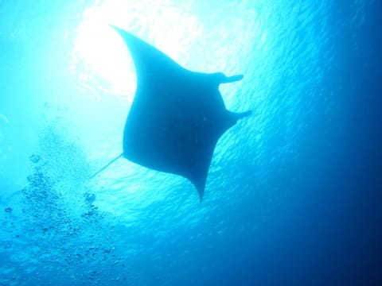

最終的には同時に7枚まで出現したらしいですが…

私が同時に確認できたのは6枚までかな．

安全停止中も真横を通過していく，かなりフレンドリーなマンタでしたね～．

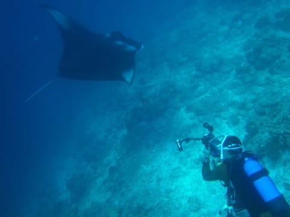

って感じで．

モルジブのボートダイブ1本目から，いきなり大量のマンタに囲まれたダイビング．

今回のモルジブツアーは，スタートから，かなりおなかいっぱい，超大満足な感じで始まったのでした．

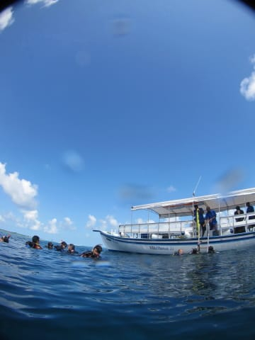
