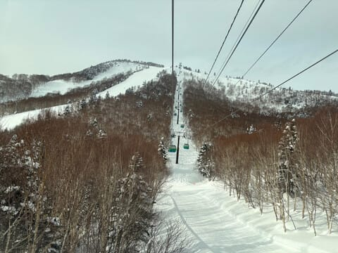
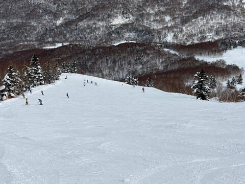

# 1月5日(日)の志賀高原スキー場特派員情報！…そして今週9，10日はまた結構積もりそうだけど，志賀高原は西風か？

📅 投稿日時: 2025-01-06 02:05:30

🏷️ カテゴリ: [日記](cc4b5682fb7b8b144980957a978653fb0.md)

ということで．

今日の志賀高原はすごい良かった

みたいなのですが，私は今日も一日

仕事してました(泣)

あぁ…

仕事なんてしたくない…

6日間の志賀高原滞在で，社会復帰

できない身体になってしまった…

とりあえず．

本日も志賀高原の特派員から写真が

送られてきたのですが．

うーん．

日頃の行いが良い私が志賀高原を離れた

ので，コンディションが悪くなるはず

なのですが…

なぜか，私がいないというのに．

すごい良かったようです…！！！（泣）

うぎゃーーー！！

こんな晴天のシマシマ，滑りたい…！！

とりあえず．

営業前の1ゴンの待ちはこの程度で，

朝はそれほど混んでなかったらしい焼額．

朝イチの気温は-10℃近い，

そこそこの冷え込みで…

雪は結構締まった感じで，午後まで

それほど荒れないしっかりした雪．

いい感じのハイスピードバーン

だったようで…

晴天でこんな雪が滑れるとは…

いいなぁ…

おおむね終日晴れの一日で．

昼頃にうっすら雲が出てきたタイミングも

あったみたいですが．

昼間の気温も最高で-3℃程度と気温が

上がらなかったので，雪は締まった

ままだったし．

午後はまた日が射してきたみたいです～！

ただ，翌日はもう平日という，年末年始

休み最終日にも関わらず，人は意外と

多かったようで．

午後になってもコース上の人口密度が

そこまで減らなかったみたいですねぇ…

15時ごろになってもこのくらい人が

いたみたいなので…

普段の週末だと，日曜午後はガラガラに

なることを考えると，年末年始休み

最終日にしては人が多いな…

うーん．明日も休みの人がそんなに

いるとは思えないので…なんでだろ？

ただ．

コースを選べば，オリンピックコースとかは

人口密度も低くて．

雪が締まっていたのもあり，ラストまで

雪は荒れず，フルカービングで攻められる

レベルだったようです…！！

いやーーー．

今日はいい一日だったみたい…

今日滑れた人がうらやましい…

滑りたかった…（泣）

ってな感じで，今日は終日晴天だった

わけですが．

今後の志賀高原の天気を見ると…

6日：晴れのち曇り，気温は上がる．

　朝はいい感じ．

7日：午前は西風で晴れ～曇り．午後は

　だんだん冷えていき曇り～小雪，

　夜はそこそこ降る．

　日本海側はメチャ積もるが志賀は

　西風でそこまで積もらない

8日：おそらく朝から雪．時折強く降る．

　そこそこ積もる．昼で20～30cm

　積もるかも

9-10日：終日雪．積もる．

　西風気味なので志賀は1日あたり

　20cm，多くて30cm程度か…

といった感じかな…

9，10日は日本海側や白馬はおそらく

パウダーデーになりそう．

…西風気味じゃなければ，志賀高原も

ドサドサ積もりそうなんだけど…

また，週末の天気は水曜深夜に予想します～！

とりあえず，今シーズンは雪が多くて

恵まれてるけど．

志賀高原は私のいない平日に降って，

私が滑る土日はすっきり晴れてくれると

いいなぁ…←ワガママすぎるから

## 💬 コメント一覧

### 💬 コメント by (富山県民)
**タイトル**: Unknown
**投稿日**: 2025-01-11 15:26:04

こんにちは。

お久しぶりです。

１月５日は志賀高原も晴天だったのですね。

私は1月5日は新潟県の赤倉観光リゾートに行きました。

赤倉観光リゾートも晴天で雪質も良かったです。

赤倉観光リゾートからは志賀高原も見えました。

久しぶりに晴天でのスキーになりました。

明日1月12日は新潟県糸魚川市にある糸魚川シーサイドバレースキー場に行く予定です。

1月12日は糸魚川シーサイドバレーは1日券が半額です。

### 💬 コメント by (Skier_S)
**タイトル**: ＞富山県民さま
**投稿日**: 2025-01-11 23:46:13

赤倉良かったんですね…

1月5日は私も滑りに行きたかった…

明日は糸魚川シーサイドバレーですか．

私も昔一度滑りに行ったのですが，どんなスキー場だったか覚えてません…

楽しんできてください！

