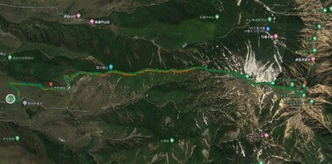
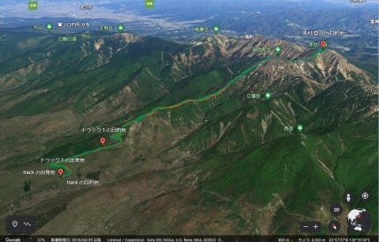
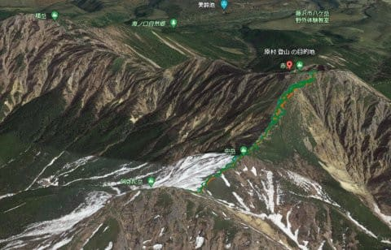
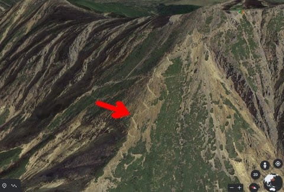
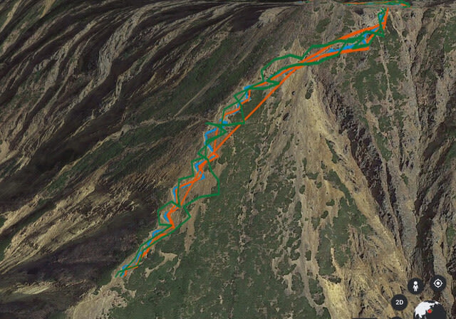
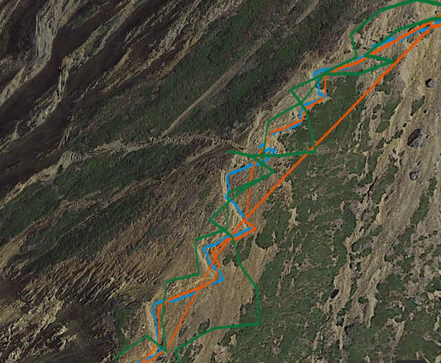
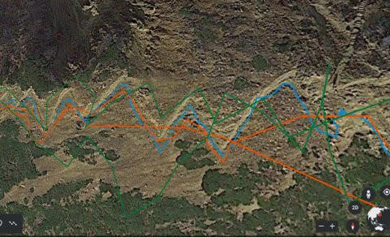
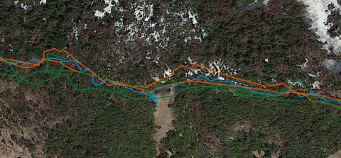
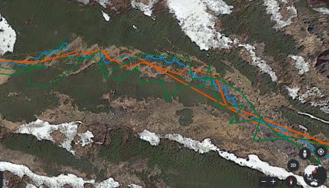

# さすがGarmin…Garmin Fenix7XのGPS精度はびっくりするほど高いし受信感度もすごい．誤差数10cmだよ！

📅 投稿日時: 2022-08-05 06:12:22

ってなことで．

今日もとんでもない時間に更新していますが…（涙）

更新やめようかと思ったけど．

なんとか記事を書く自分…えらい！！←みんなに誉めてと強要してないか？？

以前書いたように．

[物欲選手権](e8f9549107cb957571ed35f5bfda9bcbe.md)に敗れてしまい，ついつい

購入してしまったスマートウォッチ，

Garmin Fenix7X．

あまりにも多機能で，いろいろ遊べるので

オモチャとしては最高なんですが．

（むちゃくちゃお値段高いけど…（涙））

私が買った本来の目的は，山登りで使うこと．

ってなわけで．

家に帰って来たら，

登山時のGPS記録を

「むふふふ」

と，気持ち悪い笑みを浮かべながら

見るのを楽しみにしているのですが…

Googleのマイマップを使って，GoogleEarthで

表示させると．

歩いてきたコースを3Dで見ることができて，

「あぁ，このあたりはこんな地形だったのか…」

と振り返ることができて，かなり楽しいです．

で．

今回．

Garmin Fenix7Xと，

Amazfit PACEと，

スマホ（OPPO RENO3A)との

三つを身に着けて山に登ったので，

それぞれのGPS記録を比べてみましょう…

（ホントはあとデジカメのGPSログもONにして

とってた…一体いくつGPSを身に着けてるんだ）

この，矢印で示したあたり．

結構な急登で，踏み跡がジグザグに

残ってるこの部分．

ここにGPS記録を重ねてみます．

オレンジがAmazfit PACE君．

緑色がスマホ．

そして，水色がGarmin Fenix7X君の

記録ですが…

拡大すると．

オレンジのAmazfit PACE君．

GPSが拾えなかったのか，記録が飛んだ

部分が直線でつながれていて，不正確な

感じ…

そして，緑色のスマホ君．

頑張ってはいるけど，ちょっと踏み跡から

ずれてるし．

「こんな風にはあるいてないだろ」

という感じの感じの軌跡になってます…

それに比べ，水色のGarmin Fenix7Xは，

ほぼ正しく踏み跡に沿ってます！！

…この，踏み跡の幅，数10cm．

水色のGarmin Fenix7XのGPS軌跡の誤差，

数10cmってところかな…

これ，精度恐ろしく高いよ！！！

そのほかの場所でも．

木に囲まれた登山道では，GPS電波を

正確に受信できないのか．

オレンジのAmazfit PACE君はかなりとびとびの

記録になってますし，

緑のスマホは，「そこはぐるっと回ったりしてないだろ！」

というような不思議な軌跡を残してますが…

水色のGaminは，GPS記録が途切れたり，

飛んだりすることは無く．

途中，見晴らしがよいところ（画面真ん中部分）

で一旦わずかに画面下側方向に1mほどコースを

外れて立ち止まったことが分かるレベルです…！！

いや…

やっぱり，受信感度．記録間隔，精度ともに．

水色のGarmin Fenix7Xが圧倒的ですね…！！！

これだけ精度が高いのに．

7時間半の山行で電池が10%くらいしか減って

ないって…

すごいぞ，Garmin！

とりあえず．

GPS精度だけでも，そのすごさに感動できる

Garmin Fenix7Xなのでした…

Garmin Fenix7X君．

他にもいろいろ面白い機能がいっぱい

あるので，またレポートします～！

（Garmin Fenix7Xの使い方・使ってみたレポートは[こちら](e516b23a4874189de2e9208be87fa5184.md)）
