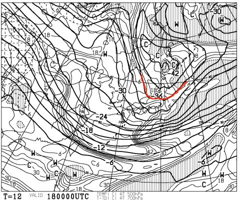
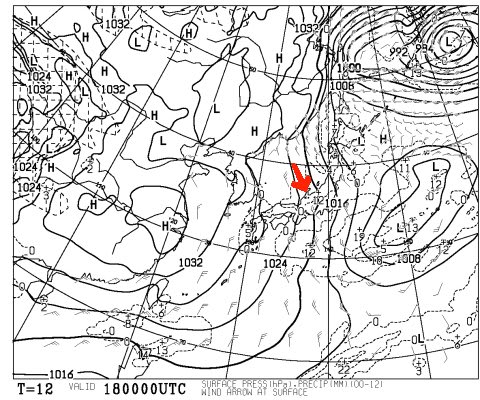

# 恒例！今週末の志賀高原の天気は？？

📅 投稿日時: 2013-01-18 01:40:16

🏷️ カテゴリ: [スキー天気予想](c6554f5c3c106093b511a8daae23757e8.md)

えー．

「今日こそ，緑の板レポートだ！」

と思って，このページを覗いた人も多いでしょうが…

…その前に．

恒例の，週末の天気予想をば…

この週末，19，20日の，志賀高原の天気です．

…あー．

なんだか，微妙ですね．

あ，いや，よさそうなんですよ．コンディションは．すごく．

ただ，晴れるのか降るのかの見極めが難しい…ちょいと微妙な風向きですね…

ただ，500hpa予想を見ると，19，20日共に-30度っていうそこそこ強い

寒気が入っているので，おそらく19，20日共に，雪が降るかな～．

ただ．

金曜日，18日は降ります．

がっつり降ります．積もります．

それも，キンキンに冷えた，いい雪が積もります！

こーんな感じで，-36度っていう大雪の目安の寒気が入り込んでるし…

風向きも，志賀高原まで雪雲が流れ込んでくる，北よりの風．

がんがん積もってくれるでしょう！！

…これが，19日朝まで積もればパウダーでしょうけど．

残念ながら，18日の夜半にやんじゃうので，まぁそんなに深いパウダーには

ならないかな．

でも，19日土曜日．

朝の圧雪バーンは最高でしょう！！

昨日積もった雪が，きれいに圧雪されたやわらかいバーン！

…でも，雪がやわらかすぎるので，昼過ぎには荒れたぼこぼこバーンに

なるかと思いますが…

んで．

19日の天気は．

現時点では

「降ったり止んだり，午後は時折日も差す」

って感じかな～．

あー．19日，むちゃくちゃ寒いですよっ！

おそらく昼間もマイナス10度くらいかも．

しっかり防寒対策していきましょう…

そして20日は…

朝のうちは小雪，午後に向かって降りが強まる，って感じですかね．

現時点では，太陽は拝めなさそうですね…

でも，19日の夜から20日朝にかけての積雪は，そんなになさそう．

ディープパウダーはないですね…おそらく．

積もって10ｃｍかな．

まぁ，この日も，朝のうちはきれいなやわらかい雪の圧雪が滑れるでしょう．

そして，午後に向かってぼこぼこになっていくパターンだなぁ…

しかし，3連休に志賀高原のゲレンデに顔を出していたアイスバーン，

この週末はおおむね隠れてくれるので．

今後のゲレンデコンディションは改善ですね～．

## 💬 コメント一覧

### 💬 コメント by (ひろりん)
**タイトル**: Unknown
**投稿日**: 2013-01-18 17:47:47

週末は行けません（TT)

でも・・・かみさんに内緒でX-KART164cm買おうかなと（汗）

エッジ研いだオガサカ、辛くって（TT)

硬いバーンでズレないとか鬼畜スペックすぎて（TT)

宿の娘さんの板（2012X-KART)借りた（留守だったので）ら、凄く楽しかったので（汗）

技術とか練習とかアホらしくなるくらいに楽しかったので（爆）

### 💬 コメント by (Skier_S)
**タイトル**: ひろりんさま
**投稿日**: 2013-01-18 22:34:12

あー．

X-KARTですか．

板なりに滑るなら，あれほど楽な板は

ないですよね．

板が勝手に曲がって行ってくれるという…

もう，むちゃくちゃ楽だった思い出があります．

でも，ちょっと人が行きたい方向より，

板が行きたい方向に行ってしまう傾向が

強い気が(汗）．

私も練習とか講習とか，そんな好きな人間じゃないので

板に思いっきり頼ります…

＃だから，このブログはスキー技術論が無いんです（笑）．

