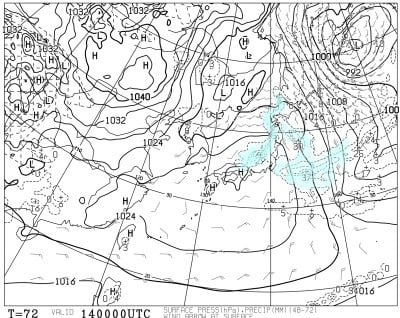

# 1月13，14日の週末の志賀高原スキー場の天気は…13日はそこそこ冷えて雪，14日は雪の後の晴れでいい感じかも！

📅 投稿日時: 2024-01-12 02:07:26

🏷️ カテゴリ: [スキー天気予想](c6554f5c3c106093b511a8daae23757e8.md)

えー．

昨日は，久しぶりにかなり早く，夜10時前に

家に帰宅していたというのに…

疲れていたのか，帰宅直後にちょっと休もうと

横になったところまでは覚えてたけど．

そのままぐっすり朝まで寝てしまって

ました（泣）

ということで．

また朝まで床で寝てしまったうえ，

Blogも更新できませんでした…

でも，久しぶりに8時間以上寝ることが

できて，ちょっと疲れが取れたかな．

（どうせ寝るなら布団で寝たかった…）

ということで．

水曜深夜恒例の天気予想ができなかったので，

本日，一日遅れでの天気予想です！

えー．

まず，

12日(金)の850hPa図を見ると…

この日は，赤い0℃線が志賀高原に

近づいているので…

ちょっと気温は平年に比べ高め

かな？

で，12日の朝9時の地上天気図は．

日本海側にわずかに雪雲が予想されてます．

志賀高原には雪雲がかかってないけど，

低気圧が東に進むと冬型の気圧配置に

なるので，午後には志賀まで雪雲が

広がって，志賀高原にも雪が降りそう…

そして．

13日(土)の850hPa気温図を見ると．

この日は水色の-6℃線が志賀高原に

かかるレベルなので…

激冷えではないけど，そこそこ冷えそう．

で，13日の地上天気図は，内陸まで

雪雲が入っていて，志賀高原も

水色の降水域に入っているので…

13日は，終日雪がぱらつく冷えた

一日になるかな．

で．

14日(日)の朝9時の850hPa図は…

この日も水色の-6℃線が志賀にかかってる

レベルだけど．

赤い0℃線が西から迫っており，

夕方には赤い0℃線は志賀に近づきそう

なので…

朝は気温が低くても，午後に向かって

気温が上がっていきそう…

そして，日曜の地上天気図は．

志賀高原に降水域がかかっていますが…

これは前日からの24時間降水量なので．

13日のうちに降る雪．

14日は高気圧に覆われるので，

おそらく朝から晴れるんじゃないかな？？

ってなことで．

まとめると…

12日(金)：朝は晴れ．気温は-5～6℃程度．

　あさイチは締まった圧雪のいい感じの

　コンディション！！

　昼に向かって気温が上がるが，

　昼前から曇り始め，その後だんだん気温が

　下がり，昼過ぎから夕方ごろに雪が

　降り始める．

13日(土)：朝から激冷え雪．

　朝の気温は-8～9℃くらい．

　朝イチまでに10cmくらい積もってるか．

　あさイチは圧雪コースも圧雪の上に

　数㎝の新雪がうっすら乗っている．

　非圧雪コースはブーツパフくらいかな．

　昼間は激冷えで，雪も時折強く降る．

　雪はそこまで積もらなさそうだけど…

　昼間だけで5cmくらいは積もるかな？

　冷えて雪が降って風も時々吹きそう

　なので，根性のないスキーヤー

　ふるい落とし機能が発動するかも．

　終日冷えて雪降りの一日．

14日(日)：前日の夕方から夜にかけて

　新雪が10～20cm積もって，

　あさイチはそれが圧雪された

　柔らか圧雪バーン！

　あさイチの気温は-6～7℃くらいかな．

　あさイチ晴れると，放射冷却でもう少し

　下がるかも．

　朝イチは雲が残るかもしれないけど…

　基本的に晴れそうな一日．

　前日の雪がいい感じに圧雪されて，

　さらに天気も良くてそれほど寒くない

　恵まれた一日．

　ただ，午後は急斜面では柔らかい雪が

　荒れてちょっと凸凹になっていきそう．

…という感じで．

土曜はちょっと天気が悪そうだけど，

雪が降ってくれるのでゲレンデ状況は

改善しそう．

そして，日曜は晴れそうなので…

日曜はねらい目！！

で．

さらに…

来週月・火の15，16日の2日間，

結構降って積もりそうな感じ…！

17日の朝はパウダーねらい目かも…

ちなみに，これから1か月，

おおむね平年並みの気温が続きそうで．

そんなに気温が上がる日はない感じ

なので…

うん．

これから1か月は，雪が積もってゲレンデ

状況が改善することはあっても，壊滅的に

状況が悪化することはなさそうな感じ…

早くオリンピックコースやSGSコースが

開いてくれることに期待！

## 💬 コメント一覧

### 💬 コメント by (レインボー76)
**タイトル**: Unknown
**投稿日**: 2024-01-12 13:42:16

金曜日の志賀高原情報

朝の蓮池-3℃、暖か目の曇り空。

今日は友人との昼餐(こんな単語あったっけ？)のためダイヤ上陸。

連絡リフトが開くまでダイヤ二本。

ファミリーへ行くと、ガーン！600人の団体と鉢合わせ。なんとか寺子屋に逃げようとするも、時間が早すぎたかクローズ中。やむなく選んだパノラマコース。なんと誰にも踏まれていない。深い幸せを感じたのも束の間、長蛇リフトに見きりをつけて、目指すはやけびたいスキー場！(三波春夫調でお願いします)

やけびたいに来てみればぁ今ウハウハの真っ最中(リズムが浮かぶ人は相当の年代物かと)

今日のやけびは最高でした。三高も動いたし、10時過ぎに唐松にコロコロ発生以外は、完全に自己を過大評価してしまう危険なバーン。今後の落差が心配になります。

### 💬 コメント by (Skier_S)
**タイトル**: ＞レインボー76さま
**投稿日**: 2024-01-13 01:12:40

ヤケビはコンディションよかったんですね…

明日に期待！！

明日夜は宜しくお願い致します～！！

