# 2022/5/8(日)，志賀高原焼額山スキー場ラストデー，速報モード…晴れ時々曇り．朝イチは冷えて良かったよ！

📅 投稿日時: 2022-05-09 01:38:30

ってなことで．

私の平和なGWが終わり．

また明日から怒涛の仕事の日々に

舞い戻るわけですね…(泣）

しかし．本日，ついに．

焼額の今シーズンの営業が終わってしまいました…(涙)

あぁ…シーズンとは短いものよ…

で．いつも通り今日も帰宅が遅く．

また明日はかなり朝早めに仕事が始まるので，

今日の焼額ファイナルデー，速報モードにて…！

えー．

まず．

ファイナルデーも6:30からの早朝から

参戦しましたが．

朝からすっきり晴天！！

…ていうか．

日差しがあると雪が融けちゃうこの時期，

晴れない方が嬉しいんですが…

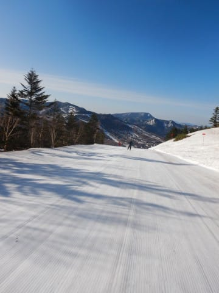

でも．

あさイチは久しぶりにマイナス気温まで

冷えてくれたので…

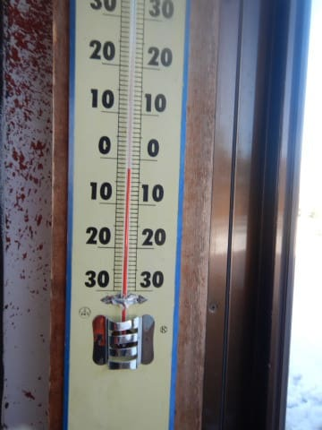

ゲレンデはガチガチに締まって，

硬い斜面が好きな人にはたまらない

GS板でガッツリ大回りを楽しめる

ハイスピードバーン！

これは楽しい…！！

最終日に予想外のボーナスがもらえた感じ！！

(硬いのがダメな人には厳しいバーンだったけど…)

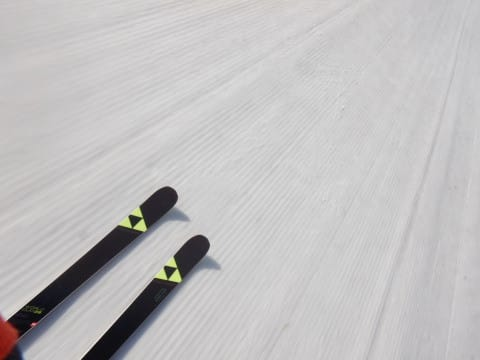

今日はGSコースがクローズだったので，

早朝からパノラマコースしか滑れません

でしたが…

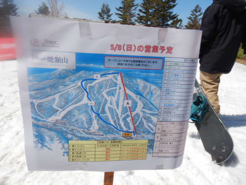

強烈な日が射したものの，

午前中は山頂で0℃程度と低めの

気温だったのもあり…

9時過ぎには雪が緩み始めたものの，

10時過ぎくらいまでは板がそこそこ滑る

楽しいバーンコンディションでした…！

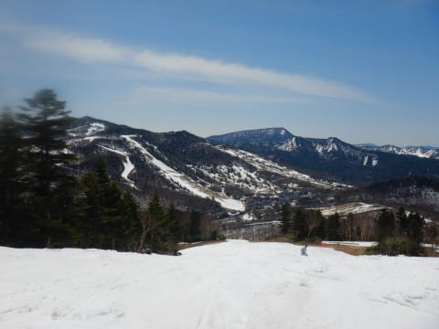

ただ，10時を過ぎると，気温は低め

だったのものの，さすがに日差しで

雪が融け，人が滑ってないところは

表面が黒ずんだ感じになっていき…

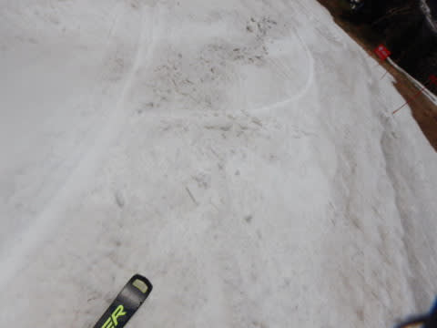

雪も春のザブザブ雪になり，バーンの

斜度がある部分はちょっと荒れ気味に

なってきました(泣）

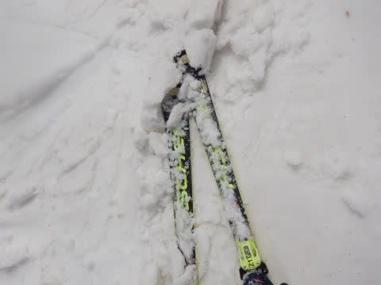

でも，午後は焼額全体でも20人程度しか

滑ってないような寂しい状態だったので，

急斜面以外のバーンはほぼフラットなままで…

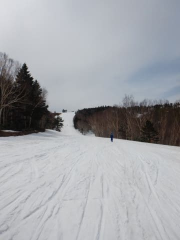

さらに午後，雲が増えたタイミングもあり．

曇った時は板も滑って，意外と楽しい

一日でした～！！

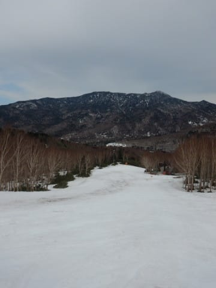

しかし．

例年の3連休最終日より3日長い

営業だった今シーズン．

さすがに最後はGSコースが息絶えたけど．

それでも営業最終の前日までは，一部を

除いて十分雪が残り．

そしてパノラマ・サウスコースは

最終日までこれだけ雪が残ってくれて…

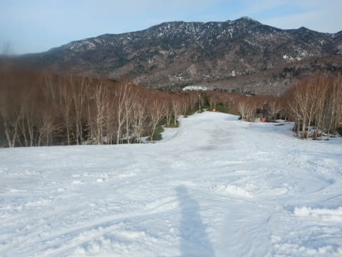

ひどい年には雪不足で最終日まで

営業できない年があったことを

考えると．

雪はたっぷり残ったし．

ゴンドラが止まったり，どしゃ降りに

なるようなひどい悪天候にもならず，

今シーズンは恵まれたGWでした…

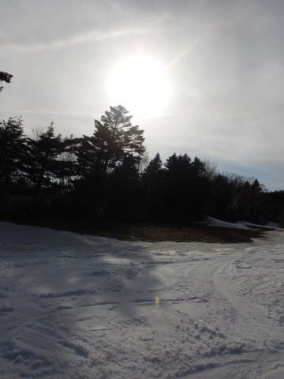

そして．

今シーズンも焼額の最終日の最後の

ゴンドラ乗客となり．

焼額最後のお客さんとして，

シーズン最後の名残を惜しみつつ，

2022シーズンの焼額山に別れを

告げてきたのでした…

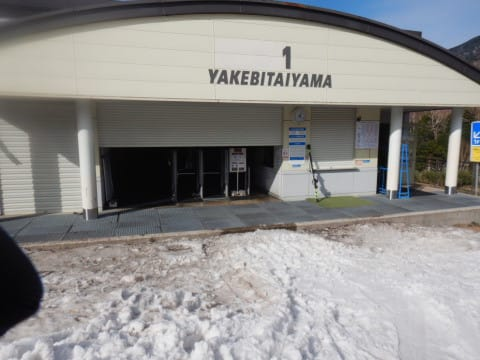

ってなことで．

12月第1週からGWまで，毎週欠かさなかった

私の焼額通いも，これにて終了です…（涙）

## 💬 コメント一覧

### 💬 コメント by (新米パンツ)
**タイトル**: Unknown
**投稿日**: 2022-05-09 16:28:44

お疲れ様でした。

今シーズンは何日滑れたのですか？

羨ましいです。

### 💬 コメント by (ぽんちゃん)
**タイトル**: お疲れ様
**投稿日**: 2022-05-09 18:20:50

お疲れ様でした。

Sさんの焼額愛に当てられっぱなしでした。

来シーズンもよろしくお願いします💖

### 💬 コメント by (Skier_S)
**タイトル**: 今日は疲れた
**投稿日**: 2022-05-10 00:17:02

＞新米パンツさま

今シーズンは，志賀高原だけで56日でしょうか．

GWがいつもより長かったので，例年よりたくさん滑れました…

＞ぽんちゃんさま

焼額愛は誰にも負けてないと思います～！（笑）．

また来シーズン，よろしくお願いします．

