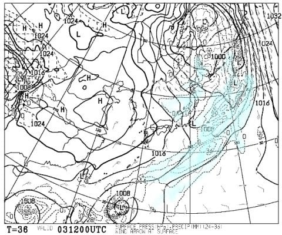
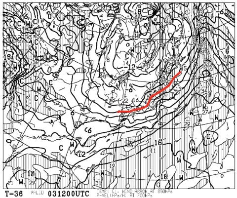
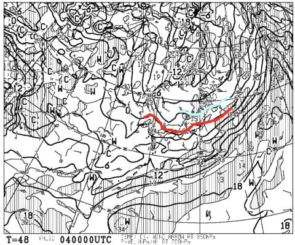
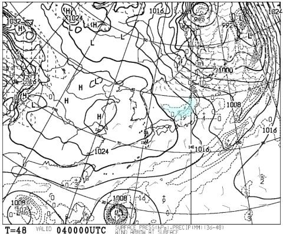
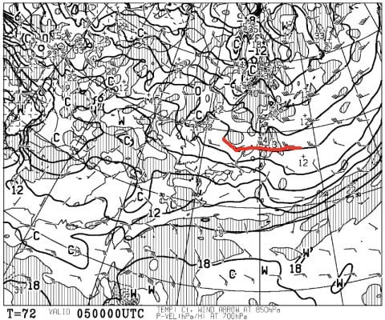
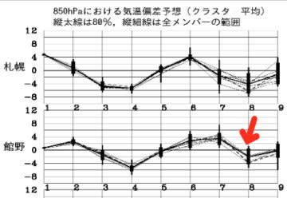

# 明日もYetiに行く予定！…そして，4日は日本海側のスキー場，かなり雪が積もりそう！

📅 投稿日時: 2020-11-03 00:30:20

なんと．

明日は祭日じゃないですか！！

…何とか今日，意地で仕事を終わらせたので

（終わってないという説もあり），

明日は当然のごとく，Yetiに滑りに

行きます～！

…そして．

明日，3日（祝）の地上天気図を見ると…

うむ．

見事な冬型の天気図なので．

日本海側は降るけど，

太平洋側のYetiは，少なくとも9時には

晴れて，その後はすっきりいい天気に

なりそうです…！

軽井沢も，朝からいい感じで晴れるんじゃないかな？

そして，3日の夜9時の850hpa気温図を見ると…

うお．

久しぶりに，赤い0℃線が本州に

かかってますね…！

朝はそれほど気温が下がらず，夜に

向かって気温が冷えていくようなので…

これは3日夜から，日本海側の

山沿いでは雪になりそう！

で．

4日の水曜の850hpa気温図は…

何と！赤い0℃線は太平洋近くまで下がり，

水色の-3℃線が東北まで下がってますよ！

そして，地上天気図では日本海側に

水色の降水域が予想されているので…

これは…3日夜から4日にかけて，

日本海側のスキー場ではそこそこ

積もりそう！

…ただ，風向きが西向きなので．

志賀はそんなに積もらないかな…

でも．

残念ながら，5日には850hpaの0℃線は

かなり北まで上がっちゃうので．

うーん．

雪が降るのは3日夜から4日にかけての

しばらくの間だけですね…

ただ，その後5，6日は気温が上がるものの，

雨になったりしないので．

軽井沢の雪は結構いい感じでもつん

じゃないかな…

そのあとは…

残念ながら，7日は気温が上がって，

雨になりそうだけど…

次に8日にまた冷えます！

雪が降るか微妙なところだけど…

いい感じで冷えてくれることに期待！

…次の週末の予想は，また追ってやりますが．

週末は，土曜より日曜がねらい目かな（今のところは）

ってなことで．

また明日，Yetiで滑ってます～！

（また今から5時間後に出発…（涙））

## 💬 コメント一覧

### 💬 コメント by (ヒータロゥ)
**タイトル**: Unknown
**投稿日**: 2020-11-03 18:02:45

Ｓさん、スキーシーズン突入おめでとうございます〜

わたくしですが、、、

2ヶ月前に交通事故にあいまして、利き手の手首を粉砕骨折し、手首にはプレートが入っている状態のありさま。

来月、スキーできるかどうか、現時点ではなんともです。ヤケビで滑る日をたのしみに今はリハビリ頑張ります。

（プレートは来春まで入ったままですが、たぶん大丈夫と信じたい（願望））

### 💬 コメント by (Skier_S)
**タイトル**: ＞ヒータロゥさま
**投稿日**: 2020-11-04 02:04:46

えええ！手首粉砕骨折！

それは大変でしたね…お大事に…

しかし，手首の粉砕骨折から3か月でゲレンデ復帰ですか！？？

大丈夫ですか…？？←あなたも手を骨折，手術して，退院した翌週からゲレンデ復帰してたでしょ

ゲレンデ復帰目指し，リハビリ頑張って下さいね！！

