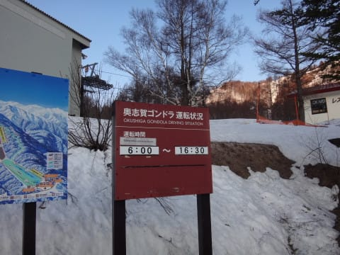
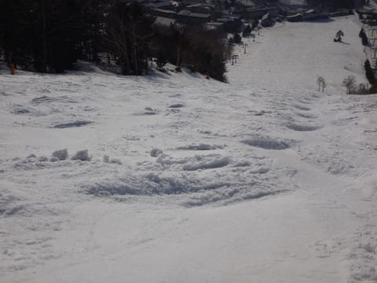

# GW2日目，4月30日の志賀高原スキー場は…終日晴天！朝は冷えて硬いバーン，昼は暑いくらいで雪がかなり緩んだよ…

📅 投稿日時: 2017-04-30 21:22:23

🏷️ カテゴリ: [2017スキー滑走日記](c7d777cecfc91bdf0fa464ad62c6d49ab.md)

志賀高原滞在3日目の，Skier_Sです．

本日は，晴天の春スキーっぽい一日でしたねぇ…

ってことで．

いつも通りのスキー場レポートですが．

まず．

朝．

道路は凍結を心配していましたが．

ほぼ凍結なく，ドライ路面でした…

ちょっと安心．

で．

本日朝は，奥志賀高原スタート！

…それも．

終わった人間である私ですから．

朝6時スタートの早朝スキーから

出動してです～！！

しかし．

朝6時のスタート前に並んでいる，

終わった人やる気のある人が，

こんなにもいようとは…

そして．

朝日が出たばかりの山頂に登ると…

ふむ．

気温は0℃をちょいと下回るくらいですか．

氷点下まで冷えているので…

ゲレンデは固いですよ～！！

でも．

はっきり言って．

朝イチのガチガチバーンは固すぎて手ごわかったかも…

そして，圧雪がちょいと荒めだし…（ちょっと涙）

でも．

6時半ごろ，ちょっとエッジが食いつくようになって

くると…

うはーー！

これは超気持ちよくエッジが利く，

快適ハイスピードバーン！！！

…と，早朝タイムいっぱい，

超快感ガラガラハイスピードバーンを

楽しんでいたところ…

さすがにこんなぴかぴか晴天ですので．

気温がぐんぐん上がり…

うむ．

8時半には，ちょっと表面に重い雪が出てきたな…

でも．

リフト側のエキスパートコースはまだフラットで．

もう少し楽しめるかな～！

…と，思ってたけど．

10時過ぎには，ゲレンデの人も

結構増え始め．

そして，雪もほぼ完全にウエットな春雪に

なっちゃって（涙）

…10時過ぎには，奥志賀全面．

春の重い雪と化してしまいました…（泣）．

だもんで．

11時過ぎに，一の瀬へ移動！！

一の瀬は…

なんと．

午前11時を過ぎても結構フラットじゃないですか！

12時前の一の瀬正面バーン．

まだこんなにフラットで，大回り行けるよ！

そして，パーフェクターコースは．

取りつき部の土がかなり広がったけど…

コース自体は，まだまだ荒れてなくて，

こちらも大回り可能なフラットさ！

うーむ．

やはり，この時期．

朝日を浴びない西斜面の一の瀬のほうが，

コンディションいいなぁ…

とはいえ．

昼間の気温は13度と，暑いくらいのレベルで．

そして，雲一つない空から，

容赦なく太陽が照り付けるので．

さすが，午後2時には．

どっしりと重い雪がゲレンデを覆い…（涙）

…重い．

重いよ…

疲れるよ…

って感じの．

かなりの疲労蓄積バーンと化してしまいました（泣）

まぁ，この時期だから．

午後にこんな雪になるのは，仕方ないですけどね～．

そして．

人が入らないところは，雪に汚れが浮かぶように…（涙）

あぁ．

春ですねぇ…

ってな感じで．

午後2時過ぎから，だんだんデコボコ化が進んでいく，

一の瀬正面バーン．

小回りレーンやコブ化がすごい勢いで進んでいき，

さすがに午後3時半を過ぎると，ゲレンデには

普通の人は誰もいなくなってしまいました…

＃残っているのは，いつも通りのメンバーで．

＃「自然淘汰で残るのは，やはりこの人たちか…！！」

＃という感じの面々（笑）

リフトストップの16時半には．

もう完全な荒れ荒れバーンと化した

一の瀬正面バーンを．

「自然淘汰に生き残った人々」とともに，

リフトストップまで滑り続けた，Skier_S

だったのでした…

いやー．

でも．

午後は荒れ荒れバーンだったとはいえ．

今日は早朝からリフトストップまでひたすら滑って．

かなり満足の，今日一日でした～！！

しかし．

また明日，昼ごろに雨になりそう（涙）

昼頃に1時間ほど，かなり強い降りになるかも…

夕方は晴れていきそうですが…

うーむ．

5日間の滞在で，2日雨に降られるとは．

ちと運が悪いかも（涙）．

## 💬 コメント一覧

### 💬 コメント by (Goku)
**タイトル**: お疲れさまでした～
**投稿日**: 2017-04-30 22:08:34

自然淘汰されたスキーヤーのひとり、Gokuraku Skierです(笑)

今日もお世話になりました～♪

最後はかなりの不整地になったんですね。

それにしても、今日の雪で早朝からリフトストップまでって、私の様な凡人には到底不可能です。

ＧＷ後半、またお会いしましょう。

### 💬 コメント by (しんちゃん)
**タイトル**: 無事帰りました
**投稿日**: 2017-04-30 23:06:58

本日は早朝タイムから奥志賀でご一緒させていただきありがとうございました。奥志賀の天才少女や一ノ瀬で自然淘汰される方々とお会いできとても充実した一日でした。

お別れした後高天ヶ原で昼食をとり、5時間かかって無事に帰りました。ＧＷ後半は5/3-4参上予定です。

しばらくお会いできないかもしれませんが、試乗レポート、楽しみにしております。

### 💬 コメント by (yama)
**タイトル**: １本足りず
**投稿日**: 2017-05-01 10:21:58

昨日はご一緒させていただきありがとうございました。最後はヘロヘロでした。リフトは６４本で20000メートルには後１本足りずでした。okazuさんやmaeさんの若さに負けました。また、３日から６日まで行きます。５日にお会いしましょう。

### 💬 コメント by (YUMI)
**タイトル**: またもや発見！
**投稿日**: 2017-05-01 18:13:11

翌日もお見かけしましたが、Sさん、早過ぎ。。。

私の横をピューって抜けて、あっ！というまに消えていきました。（悲）

シーズン中は、月に７～１０日位はいちゴンスタートなので知らない間にごあいさつしているかも？

SAパパさんも目が合ったらごあいさつする程度です。

### 💬 コメント by (Skier_S)
**タイトル**: 今日は悲惨な雨降り（涙）
**投稿日**: 2017-05-01 22:42:56

＞Gokuさま

昨日はお疲れさまでした～．

最後はかなりの凸凹斜面でしたよ．

…しかし．

昨日も，早朝込みで20000m行ってしまいました…

奥志賀早朝はSkilineに乗らないので非公式

記録ですが（笑）．

昨日はmaeさん，OKAZUさんが昼間20000m

行ってると思います．

あの雪で20000とは…信じられない…

＞しんちゃんさま

昨日はご一緒で来て楽しかったです～．

無事ご帰宅できたようで良かったです．

…でも，ゆっくり昼食をとる時間があれば，

その時間も滑ったらいいのに…

と，一瞬思ったけど，言わないことにして

おきます←いや，言わなくてもここに書いてるから

GW後半，4日にお会いしましょう！

＞yamaさま

昨日は，OKAZUさんについていこうとして

死ぬかと思いました…

やっぱり，私のようなエセ20000mの人間には，

あの速度で滑り続けるのは無理だと

分かりました（笑）

GW後半，宿はどうされますか？

＞YUMIさま

あらーーー．

また発見されましたか！

奥志賀のどこを滑ってるときでしょうか…

そんなに速かったでしょうか…（＾＾；

しかし，シーズン中，月に7-10日

イチゴンスタートって…

全部の週末の土日，イチゴンスタート

ってことですか？？？

そして，ヤケビマニアですか？？

GW後半もいらっしゃるなら，

4-7日は滑ってますので．

また声をおかけください…

ステッカーお渡しします！！

