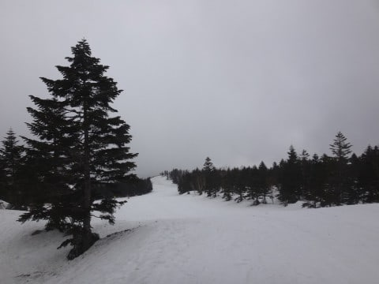
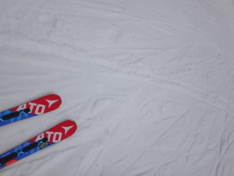
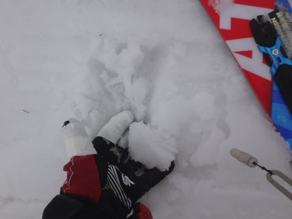
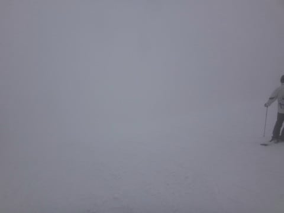
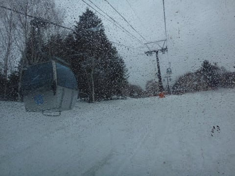
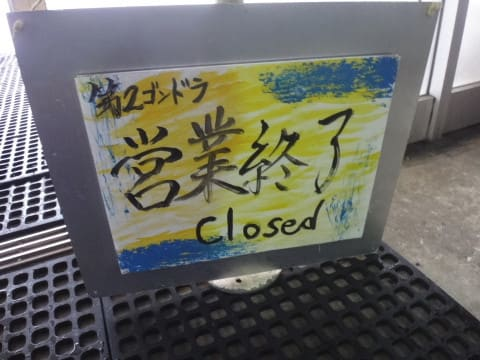

# うぎゃー！日曜にスキーに行けない…ってことで，4月8日土曜午後だけ，突然に志賀高原へ

📅 投稿日時: 2017-04-09 03:35:30

🏷️ カテゴリ: [2017スキー滑走日記](c7d777cecfc91bdf0fa464ad62c6d49ab.md)

ということで．

本来なら，今週末は．

土曜にとある用事があって，日曜日帰り予定だったのですが．

…だったのですが．

本日朝．

その，とある用事についての衝撃の連絡が！

「本日は都合が悪くなったので，日曜に変更します～」

…

…え？

えええええっ！！！！？？？

ちょっと待て～っ！！

ってことは．

明日の日曜，スキーに行けないってこと？？

今週，焼額営業ラストウィークなんだけど？？

[昨年も焼額営業ラストウィークはスキーに行けなかった](d20160401.md)ので．

2年連続焼額ラストウィークを逃すことになるんですけど！？？？

今は，朝8時．

今日の予定はキャンセルになったんだから，

これから焼額に向かうか？？？

という，危険な思いが脳裏を横切りましたが．

…しかし．これから全力で志賀高原に向かっても，

到着は12時半…

ヤケビ営業終了までの3時間半滑るだけのために，

往復9時間運転していくなんて．

史上最高の馬鹿野郎じゃないとやらないよな．

…うん．そんなことするの，史上最高の馬鹿野郎だよな…

…と，思っていたのですが．

なぜか気が付いたら．

12:10には焼額のゲレンデに立っていました…

…いやー．

なんだか最近．

意識を失っているうちに第2ゴンドラ前に立ってることが

多いなぁ…

きっと．

焼額に今シーズン最後のお別れをせねば…！

という強い思いが．

何かの奇跡を起こして，ゲレンデに立たせて

くれたに違いありません！←違う．断じて違う！

＃…しかし，車で普通に走れば12時半を過ぎるはずが．

＃12:10にゲレンデに着いていたんだから．

＃かなりいろいろな奇跡を起こしたに違いない…

…しかし．

ゲレンデは．

完全に春の雪ですね…（涙）

ただ，ザブザブで板が潜っていく…

という雪ではなく．

ちょっとネットリとしたクリーミーな

感じの雪にとどまってはいましたが…

でも．ちょいと滑りが悪い雪で．

さらに．

コース上半分．

かなりのガスが…（泣）．

雪が荒れててるのに，バーン状況が見えないので．

かなり滑りにくいんですけど…（かなり残念）．

でも．

まぁ．

リフトやゴンドラはガラガラ飛び乗りだし．

まぁ，良しとしておこう…

と，思っていたら．

追い打ち．

3時半ごろから，ポツポツ雨が…（激烈涙）

なんてことだ…！！！

残念だ…

残念だよ…（泣）

私にとっての焼額今シーズンラストデーが．

こんなよろしくない終わり方になってしまうとは…

かなり残念…（涙）

しかし．

それでも．

今シーズンも40日以上通った，

わがホームゲレンデの焼額．

「あぁ…ラストウィークに滑れなかったか…

焼額のゲレンデと，お世話になったスタッフの皆さんに，

お礼としばしのお別れを告げられなかったか…」

と，かなり落胆しましたが．

気を失っているうちにゲレンデに到着していた

という奇跡のおかげで．

無事ラストウィークに滑ることができたので．

自分としては満足だよ．

うん．

満足だ…

ラストデーに滑れなかったことはちょっと心残りではあったけど．

焼額ファイナルウィークのゲレンデ詳細レポートは，

また明日～！！

## 💬 コメント一覧

### 💬 コメント by (横須賀のウルトラセブン)
**タイトル**: お会いできなくて残念！
**投稿日**: 2017-04-09 06:32:01

極楽さんブログにお邪魔してますセブンです。お会いできなくて残念～まさか昨日午後からヤケビで滑っていたとは～僕は１１時ころまでヤケビで滑ってました。極楽さんと徒然さんがラストヤケビに来てないなんて・・・と心配してましたがお見事！その誰にも真似のできないスキー魂・ヤケビ魂・シマシマ魂～ほんと好きです！(笑)僕は今シーズン終了ですが、まだまだ続く徒然さんのスキーブログ楽しみにしてますよ～！！

### 💬 コメント by (はなげ親分)
**タイトル**: お、お～
**投稿日**: 2017-04-09 07:37:13

すごいっ！

私も土曜日半日日帰りの思いがよぎりましたが、後一歩が踏み出せませんでした。

最後の一線を越えられるかどうかがお札の色の違いなのでしょうか・・・（笑）

### 💬 コメント by (Lombard)
**タイトル**: これで終われます
**投稿日**: 2017-04-09 08:38:02

こんにちは。

Sさん、kasayanの天気予報のおかげで踏ん切りがついて、昨日志賀におりました。

焼額か、熊・横手で迷いましたが、イチゴンが止まっているようで、結局熊・横手で半日滑りました。雪の状況は焼額と同じようだったと思います。

途中、移動の関係で雪が汚れているところに入ってしまい、板が汚れたようで、その後の板の滑りが悪くなってしまいました。

多分これが今シーズン最後になると思いますが、やっと”まあええわ”ってコンディションなのでスキーが終われます。（今までのいいコンディションでは終われませんでした）

今後ともよろしくお願いします。

### 💬 コメント by (かず)
**タイトル**: 今週はやめです
**投稿日**: 2017-04-09 09:56:11

ほんと凄いです　なんか来週末も気温が…このまま終了は避けたい

### 💬 コメント by (FCAMEL)
**タイトル**: Unknown
**投稿日**: 2017-04-09 12:14:06

神奈川から雨の志賀に半日日帰りですか・・・（絶句）流石です。。

### 💬 コメント by (まいる)
**タイトル**: こちらは
**投稿日**: 2017-04-09 15:06:35

Sさん、お疲れさまです。

半日のために焼額山に行かれるとは・・

こちらは予定どおり、土曜日にかぐら、日曜日に丸沼でした。

かぐらは雨にはならず時おり晴れ間もあり、暑かったけど、コンディションはまぁまぁ

丸沼はザアザア雨が降るなか、一緒に行った仲間は滑らず、私は試乗会があって滑ってました。雨の中、丸沼の駐車場はほぼ満車で、たくさんの方が滑ってましたが

### 💬 コメント by (michi)
**タイトル**: 凄すぎます
**投稿日**: 2017-04-09 20:31:11

Sさま

往復9時間の運転、半日滑るため、、、

やっぱり神ですね。

### 💬 コメント by (yama)
**タイトル**: 終わった人
**投稿日**: 2017-04-09 21:05:42

大人の事情とは言えご苦労様です。さらにもう１人日帰り志賀２日した人がいました。２人とも終わった人に決定だと思います。mae様と２人で確認しました。この天気で親分は不在でした。来週は日曜日日帰りです。会えるでしょうか？

### 💬 コメント by (しんちゃん)
**タイトル**: スゴイ能力ですね。
**投稿日**: 2017-04-09 21:13:06

気が付くと２ゴン前、というスゴイ能力ですね。

ヤケビラストウィークお疲れ様でした。

私は今シーズン、片道5時間かけて、極寒のほぼ貸し切り状態のヤケビナイター１：３０だけ滑って、再び5時間かけて帰ったという、とんでもなく馬鹿げたことをしてしまいました(*_*;

たぶん2度とできない（しない）と思います(+_+)

### 💬 コメント by (mamiko)
**タイトル**: いつも読ませていただきました
**投稿日**: 2017-04-09 21:40:31

私をスキーに連れってを見て以来、一度は行きたかった焼額。それが今年の1月23～25日に行くことが出来ました。感動～は、雪が多すぎて圧雪が間に合わずのゲレンデでした。

そんな中毎週志賀高原に通っている徒然スキーヤーさんのコメントを見つけ、毎週毎週楽しく読ませていただきました。ありがとうございました。

### 💬 コメント by (KENKEN)
**タイトル**: コメントしようが・・・・・
**投稿日**: 2017-04-09 21:58:20

やるかもとは思っていましたが・・・・・

凄いの一言です。

感動？のあまり泣きそうです。

### 💬 コメント by (肥満なスキーヤー)
**タイトル**: 素晴らしい中毒っぷり！あっぱれ！
**投稿日**: 2017-04-09 22:12:45

自分は1ヶ所だけではないので、さほど熱烈さは有りませんが、いつまでも諦めきれず“月山”等雪の有るところをさ迷い続けていまして、今日は会津の猫魔に行きました、来週は奥只見、再来週は蔵王BC、その次は丸沼高原、後は月山です。あっ、ごめんなさい下らない話しでした、今季は志賀高原も大変よかったです焼額も最高、渋峠横手は景色がよかったですね。又来年が楽しみ&待ち遠しいです。

### 💬 コメント by (Goku)
**タイトル**: 入れ違い
**投稿日**: 2017-04-09 23:39:02

私は１１時頃まで焼額山にいましたが、そのあと一の瀬方面に移動していました。

それにしても、日帰りはもう驚きませんが、３時間半のためにってのはビックリ仰天です。

そのうち焼額山にＳさんの銅像が立つかもしれません。

### 💬 コメント by (Unknown)
**タイトル**: Unknown
**投稿日**: 2017-04-10 09:46:49

今週は別の用事が・・・と言っていたはずなのに、

何故か早朝の高坂 SA で待機している Skier_S 氏を幻視しました。

「両方とも準備をして中間地点で連絡待ちです。

予定が変更になったら速攻で焼額に行かなくては・・・」

4/10 から閼伽流山トンネルの補修工事が始まるようです。

### 💬 コメント by (Skier_S)
**タイトル**: コメント回答遅れました…
**投稿日**: 2017-04-11 08:21:11

＞横須賀のウルトラセブンさま

コメントありがとうございます～

まさか土曜午後からヤケビで滑っているとは，

自分でも思ってませんでした（笑）

今シーズン終了ですか…

また来シーズンお会いしましょう！

＞はなげ親分さま

最後の一線を越えられるかどうかが，

宗教になるかどうかの違いなのかと（笑）

いろんな意味で教祖様になれそうな

今日この頃です．

＞Lombardさま

最終週は，2ゴン＆2高のみの運転なので…

イチゴンが動いてないのが残念でした．

これでシーズン最後ですか…

まだGWまで雪はありますけど（笑）

また来シーズンお会いしましょう～！

＞かずさま

今週は滑らなくて正解だと思います…

先週までが良すぎましたね…

＞FCAMELさま

いや…

自分でもあきれてます．

でも，雨が降ったのは最後のちょっとだけだったので，

それが救いでしょうか…

＞まいるさま

丸沼，雨なのにいっぱい滑ってたんですね！

信じられない…

雪も悪いのに…

しかし，これからはこんな雪が続くんでしょうね（涙）

＞michiさま

いや，しんちゃんさんのように，ヤケビナイター1:30だけのために

往復10時間運転する人もいますから…

私なんて甘いものです

＞yamaさま

もう，今回はホントに大人の事情でした（涙）．

今週末は，ちゃんと土日滑る予定です～！

＞しんちゃんさま

…ヤケビナイター1:30だけのために往復10時間ですか…

これはある種の記録ですね…（感動）

私の馬鹿さ加減を激しく超える，

キング・オフ・スキーバカではないでしょうか…（笑）

＞mamikoさま

焼額は，新雪もいいですけど晴れてきれいに圧雪された日も

ぜひ滑ってみてください．

来シーズンもまた，志賀高原にいらっしゃることを

おススメしておきます～！

…週末に焼額を滑っていれば，かなり高い確率で私を

見かけることができると思います（笑）．

