# 4月の1か月予報が出たけど…ダメダメ高温な4月になりそう(涙)．

📅 投稿日時: 2024-03-29 01:42:22

そういえば．

昨日の夜の焼額のライブカメラを見て

気づいていたのですが．

どうやら，そろそろ4月という時期に

なってきたというのに．

気温が冷えた昨日の夜，焼額は人工降雪を

打っていたらしいです…！！

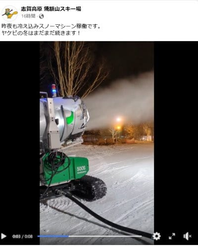

（[焼額山スキー場Facebook](https://www.facebook.com/yakebitaiyama/videos/%E6%98%A8%E5%A4%9C%E3%82%82%E5%86%B7%E3%81%88%E8%BE%BC%E3%81%BF%E3%82%B9%E3%83%8E%E3%83%BC%E3%83%9E%E3%82%B7%E3%83%BC%E3%83%B3%E7%A8%BC%E5%83%8D%E3%81%A7%E3%81%99%E3%83%A4%E3%82%B1%E3%83%93%E3%81%AE%E5%86%AC%E3%81%AF%E3%81%BE%E3%81%A0%E3%81%BE%E3%81%A0%E7%B6%9A%E3%81%8D%E3%81%BE%E3%81%99/772926594800643/)より）

すげぇなぁ…

もう4月というこの時期に，ガンガン

人工雪を打ってまで春営業をなんとか

伸ばそうとするこの努力…！！

願わくば，この努力が実ってGWまで

滑れますように…

ただ．

そんな祈りもむなしく．

志賀高原は，本日午後6時ごろから

液体が降り始めたようです（涙）

蓮池や志賀第3トンネルを見ると，

降り始めから雨だったようだけど

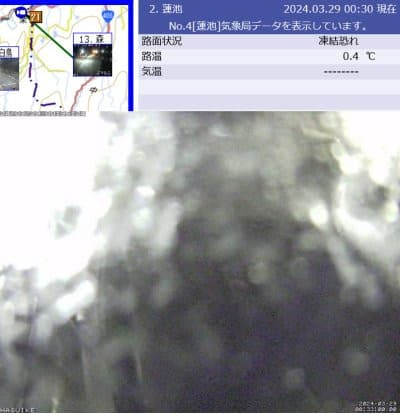

（[北信建設事務道路気象状況カメラ](http://hokushin.pref-nagano-roadcamera.jp/)より）

でも，焼額のライブカメラを見ると，

夜8時くらいまでは雪っぽくて，

うっすらと雪が積もってるのが見えて，

液体じゃなく固体だ！！

と喜んでいたんだけど…

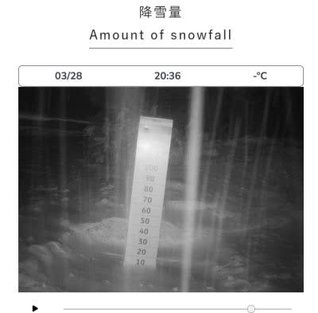

（[焼額山スキー場ライブカメラページ](https://www.princehotels.co.jp/ski/shiga/livecamera/)より）

深夜1時現在，なんだか焼額の

ライブカメラも雨っぽくなってきて．

標高の高い硯川も，完全に雨になってます…（泣）

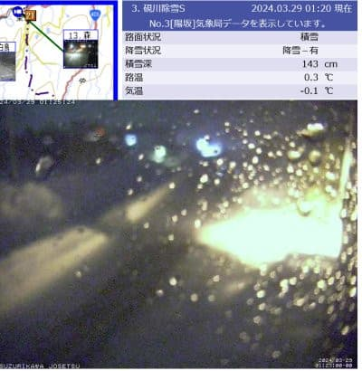

（[北信建設事務道路気象状況カメラ](http://hokushin.pref-nagano-roadcamera.jp/)より）

うーん．

山頂付近はまだ雪だと信じたいところだけど…

天気図を見る限り，それは期待薄．

じきに山頂まで雨になるでしょう…（激泣）

この雨は，明日の昼頃まで降り続け．

今回はそのあと雪になることなく，

雨でぬれた雪のまま週末に突入します（涙）

だめだ…もう，春ですね…

私の一番嫌いなシーズンがやってきました（泣）

で．

本日は木曜日．

気象庁の1か月予報が出る日です！！

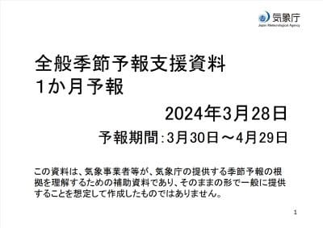

ってなことで．

今回はちょうど4月1か月くらいの予想が出るタイミング．

果たしてこの4月やいかに…？？

…と，見てみると．

うぎゃーーーーーー！！！

ダメだ～！！

第1週は気温が高い確率80％？？

第2週も70％？？？

さらに3-4週目も50％の確率で

気温が高くなるってことなので．

この4月，気温が高すぎるんですが…（激涙）

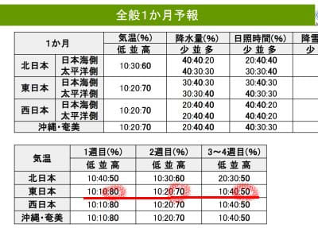

それも，気象庁から早期天候情報が

出るくらいの高温のようで…

[気象庁の早期天候情報のページ](https://www.data.jma.go.jp/cpd/souten/)を見にいくと．

4月4日以降の高温の注意が喚起されてます（泣）

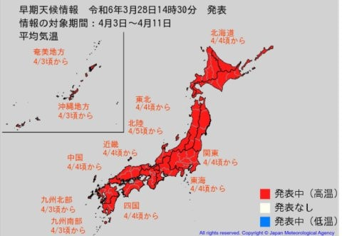

そして，一か月の気温傾向を見ると…

ダメだ．

ダメすぎる…

4月末まで，平年比2～4℃高い日が続き，

4月の1か月間，気温が下がる気配がない（泣）

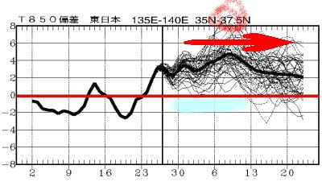

それも，水色で塗った部分細い線すら

かかっておらず．

気温が最も低いパターンにずれでも，

平年並にすらならないという悲しい

事実．

それどころか，逆に高いほうのパターンにずれると，

赤く丸をしたところのように，平年比+8℃を

上回りかねない勢い（泣）

1か月間の850hPa気温図を見てみても．

水色の平年比+3℃線が志賀を覆っていて…

1か月間平均で平年比+3℃って，

かなりの異常気象レベルの高温ですね（泣）

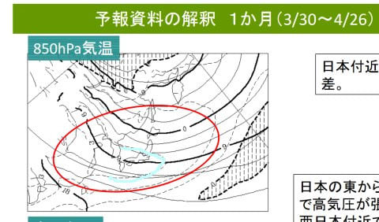

特に，2週目の4/6～4/12にかけては，

水色の+5℃線が志賀にかかっていて…

この1週間，平年より平均で5℃も高い

という，異常高温状態（涙）

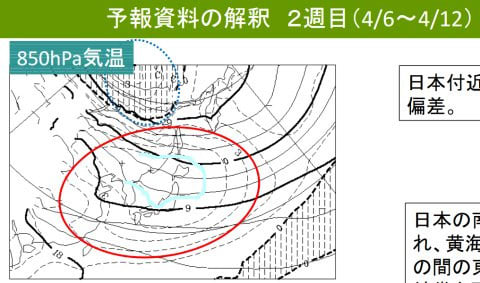

ダメだ…

この4月は，ダメすぎる…（激泣）

あぁ…せっかく3月が良くて，GWまで

もつかも？？？

…と，期待したのに．

また4月になると，平年よりずっと気温が

上がってしまうようです（泣）

あぁ…残念…

そして．

今週末も，今日から明日午前まで降り続ける

雨の後の雪そのままで週末に突っ込みそうだし．

土日とも気温がぐっと上がるし．

さらにそのうえ，追い打ちをかけるように…

[気象庁の黄砂情報ページ](https://www.data.jma.go.jp/env/kosa/fcst/)を見に行くと．

この週末，見事に黄砂直撃　（涙）

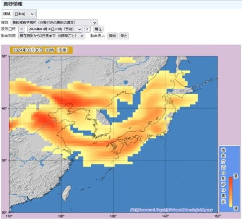

まぁ，高温になっても晴れてくれれば

まだ春スキーとして楽しめるか…

と思ったら．

ヘタすると，黄砂で全く滑らない雪に

なっちゃいかねないこの週末．

高温，ザブ雪，そして黄砂のトリプルパンチに

なったら…

さすがの私も，リフトストップまで滑り続ける

自信はないんだけど（泣｝

果たして．

今週末は予想より冷えて，ちょっとはマシな

コンディションになるのか？

それとも，黄砂にやられてゲレンデ全面

滑らない雪になるのか…？？

乞うご期待！！！

## 💬 コメント一覧

### 💬 コメント by (モイストシルバー)
**タイトル**: Unknown
**投稿日**: 2024-03-29 22:24:52

この時期の人工降雪機の稼働、凄い執念ですね。昨日の奥志賀の下部第1ゲレンデでは、細長い雪壁？を造成していましたが、来月雪解け以降の下山ルートの廊下になるんでしょうかね？

### 💬 コメント by (Skier_S)
**タイトル**: ＞モイストシルバーさま
**投稿日**: 2024-03-30 00:49:44

いや…ホントにこの時期に人工降雪ってすごいですよね…

奥志賀の土手は，その通りで雪不足の時の廊下です！！

