# 2018年大晦日の志賀高原スキー場は…朝は軽い膝パフ！午前は混んだけど，午後は雪も良くて日も射すスキー日和！

📅 投稿日時: 2018-12-31 23:51:39

なんと．

今日は大晦日じゃないですか！！

…あまりにもいつも通りに

スキーをしているので．

とても大晦日とは思えないのですが…

そんな大晦日の焼額山．

本日も朝イチの第1ゴンドラに並びますが．

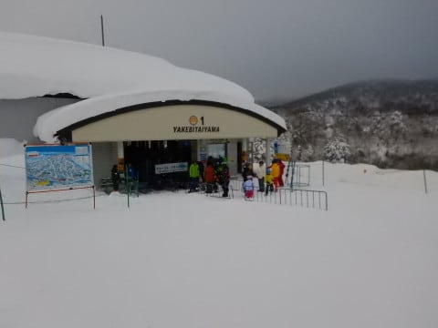

…今日は並んでる人，少ないですね…

んで．

朝イチゴンドラで山頂に上がると…

気温は-12℃！

いや．

今日も冷え冷え！

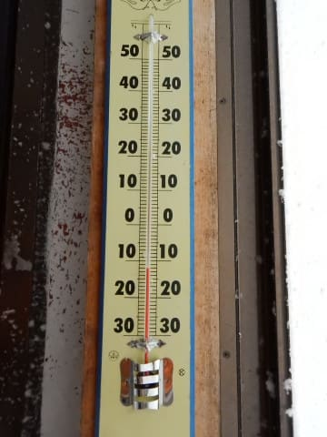

いやーーー．

12月上旬から中旬にかけて踊り続けた

冷え冷え踊り．

効いてますね～！！←今になって効いてるって，時間差ありすぎ…

朝の山頂の天気は曇り．

でも，雲が薄いのか，明るめの曇り空です…

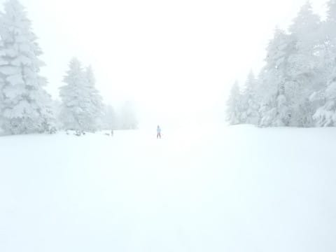

で．

コース上は，冷え冷えやわらか新雪が圧雪された，

ふわふわバーン！！！

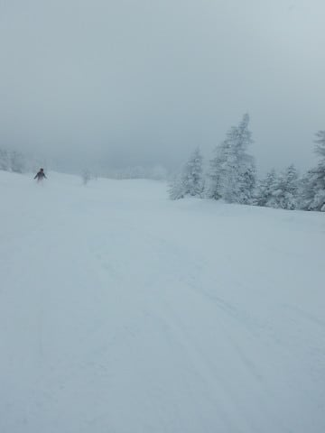

今朝も新雪が積もったようなので，

太い板で出動です．

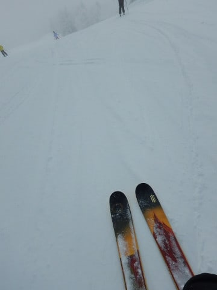

そして．

当然，新雪狙いのオリンピックコースへ飛びこむと…

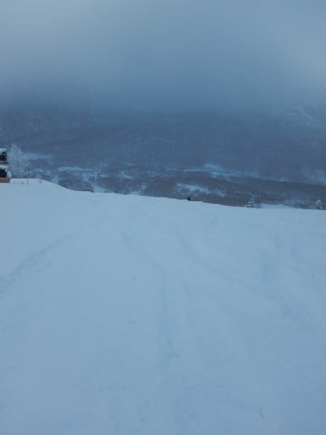

今日も脛～膝パフの，軽い新雪！

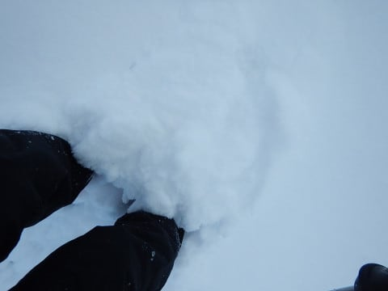

今日の雪は，昨日より軽いよ！

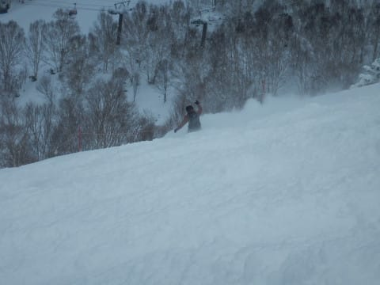

あさイチの一本は…

うはーーーー！！

パフパフ最高！

軽くてものすごい雪煙が上がる！！

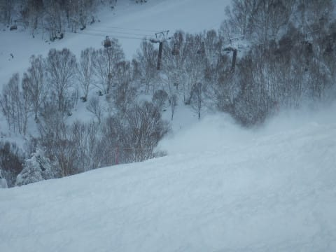

それほど雪は深くないけど，軽くて

かっ飛ばせる最高パウダーバーン！

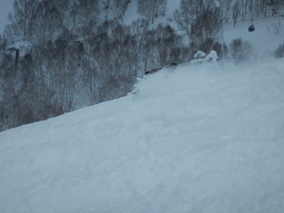

…ってな感じの最高バーンを楽しむこと，

数本．

うーむ．

そろそろ全体が踏まれちゃったかな…

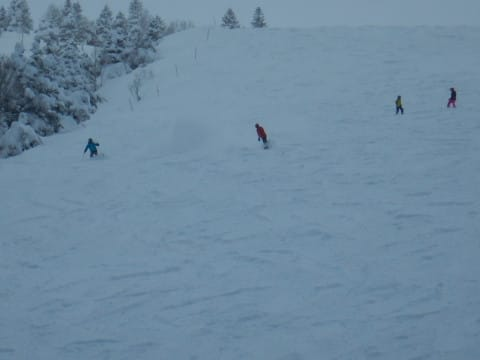

でも，まだコースの横の方はパフパフ！

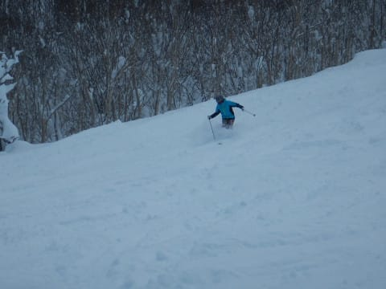

と，思っていたら…

オリンピックコース．

なんだかかなり人が増えてきて．

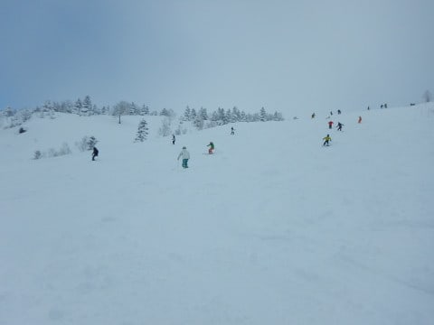

…これだけの人に踏まれると，

さすがにもう新雪は楽しめないな…

と．

1時間ちょいで，新雪のオリンピックコースを

脱出し．

圧雪のGSコースへ移動してみますが…

やっぱり，こちらも人が多いな…

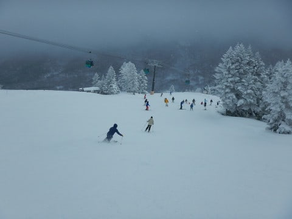

圧雪コースも，冷え冷えやわらか最高雪質で，

すごく滑りいいのですが．

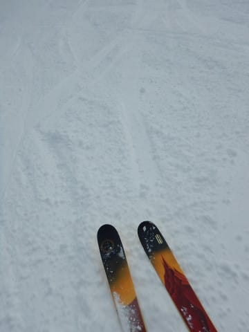

でも，コース上の人口密度が…

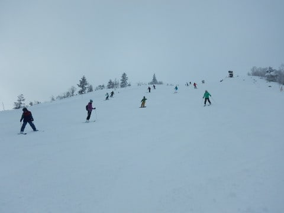

ちょいと高すぎるよな…

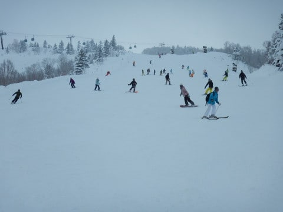

と，思っていた午前10時過ぎ．

うぎゃーーー！！

なんだ，この列はっ！！

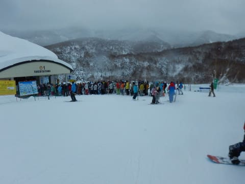

この後，もっと列が長くなり．

最長10分待ちまで行ったようです…（涙）

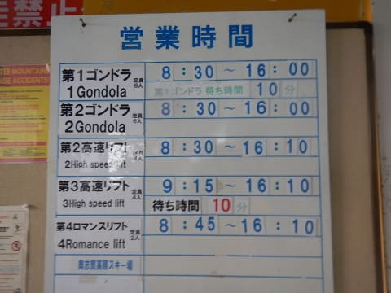

でも．

第3高速も一瞬ゲートを超えるくらいにまで

並んだものの．

そんなに待ちなく乗れましたし．

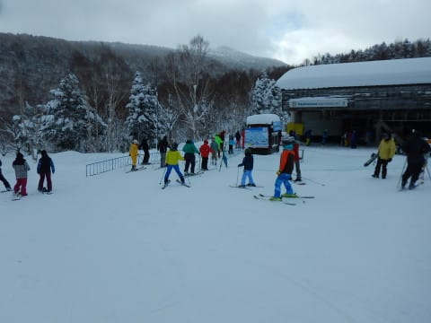

第2高速もこの程度の待ちだったので．

まぁ許せるかな…←だから，どうしていつも上から目線？

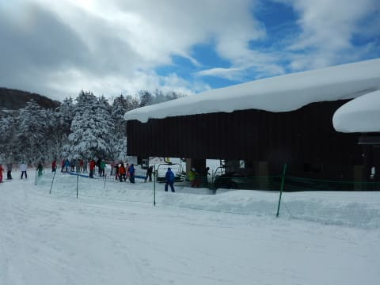

で．

第1ゴンドラの混雑も．

11時半には終わって，

この程度になってたので．

混んだのは，1時間弱でしょうか…

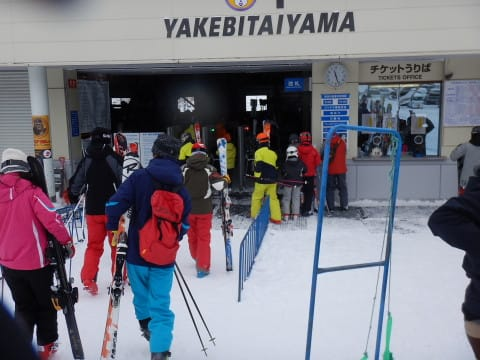

って感じで．

ゴンドラ待ちはなくなったけど．

午後になっても，ゲレンデの人口密度は

相変わらずちょい高め．

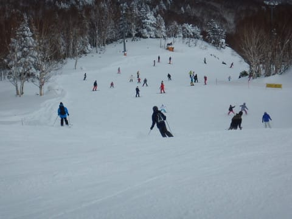

だけど…

午後になると，雲が切れ始め，

空が明るくなり始めて来ましたよ！

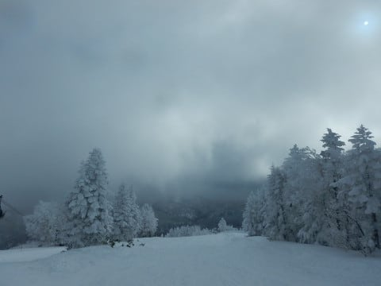

…そして．

ををををを！

久しぶりの青空だ！

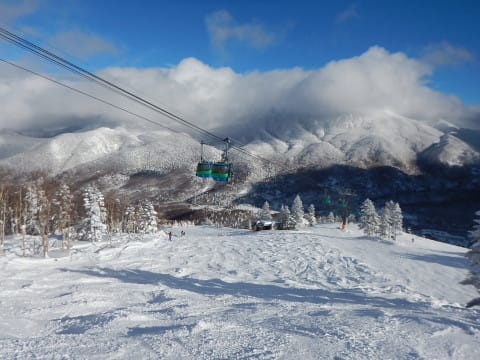

すごい久しぶりの，太陽の下の

スキーだ！！

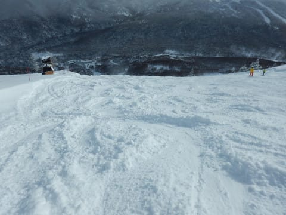

太陽が出ているにもかかわらず．

昼間の最高気温は-9℃と低めで…

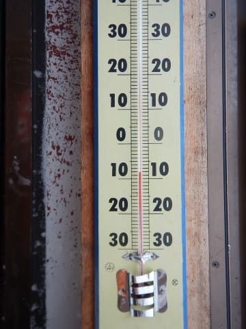

コース脇は，冷え冷え軽い新雪が

まだ残ってます．

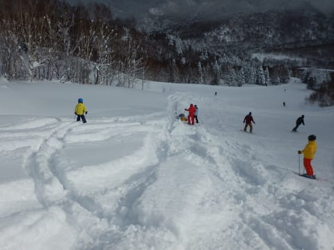

…日が差して．

ゲレンデがちゃんと見えて．

そして，雪質はやわらか最高と

来れば…

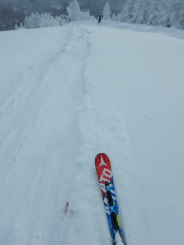

もう，なんて最高のスキー日和なんでしょうか！！

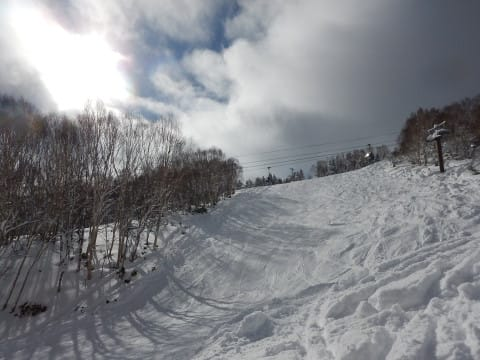

午後も，すっきり晴れ続けたわけでなく．

曇ったり晴れたりの天気でしたが…

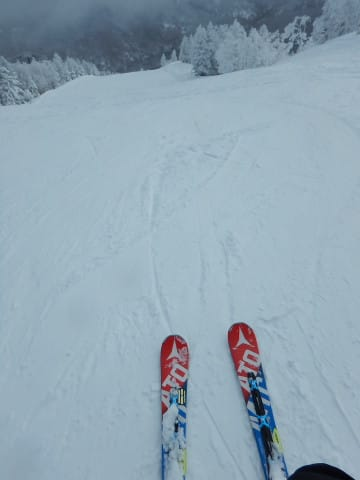

でも．

昨日までの

「雪はあるけど，寒くて吹雪いて見えなくて死ぬ」

というコンディションから比べると．

…もう，天国…っ！！

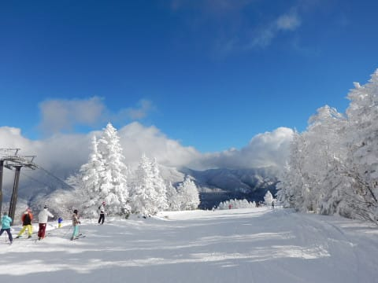

ってな感じで．

ラストは完全こぶ斜面になった

オリンピックコースを攻めて．

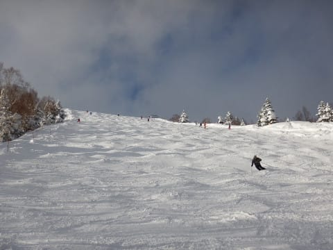

今日もしっかり午後4時のラストゴンドラまで

滑ったのでした…

いやーー．

終日吹雪の昨日とうって変わって，

午後は天気も回復したし．

朝イチパウダーも楽しめたし．

今日はいい一日だった…

…というわけで．

2018年も終わっていくわけですが．

大晦日の夜．

ナイターが終わった後に行われる

松明滑走に参加して…

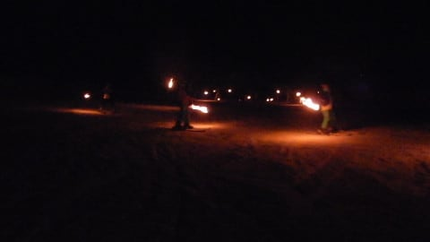

過ぎ去る年を見送る，

Skier_Sなのでした…

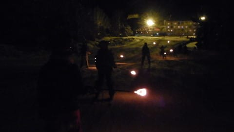

ということで．

いろいろあった2018年も終わっていきます．

今年もお世話になりました～！

## 💬 コメント一覧

### 💬 コメント by (Goku)
**タイトル**: 初日の出は・・・
**投稿日**: 2019-01-01 08:16:35

あけましておめでとうございます。

今年もよろしくお願いいたします(^^)v

それにしても、ド・ピーカンの元旦ですね。

ＦＴでは初日の出を拝むことができたことでしょう。

うえ～ん、滑りたいよー(T_T)

### 💬 コメント by (ほっぽ)
**タイトル**: 昨日はありがとうございました
**投稿日**: 2019-01-01 16:42:12

Ｓさん

昨日は志賀高原３日目にしてやっとご挨拶できました。

ゴンドラ乗り場で見かけたので相乗りレーンから無理やり？合流しました。

昨年はお世話になりました。今年もよろしくお願いします。

私は１／４から志賀高原に戻ってきます。

http://www2.tokai.or.jp/nana_hoppo/

### 💬 コメント by (ホンダ)
**タイトル**: 今日はサイコー
**投稿日**: 2019-01-01 19:28:05

今日の元旦ファーストはサイコーでしたね。数年に一度の御来光でしたね。娘さんにはまいりました。あのあと奥志賀ファーストトラックやりました。またまたサイコーでした。また明日お会いしましょう。

### 💬 コメント by (アズマです)
**タイトル**: 明けましておめでとうございますー
**投稿日**: 2019-01-01 22:04:52

今年も宜しくお願いします

我が家も4日から志賀高原入りします🎵

１週間東館にstayって聞いたような気がしますがまだいらっしゃるかな？

レポ毎日楽しみにしてまーす

### 💬 コメント by (しんちゃん)
**タイトル**: 晴れたゲレンデ
**投稿日**: 2019-01-01 23:23:39

あけましておめでとうこざいます。

久々に晴れたゲレンデの画像を拝見しました。

やっぱりヤケビの晴れた空はいいですね！

今年もよろしくお願いします😄✋

### 💬 コメント by (Skier_S)
**タイトル**: あけましておめでとうございます
**投稿日**: 2019-01-01 23:37:27

＞Gokuさま

この元日は最高でしたよ…！！

初日の出もきれいに見れました～！

また3日の参戦をお待ちしています！

＞ほっぽさま

お会いできて良かったです…

しかし，昨日帰られたのは惜しかった．

今日まで滞在すれば…

私は4日は家ですので，5日にまたお会いしましょう！

＞ホンダさま

いや…

ホントに最高の初日の出だったし，

最高のゲレンデコンディションでしたね．

…ストックを落としたのが痛恨でしたが…

今年はいい年になりそうです．

また明日お会いしましょう！

＞アズマさま

今年もよろしくお願いします～．

志賀には3日まで滞在して，その後5，6日は

またYamaさんと1泊2日です．

また5日にお会いしましょう！

＞しんちゃんさま

あけましておめでとうございます～！

いや，今日はさらに良かったですよ！

早くゲレンデに復活してください…

お待ちしています～！

