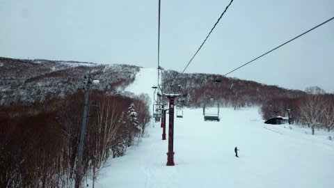
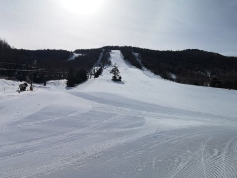
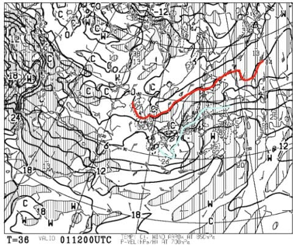
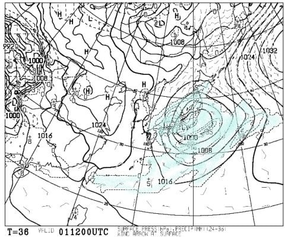
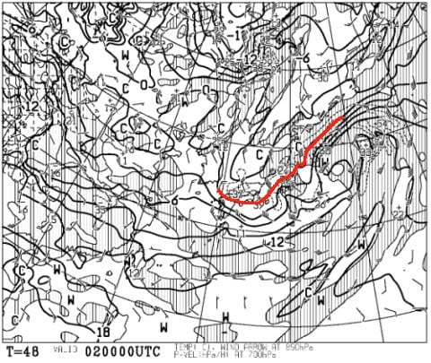
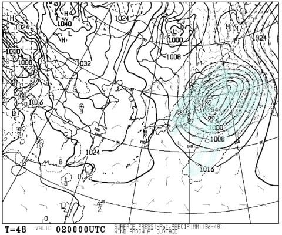
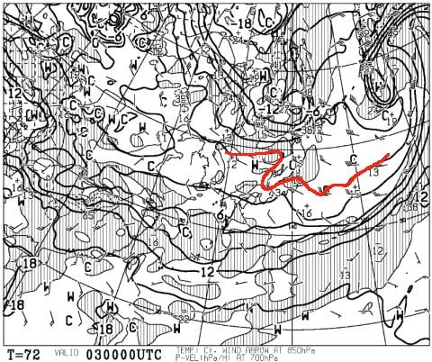
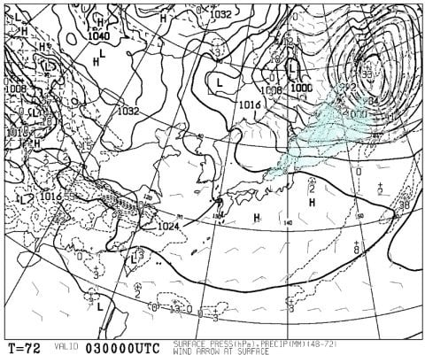

# 今週の志賀高原の天気は…1日は高温のものすごい雨（涙）．でも，2日は冷え冷え雪降り！

📅 投稿日時: 2020-04-01 01:08:11

🏷️ カテゴリ: [日記](cc4b5682fb7b8b144980957a978653fb0.md)

ということで．

いろんな不穏なニュースが飛び交っている

今日この頃．

昨日は更新が無く，

「Skier_Sはスキーできなくて死んだのか？？」

と思った方も多かったと思いますが．

本来は強制在宅勤務になった，私の給料を

出してくれる某組織ですが．←普通に勤務先って言おうよ

年度末は出社しないとできない

仕事が山積しており，

なぜだか私を含む数人は，

月・火と普通に出社（涙）．

…だもんで，月曜はいつも通り夜中まで仕事して，

深夜に帰宅後，またBlog書きかけで机に

突っ伏して寝てしまったという，いつもの

パターンでした…（涙）

そして今日も安定の深夜帰宅＆深夜更新

パターンです（泣）

で．

この，月・火の志賀高原ですが．

特派員情報によりますと，

月曜朝のうちは，日曜に積もった雪が圧雪された，

いい感じのコンディションだったようですね！

とはいえ，午後はゲレンデのそこかしこで

滑らない雪になり，ちょっと苦労したようですが…

そして．

本日も，朝早くはいい感じだったみたいですけど．

朝から気温が高かったので，

すぐにゲレンデ全面，妖怪板掴みが

大量発生していたようです…（涙）

ってなわけで．

雪不足＆コロナウイルスのダブルパンチ状態の

現在，実質スキーシーズンが終了している人が

ほとんどのような気がしますが．

一応，まだGWに望みをつなぐために．

これから週末にかけて，雪が積もるのか

どうかの予想をしてみたいと思います…！！

まず，4月1日（水）の850hpa図を見てみると．

うううううーむ．

赤い0℃線ははるか北海道まで北上し．

志賀高原には，水色の+6℃線が近づいてます…

これは，昼間+10℃近くまで，かなり気温が上がりそう（涙）

で，1日夜9時の地上天気図を見ると…

降水域がしっかり日本全域を

覆ってますね（泣）

ダメです．

明日，水曜は．

朝からかなりの高温の，本降りの雨に

襲われそうで．

かなりの壊滅的ダメージを受けそう…（激泣）

そして．

2日（木）の850hpa図ですが…

をを！この日は赤い0℃線が志賀より南に

下がってるよ！

そして，地上天気図は…

うむ．志賀高原にも降水域がかかってますので．

この日は朝から雪降りの天気です！！

水曜降り続いた雨は，真夜中から明け方ごろに

雪に変わり．

2日は一日中雪が舞う天気になりそう…！

1日の雨で溶けた雪をリカバーしてくれるほど

降ってくれると嬉しいんですが…

そこまでは積もらなさそう（泣）

続いて，3日(金)の850hpa図ですが．

うーむ．

この日も，ギリギリ赤い0℃線は志賀より南．

そして，地上天気図は…

ごくわずかに日本海側に降水域が

予想されているので．

まぁ，金曜は明け方まで雪が降ってるかな…

リフト営業開始のころには止んでいて，

曇り空になりそうか…

ってなことで．

まとめると．

1日(水)：朝から雨．朝からプラス気温．

　最高気温は+10℃くらいまで上がり，

　この日は終日雨．時々かなりの本降り．

　高温でひたすら雨の一日なので．

　雪はかなりやられそう…（涙）

　この日は滑りに行こうと思わない方が吉．

2日(木)：前日から降り続く雨は，

　深夜～早朝にかけて雪に変わり，

　あさイチは重い雪が数cm，運がよければ

　10cm近く積もる．

　あさイチの気温は-3～4℃くらい．

　昼間も気温はマイナスをキープし，

　雪は終日降り続け，昼間のゲレンデは　

　急斜面は硬い下地，その上に重い春雪

　といったコンディションになっていく．

3日(金)：この日の明け方まで雪が降り続く．

　あさイチの気温は-2～-3℃で，カリカリした

　感じの圧雪バーンの上にうっすら新雪．

　この日の天気は曇り時々日も射す．

　昼間は+3℃くらいまで上がり，

　日が射したら雪は一気に緩む．

ってな感じでしょうか…

これ以降，週末の土日は，やっぱり予想通り

そこそこ冷えそうです！

土曜は雪がぱらつく天気で，

日曜は晴れかな～．

とりあえず．1日の高温＆どしゃ降りで，

かなり雪が解けそうなのが心配だけど．

そのあとは，２日～5日までは，

ちょっと冷えてくれそう！！

後は，どっさり降ってくれれば文句

ないんだけど…←いや，文句ないどころか，そこまで逝けば最高じゃないですか…！？？

## 💬 コメント一覧

### 💬 コメント by (西館)
**タイトル**: 生きてた良かった
**投稿日**: 2020-04-01 01:17:30

「死にました白い粉見られなくて」ってのが今日の記事かと思ってどきどきしていました。

4月1日だしね。

### 💬 コメント by (新米パパさん)
**タイトル**: Unknown
**投稿日**: 2020-04-01 09:46:21

志賀高原を盛り上げるべく、スキー以外も志賀高原に行くようにします。

蛍も見れる？なんて、素晴らしい。

奥志賀グランフェニックスも安く泊まれるみたいだし！

### 💬 コメント by (レインボー)
**タイトル**: Unknown
**投稿日**: 2020-04-01 12:14:22

水曜日の志賀高原情報

朝一、1ゴン待ちは６人のみ。まずはＧＳ、ファーストだ。パノラマもファースト。カラマツもファースト。

オリンピックは閉鎖。

奥志賀へ行くと、第４ファースト、ダウンヒルもファースト。どうなってるの。幸せ過ぎる。第二、第三リフトが強風ストップなので、バス回しを決意して第三、エキスパートへ。超不運なことに(欲張りじじい！)、ここは杉山さんの勝ち。

九時15分のバスで一の瀬へ。ファミリーリフトが超超強風でも動かしてくれてるのに感心！　ファミリー、パーフェクタを気持ち良く滑走(自己満足ですけどね)。気温はプラスだけど、体感は寒すぎ。やけびを目指すも、ダイヤモンドに搬器がない！　慌ててバス停へ行くや、なんという幸運か。すぐにバスが。10時03分のバスで1ゴンへ。なんと、動いている。ついてる。ＧＳ一本滑ってギブ。

自作の、山菜おこわ、マカロニサラダで早すぎ旨すぎ(またまた自己満足でーす)昼食をしていると、ゴンドラストップの放送が！　生き残ったのはニ高のみ。

今日の滑りではなく我々の動きに大満足して、イレブン帰りをしたのでした。

### 💬 コメント by (かず)
**タイトル**: Unknown
**投稿日**: 2020-04-01 14:22:24

レインボーさん雨なのにさすがです ftざんまい！笑 予報はそんなに強風ではなかったですがゴンドラ全停止みたいですね…

自分のほうは地元も感染者増えてきてるし  これからゲレンデに人が集まって来そうなので 現状ここで終了かな？って思ってます 3月ミラクルパウダー楽しめたし！

本日来期の板 急遽1枚目オーダーしました！無試乗ギャンブルです笑

レアなうえにアメリカの工場がストップのようなので  レインボーさんはもう注文してるようなので安心と思いますが  Sさん決定してるようなら状況は確認しておいたほうがよさそうですヨ

### 💬 コメント by (Skier_S)
**タイトル**: 今日は雪が解けたみたい（涙）
**投稿日**: 2020-04-02 00:41:34

＞西館さま

いや，実際死にかけてます，いろいろ…

年度末・年度初めは忙しいです…（涙）

＞新米パパさんさま

コロナウイルス騒ぎが落ち着いたら，ぜひスキー以外でも志賀高原に

行ってください！

蛍も見れるし，トレッキングルートもいい感じだし，

登山に適した山もいっぱいあります．

タケノコ狩りもありますし．

いろいろ楽しめますよ～！

＞レインボーさま

いろいろファーストトラックをGetしてきたみたいですね…！

11時前には焼額ゴンドラも止まったみたいなので，

今日の移動パターンはかなりナイスな判断だったのじゃないでしょうか．

午前，雨にならず良かったですね…！

＞かずさま

え？来季の板，もう注文されたんですね…！

スキーでは，アメリカだけじゃなく，ヨーロッパメーカーも

製造がストップし，来シーズンの板が納品できないって

言われてる人もいるみたいです…

