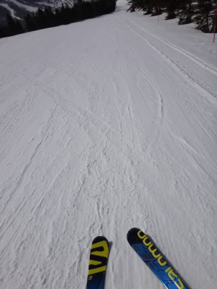

# 4月18日の志賀高原は…晴天なれど気温は低め．この時期としてはまぁまぁ楽しめたかな！

📅 投稿日時: 2015-04-18 21:27:46

🏷️ カテゴリ: [2015スキー滑走日記](c09ea645cfc085f86dfcd80f49599dd89.md)

という感じで．

今日もいつもどおりの志賀高原に来ているわけですが．

…今日は先日の予想通り，終日いい天気の志賀高原でしたよ～！

で．

今朝は，通常営業開始時間，

朝8時半にゲレンデに到着したわけですが…

天気は晴天っ！！

で，気温はプラス3度と．

この時期の快晴の朝としては，低めの気温ですな～

だもんで．

早朝が終わった時間というのに．

ゲレンデは比較的締まっていて．

…それも，カリカリアイスバーンではなく，

表面が適度にやわらかくなり始め，がっつりエッジが効くのに，

下地はしっかりして足場が崩れないという．

ちょうど楽しい感じのバーン状況じゃないですかっ！

うはー．

ぴかぴか晴天だというのに．

早朝営業が終わった時間に，これだけ楽しめるバーン状況を

キープしているとはっ！

…早朝は，きっと．

きっと．

すごく良かったに違いない…（かなり涙）．

でも．午前10時近くまで，かなり気持ちいい大回りを

続けられて．

…早朝営業に来なくても，これだけ締まったハイスピードバーンを

滑れたんだから，いいじゃないか…！！

…と，自分をごまかしてみる（かすかに涙）．

しかしホントに．

この時期の朝10時で，この雪質なら許す．

さらに，晴天日差しの下で，この雪質なら，許す．

日差しがあるのに，空気は割りと冷えていて．

人が少ないのもあって，かなり滑りいいよ～．

ゲレンデの人は，ホントに少なく，

ゴンドラ待ち，リフト待ちも完全に0．

もう，スカスカがらがら，ゴーストタウン状態の

寂しいゲレンデを飛ばしたい放題！

いやー．

昼までは，こんな感じのゲレンデで．

気持ちよく滑れましたよ～っ！！

…でも．

さすがに．

午後1時を過ぎてくると，ちょいと雪は緩んできたかな…

とはいえ．

人が少ないので，荒れない．

ホントに荒れない．

結局．

焼額のリフトストップ時でも，

ゲレンデコンディションはこんな感じで．

シュプールが少なくて荒れてないところを選べば，午後まで

ぜんぜん大回り可能でしたよ～！

結局，この日も夕方までひたすら滑り続け…

最後は，一の瀬のリフトストップまですべり．

一番最後のお客さんとして，パトロールさんに

見守られながら滑った，我が親子だったのでした…

…しかし．

焼額が16時に終わっても

「まだ滑りたい～」

という娘のために．

16時半まで営業している一の瀬に車で移動してまで

追加で滑ったというのに．

「まだまだ滑りたい～」

といい続けていた我が娘を見て．

…やはり，誰かの血を引き継いでいるのだろうか…

と，思わずにいられない，Skier_Sなのだった…．

## 💬 コメント一覧

### 💬 コメント by (いか)
**タイトル**: Unknown
**投稿日**: 2015-04-19 11:08:28

すばらしいコンディションかつ熱意ですね…

笑

私も小さいころから、最後の一本まで滑っていたような気がします。どんどん上手になりそう！

### 💬 コメント by (ひろちゃん)
**タイトル**: コブ頑張った
**投稿日**: 2015-04-19 14:13:02

土曜は、本当に、よいゲレンデ状態でしたね。早朝終わり、奥志賀で、又々コブ三昧、S様のコメント思い出し、右荷重意識、未だ未だコブ奥深い、日帰り温泉湯田中駅の、楓の湯300円発見、とても良い感じ。そして、本日仕事です。（笑う）

### 💬 コメント by (Skier_S)
**タイトル**: コメント回答遅れました…
**投稿日**: 2015-04-20 12:53:49

コメント気づかず、回答遅くなりました…すいません

>いかさま

娘の熱意はなかなかのものですが…

さすがに昨日の雨では「もう帰る」と切り上げたので、

まだ人間だなあ…

と思いました(笑)

>ひろちゃんさま

コブおつかれさまでした！

そして次の日仕事ですか…

お疲れ様です…

楓の湯、うちもよく使います！

露天風呂がもう少し開放的だといいかな～

とも思いますが、安いのでちょうほうしてます。

前の桜が今は満開で、いいですよね～

