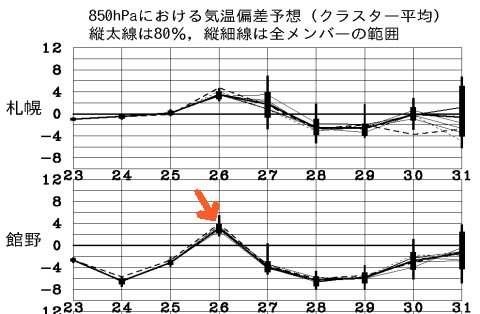
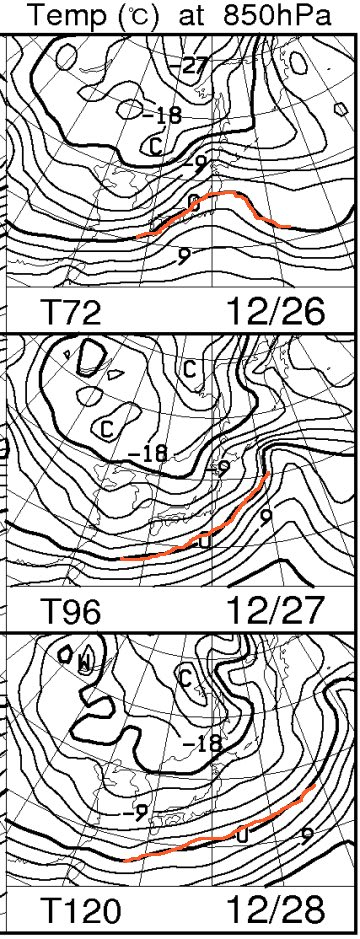
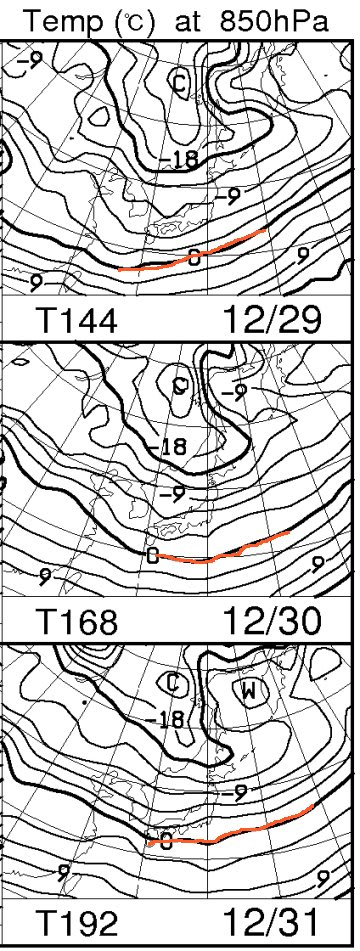
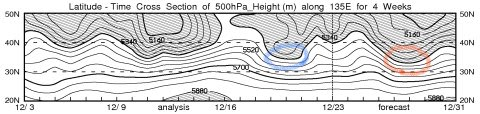
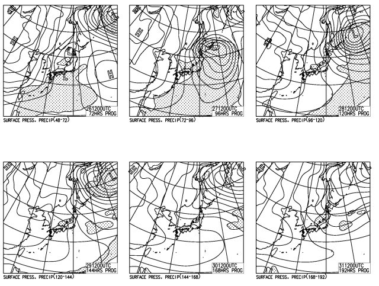

# この年末の天気は…26日は微妙だけど，それ以降は激冷えだなっ！

📅 投稿日時: 2013-12-25 00:53:24

🏷️ カテゴリ: [スキー天気予想](c6554f5c3c106093b511a8daae23757e8.md)

この3連休．

ちょっとショックなことがあり，凹んでいる

Skier_Sです．

＃何があったかは，後日…(涙)．

さてさて．

早いもので．

今週末からもう，正月休みの時期ではないかっ！！

…ということで，正月休みにひたすら山にこもる

スキーヤーにとっては，この正月休みのスキー場の天気が

気になるところ．←正月休み全部山にこもる人はそんなにいないって

とりあえず，12月31日までの週間予想天気図が出ているので．

この年末の天気を予想してみようではありませんか．

えーっと．

（がさがさ）

…なんだ，これは．

赤い矢印をした26日だけ，平年よりちょっと高めに気温が上がるけど．

それ以外は平年より4-6度くらい低い日が続くではないか？？

この年末，むちゃくちゃな冷えが続くみたいなんですけど？

850hpa気温図を見ると…

こんな感じで．

26日だけ，わずかに志賀高原に0度線がかかってて，

南風が吹き込んで，かなり重い雪が降りそうだけど…

(標高が低いところでは，雨っぽいかも…)

それ以外は，31日までずっと，0度線は日本の南はるか．

それどころか，志賀高原は-6～-9度線がかかっていて．

むちゃくちゃ冷えそうではないかっ！！

500hpa高度線の推移も…

赤丸で囲った部分．

網掛けの5400m以下の部分が，27，28日あたりは北緯35度以下まで下がってきてます．

これは…かなりの大雪の目安．

青丸で囲った先週末が，かなりのドカ雪だったことを考えると．

どのくらいの降りか，想像がつこうというもの…

んで．

地上天気図も，27日～29日くらいまでは，冬型が続き．

結構な雪が降り続けそうな感じですね～

…ということなので．

26日，昼間は結構重い雪．標高が低いところでは，

ちょいと雨っぽい感じになってしまうかも知れませんが．

26日の夜からは．

降りますね．

27日～29日までは，かなーり降りますね．

28，29日はパウダーねらい目っ！！！

30日以降は，予想精度がまだ低い領域なので，

どうなるか分かりませんが…

まぁ，雪は弱まるか晴れるか，といったところ．

このままの天気図だと，31日あたりはいい雪質で冷えて晴れて，

いい感じになりそうだな～．

ということで．

この年末も，スキー場のコンディションはよさそうだなっ！

＃冷えてむちゃくちゃ寒いけど

## 💬 コメント一覧

### 💬 コメント by (いか)
**タイトル**: しゅーまつ
**投稿日**: 2013-12-25 01:06:15

土曜日から火曜日で八方に行っておりました。土日はパウダー日和でひたすら、オフピステばかり。。。

日曜日の新雪は志賀には及ばなかったようですね(・_・;

月曜日は、リーゼン日和で、ぶっ飛び放題なもので、足はパンパンでした！

年末年始もコンディション良いままいきそうですね！

### 💬 コメント by (Skier_S)
**タイトル**: 年末はよさそうですよ！
**投稿日**: 2013-12-25 02:00:27

26日がどうなるか，微妙ですが…

それ以降に降る雪はいいと思いますよっ！

しかし，八方3泊4日ですか…

うらやましいです…

土日パウダーは楽しめたようですね！

また，年末も八方ですか？

正月休みも楽しんできてください！

### 💬 コメント by (千春)
**タイトル**: 明日から北海道です
**投稿日**: 2013-12-27 14:03:58

お久しぶりです！

スキー、満喫していらっしゃるようですね！

天気図狙いで、またブログにお邪魔しました（笑）

明日から北海道です。

東京・大阪・新潟から、飛行機やフェリーにて

新千歳orニセコで合流というフレックス制のボード旅です。

果たして、全員無事に北海道に上陸できるのか・・・

車、残念でしたね

### 💬 コメント by (Skier_S)
**タイトル**: 千春さま
**投稿日**: 2013-12-27 16:05:09

明日から北海道ですか！

…明日は天気、荒れるかもです…

とりあえず、28，29日は寒くて風も強いので

気をつけて!

楽しんできてくださいね～！

