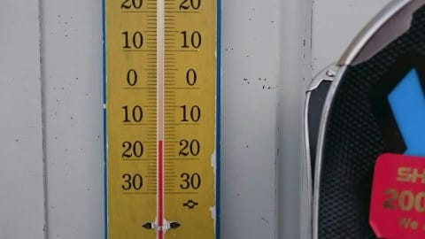
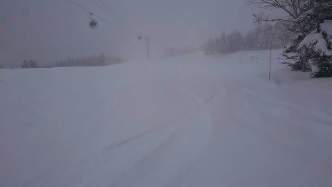

# 1月29日の志賀高原は，朝10cm，昼間10cmの積雪，終日-10℃以下の冷え冷え！…だけど，1日夜から2日にかけて，またヤバそう！？？

📅 投稿日時: 2021-01-30 03:08:44

🏷️ カテゴリ: [日記](cc4b5682fb7b8b144980957a978653fb0.md)

ということで．

水曜の雨でバーンがちょっと硬くなったものの，

昨日の記事で，

冷え冷えの雪が降っている

と報告した志賀高原．

今日は，予想通りの冷え冷え吹雪で，

トップシーズンの冷え冷え雪が積もった

ゲレンデに戻ったのか？？

…今日も，特派員レポートを見てみましょう…

まず．

朝の駐車場での積雪は10cmほどだったらしく…

うーん．もうすこし積もってほしかったけど，

　朝の積雪はそれほどなさそう．

　10cmほどかな？

という水曜の予想，見事に当てましたね…

（相変わらず比較対象をおこみん人形にしているところが，何とも言えずにイイ）

そして，朝の気温は-12℃！

これも，-12~-13℃という予想と

ぴったり一致！

ふはははは！見よ，わが予想精度の

すばらしさ…！

ただ．

営業開始時に，ものすごい吹雪で

ドサドサ雪が降っていると思っていた

ところ．

朝の降雪はそれほどでも無かったみたいで…

だもんで．

圧雪バーンには新雪が乗っておらず，

何と，見事なシマシマ！

それも，トップシーズンの冷え冷え

柔らかシマシマだったようです！！

午前中は，意外と吹雪にならず．

奥志賀ゴンドラも普通に営業運転

していたようで…

雪は降っているものの，バーンも

十分明るく，見通しも良かったようです…！

…そして．

やっぱりガラガラだったようです…

どこに行っても，ガラガラのフラット

バーンですね…

今日は昼間にむかい，むしろ気温が

落ちていったようで…

なんと．-15℃まで落ちたようです！

そして，昼ごろから風と雪が強まり…

ネットがバタバタはためくくらいの

強い風になり．

午後は雪で視界も悪くなってきたよう

です…

だもんで．

午前中はそれほど積もらなかった雪も．

午後になると，

ゲレンデは昼間も新雪が積もり続ける

という予想通り，うっすらゲレンデを

覆っていったようで…

最終的には，昼間だけで10cmほど

積もったようですね…！

ってな感じで．

とりあえず，これでゲレンデは完全に

冷え冷え雪で覆われて．

バーンコンディションはトップシーズンへ

復活！

明日の土曜は，水曜段階の予想では，

午後に晴れ

と予想しましたが．

うーん．

終日雪が降ったりやんだり，時折

日差しも…という程度かな．

でも，冷え冷え柔らか雪が圧雪された，

最高トップシーズンの雪で滑れそう！

そして，日曜は，朝のうちちょっと雪が

ぱらついているかもしれないけど．

冷え冷えなのに日が射す，今シーズン

最高級の一日になりそう…

…うらやましい…

でも．

でも…

2月1日の月曜日の天気図を見ると．

あれ？？

850hpaの0℃線，津軽海峡付近まで

北上してますけど…！？？

これで，何かが降れば…

志賀高原でも液体の可能性が！！

地上天気図は，どうだ？？？

（涙）（涙）（涙）

…どうやら．

2月1日の夜から2日の朝にかけて．

また，27日の水曜と同じ感じで，

空から液体が降ってくる危機が…

せっかくトップシーズンの冷え冷え雪に

戻ったけど．

月曜夜までの命だったのか…！？？

…でも．ご安心を．

2日からまた冷え冷え雪が降って，

すぐにトップシーズンの雪に戻りそうです．

うーん．

意外と今シーズン，雪質には恵まれてるなぁ…

…だれか．

今の時期のいい雪を，私が滑れるようになる

時期までとっておいてください…（懇願）

## 💬 コメント一覧

### 💬 コメント by (レインボー73)
**タイトル**: Unknown
**投稿日**: 2021-01-30 17:22:34

土曜日の志賀高原情報

寒い。とにかく寒い。寒すぎて二高リフトは耐えられない。あそこは冷凍庫の底。でもその分、雪質が、さすがの流石の流れ石、志賀高原。朝の蓮池マイナス１２℃。山頂マイナス１７℃。寒すぎて小学生がべそをかくほど。子供のウエアや手袋って、薄っぺらいんですね。かわいそう。

パウダーを逃すまじと、今日も太板のレインボーでしたが、パウダーなんてない。あいも変わらず読みが甘い。

午前中はヤケビ天国を満喫し、目指すはタンネのチウホテル。そこで会いたかった人と初対面。

午後になると、なんとお日さまが！　視界良好、雪もよし、みんなで滑るも楽しで、禁断のレインボー（虹、２時）破りの残業をすることに。

新型たまには休みたいウイルスのワクチンが効いたのか、なかなかやめられなくなったレインボーでした。

明日もまた出勤が続きます。

### 💬 コメント by (かず)
**タイトル**: Unknown
**投稿日**: 2021-01-30 17:46:34

ほんと寒かったですね…

寒すぎて13時にあがるつもりが結局16時までパウダー滑ってました

Sさんの予言どうり午後晴れて少〜し暖かくなりました

### 💬 コメント by (レインボー73)
**タイトル**: Unknown
**投稿日**: 2021-01-30 17:56:35

昨日転倒して怪我をした人に、

私『痛いのは、前足ですか、左足ですか？』

その人『？？？』

私って、悪人？

### 💬 コメント by (レインボー73)
**タイトル**: Unknown
**投稿日**: 2021-01-30 17:58:44

間違えました。

『痛いのは、前足ですか、後ろ足ですか？』

でした。

### 💬 コメント by (Skier_S)
**タイトル**: 明日は最高コンディション！
**投稿日**: 2021-01-31 04:42:47

＞レインボー73さま

土曜の朝は，それほどパウダー深くないと昨日コメントに書きましたが…

やっぱり太板もっていったのですね(笑)．

そして，今日も残業するほどのいいコンディションだったとは…

いいですね～！！

しかし，「前足」ですか(笑)．

＞かずさま

寒かったみたいですね…今日は．

パウダーあんまりなかったと思いますが，パウダー楽しめるところがあったんですか？

