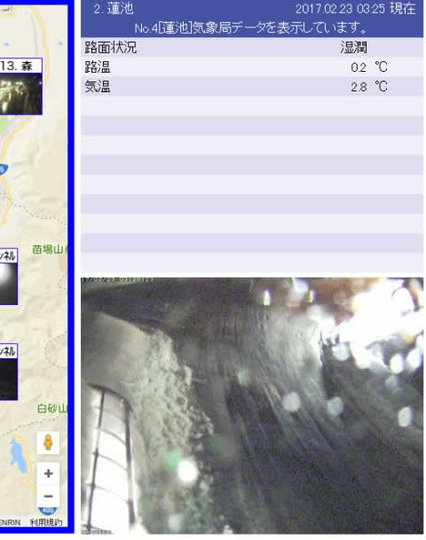
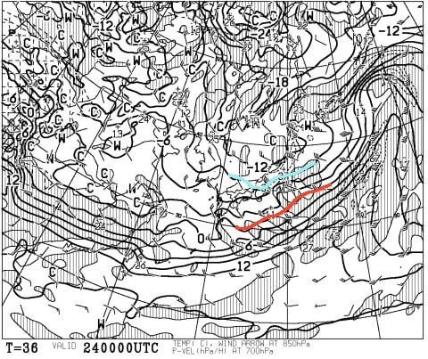
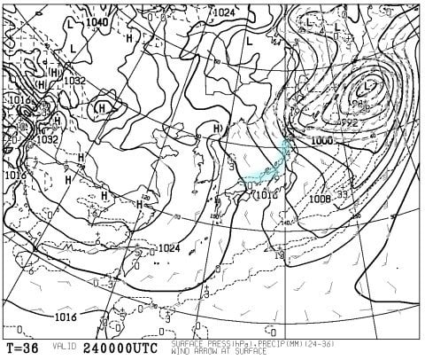
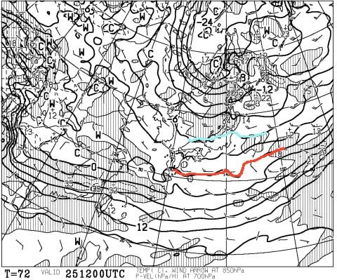
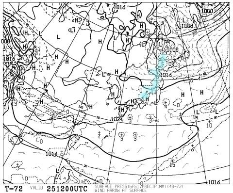
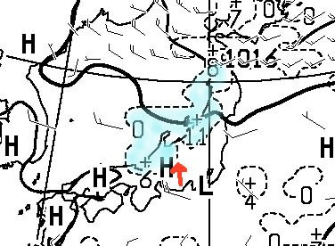
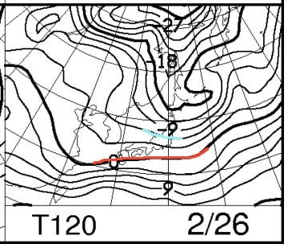
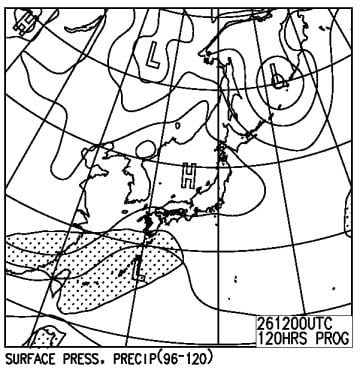

# 2月25，26日の週末，志賀高原スキー場の天気は？…今週末も，晴れて気温が低めの週末かな

📅 投稿日時: 2017-02-23 04:20:54

🏷️ カテゴリ: [スキー天気予想](c6554f5c3c106093b511a8daae23757e8.md)

えー．

今日もご無体時間まで仕事をしていた気がする，

Skier_Sです．

で．

もう午前4時ですが（涙）

この時間の志賀高原．

…降ってます．

ええ，降ってます．

…それも．液体が（涙）．

慈悲も何もなく，冷酷に空から

液体が降り注いでいます…（泣）（泣）（泣）

…やっぱり，予想通りか…っ！

本日，これから．

昼頃まではゴンドラの営業がヤバいほどの風が吹き．

雨が降り続けそうです…

…それも，時折ザーザーと，強く降ります（涙）．

月曜のように，ギリギリみぞれっぽい雨，というより．

本格的な雨が降ります．

ダメです．

木曜は，いろいろ終わった天気です（悲）．

で．

午後になると…

雪になります．

23日の午後に降り始めた雪は．

24日の金曜まで降り続けそう．

翌24日．金曜の850hpa図はこんな感じで．

-0℃線ははるか南まで下がり，

志賀高原は-9℃線がすっぽり覆っているので．

23日と打って変わって．

-10℃を大きく下回る，冷え冷えの朝になりそう．

ただ，24日の地上天気図では，

水色で塗った日本海沿岸の降水域，

かなり狭い範囲にとどまっているので．

うーむ．

それほど積もらなさそう…（涙）．

で．

土曜日，25日ですが．

850hpa図を見ると…

うむ．

この日も0℃線ははるか南．

志賀高原には-6℃線がかかっているので．

朝は-10℃程度まで冷え込み．

昼間の気温も，-5℃程度までしか上がらないかな～．

そして，地上天気図を見ると…

あぁ．

これは…志賀高原は雪が降らない，

見事な西風パターン．

…志賀高原近辺を拡大すると．

…こんな感じで．

矢印の先の位置にある，北アルプスに西から雪雲がぶつかり．

そこから東は雪雲が進まず，降水域の水色に塗った領域，

見事に北アルプスの東だけ，忘れ去られたように

降水域がありません…

だもんで．25日．

晴れそうです…！

…って．

晴れてくれなくていいんですけど．

雪がドサドサ降って，下地のアイスバーンを

隠してほしいんですけど…（涙）．

そして，日曜，26日．

この日も0℃線は日本のはるか南．

志賀高原には水色の-6℃線が掛かっているので．

…この日も，志賀高原はそこそこの冷え込み．

で，地上天気図を見ると…

ふむ．

この日も高気圧に覆われて晴れそう…

…いや．

晴れなくていいから．

晴れなくていいから，たっぷり雪が降って

アイスバーンを隠してよ…（懇願）

ということで．

まとめると…

25日土曜日：朝は雲が広がり，雪がちらついてそうだけど…

　皆さんの日ごろの行いが激烈に良ければ，

　朝は積雪10cmほどあるかも…？

　朝の気温は-10℃程度．そこそこ冷え冷えの朝．

　朝は前日の積雪が圧雪され，

　表面は柔らかい圧雪が乗っている．

　じきに陽が射す天気になる．

　この日の志賀高原は雲が多めかもしれないけど，

　基本的に晴れ．

　昼間も気温は-5℃程度までしか上がらない．

　時折チラチラ雲が流れ，雪がわずかにぱらつくかも…

　午前中から，急斜面はゲレンデの一部にアイスバーンが出始め，

　時間が遅くなるにつれ，だんだんアイスバーン領域が

　拡大していきそう…

26日日曜日：この日も朝はちょっと雲が多めかもしれないけど，

　基本的に終日日が射す天気．

　朝の気温は-10℃，朝イチは気持ちよく締まった圧雪バーン

　を滑れそう．

　ただ，じき荒れていき，じきに氷のコロコロや

　アイスバーンがゲレンデのそこかしこに現れそう．

　午後に向かって，うっすらと表面に乗っている雪が

　大勢のスキーヤーによってはがされてしまったら．

　かなり固い斜面がコンニチハしてきそう…（涙）．

　

ということで．

返す返す，23日の雨が惜しい感じ…

これさえ無きゃ，ちょうどいい感じの冷え冷え＆晴天週末

なのに…（涙）．

とりあえず

そう．

今シーズンも．

やっぱり，踊るのです．

信心深いスキーヤーの皆さんの総力を結集し，

今週金曜は冷え冷えになって

いい雪がドサドサ積もって下地の

アイスバーンが隠れる踊り

をっ！

…この効果が出てくれれば，

先週末同様，今週末も楽しめるはず…っ！

## 💬 コメント一覧

### 💬 コメント by (下手くそスキーヤーのS)
**タイトル**: 神予報士
**投稿日**: 2017-02-23 20:56:00

初めまして、下手くそスキーヤーのSです。

本日日帰りで焼額山に行ってきました。

諸々の天気予報を信じて雪が唯一降るはずのゲレンデに。

結局のところ、Skier＿Sさんの予報が1番近かったです。朝から嵐で第四ロマンスリフトだけかろうじて運行、時折激しく雨が降り昼まで嵐の様に風も吹いて午後から第二高速リフトがどうにか運転。午後1時になっても第二ゴンドラ運転見合わせで、諦めかけていたところ、やっと運転。その後夕方まで雪は降らなかったです。といった感じです。

スキーも相当の腕前と察しますが、予報もプロ級ですね。

### 💬 コメント by (Skier_S)
**タイトル**: Sさま
**投稿日**: 2017-02-24 06:05:36

コメントありがとうございます～！

平日日帰り焼額ですか！

うらやましいです…

しかし．

何もこんな日に当たらなくても，って感じですよね．

天気予想がある程度当たったようで，うれしいです…

もう，10年以上ひたすら天気図を読み続けているので，

天気図を読めるというより，大体どんな天気図なら

焼額はどんな天気になるか…というのを覚えてしまった

という感じかもしれません（笑）

ちょくちょく焼額で滑ってらっしゃるのでしょうか？

1ゴン前で15分待てば，かなり高い確率で

私に会うことができます（笑）

＃スキーの腕前は，おそらく想像されているより

＃しょぼいかと思います…（^^:

### 💬 コメント by (下手くそスキーヤーのS)
**タイトル**: 物欲ばかりです
**投稿日**: 2017-02-24 19:23:34

S様

志賀高原、今シーズンは2回目ですが10年で数える程です。葛飾区在住なんで片道300キロ😅

スキーにハマったのもここ2年ですかね。Sさまの試乗記を参考に板選びをしてます。と言いながらフィッシャーDTXなんですけどね。アトミックは敷居が高くて・・・⛑

サロモンのＸ-race乗ってみたいです。リズムの新作も良いなーなんて物欲ばかりでスキーの腕前はまだまだなんですよ💰

それにしてもハイシーズンの志賀高原の道路事情すごいですね。厚い氷の上に雪が被ってる☠️

前走ってたSUBARUアウトバックが反対車線まで飛び出してましたよ。スピード出し過ぎなんだろうけど、当方のFFスタッドレスだと結構厳しい感じでした。

色々参考にさせて貰ってます💮

今週末はファミリースキーです。さてどこ行こうかなー☃️

### 💬 コメント by (Skier_S)
**タイトル**: Sさま
**投稿日**: 2017-02-24 21:26:38

我が家からも，志賀高原はちょうど300kmです（笑）．

フィッシャーDTXですか！

小回り用としてはいい感じの板ですよね～．

SALOMONもATOMICもいい板なので，

また試乗会にでも参加してみたら

面白いかと思いますよ…

今週末はファミリースキーですか．

ぜひ志賀高原へお越しください（笑）

でも．

この週末，どこに行ってもアイスバーンっぽい

ですけど…（残念）

