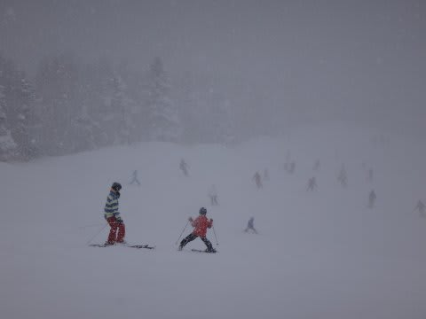

# 1月13日の志賀高原の詳細コンディション…午前パウダー，午後晴れの一粒2度おいしい日

📅 投稿日時: 2014-01-15 02:16:00

🏷️ カテゴリ: [2014スキー滑走日記](c992167609b6415052179ee69ea1ea7d8.md)

というわけで．

昨日速報した，3連休最終日の詳細レポートをば…

えー．

速報にありましたように．

かなりの雪降りで始まった，この日の朝．

朝は山頂温度計でマイナス14度になるまで冷え込み…

ふーむ．朝の積雪は，ブーツパフくらいですな～

それほど深いパウダーではないが，パウダーのオリンピックコースへ向かうのだ！

ふむ？

ふむむ…

うほほー！

そんなに深くない，底付きパウダーだけど，楽し～っ！！！

…でも．

浅いパウダーは数本すべると単なる荒地になってしまうのだ…

ってことで．

圧雪がかかった整地へ向かうわけですが．

…なんだか．

視界も悪いし，人も増えてきたし．

うーむ．今日はこれから，あんまり楽しめないかな～．

…と，思ったところ．

そうです．

私の日ごろの行いがよかったので．

昼前から薄日が射し始めてきましたっ！

ぉぉ！

やっぱり，私の日ごろの行いの良さを，神様はちゃんと見てくれて

いるんだねっ！←ほかの人の行いが良かったから，とは考えないのかっ？

…それどころか．

午前11時過ぎには，なんだかゲレンデがガラガラになってきたんですが？

…一の瀬ファミリーにも移動してみたんですが…

12時ごろに，一の瀬ファミリーの正面バーンに

誰も人がいないんですがっ！？？

って感じで．

午後からは完全に太陽が顔を出し．

すっきり晴れ晴れ，ガラガラのゲレンデを．

好きなだけ滑りたい放題なんですがっ！？？

良いんですか？

こんなにガラガラ，冷えひえ最高雪質のゲレンデを

好きなようにがしがし滑れて，

こんなに幸せで良いんですかっ！？？

…当然午後遅くになると，ゲレンデは結構荒れ荒れになってきて．

朝はパウダーだったオリンピックコースはコブコブになりますが．

それでも，晴天でガラガラの，好きなラインとりたい放題なんですがっ！？？

け，経営大丈夫か～っ！？？（と言いながら，歓喜の雄たけびを上げながら滑るSkier_S)

…って感じで．

この日もリフトストップの，日が沈むまで…

誰もいないゲレンデを，たっぷり滑って満足の一日だったのでした…

…ホントに経営大丈夫なんだろうか…（ちょっと心配)

## 💬 コメント一覧

### 💬 コメント by (Goku)
**タイトル**: Unknown
**投稿日**: 2014-01-15 20:02:15

焼額山と一の瀬に人がいないんじゃ～ホント大丈夫？って思っちゃいますね。

### 💬 コメント by (ゆうこ)
**タイトル**: 関越道
**投稿日**: 2014-01-15 23:47:56

三連休最終日なのに関越道上り、渋滞あんまりなかったですよね。

みんなスキーには行かなかったんですかね。

スキー場が潰れないか心配です。

### 💬 コメント by (Skier_S)
**タイトル**: 経営が心配…
**投稿日**: 2014-01-16 01:33:36

＞Gokuさま

栂池は，人が多かったようですね～．

志賀は，リフト券やら営業内容が

悪くなっていく一方なので…

離れていったお客さんが多いんですかね～．

＞ゆうこさま

そうなんですよねー

道路もすいてましたよね～．

…ってことは，すいてるのは志賀高原だけの現象では

無いのかな～．

スキーヤーとしては，ゲレンデがすいてるのはうれしいけど，

それでスキー場がつぶれちゃうのはマズいです…

