# 2024/3/31(日)の志賀高原スキー場，詳細レポート！…GW並みの高温で雪はゆるゆる荒れ荒れ（泣），南斜面の標高の低いところは一部滑りが悪いところも（涙）

📅 投稿日時: 2024-04-02 03:41:44

いかん…

睡眠不足過ぎて眠い…

今日ももう深夜3時過ぎてるから，

早く寝たいんだけど，

なぜかBlogを書いている自分がいる…

ってなことで．

睡眠不足ですごい眠いのに，

日曜の志賀高原の詳細レポートを

書いてみます～！！

…途中でくじけて寝たら，途中までで

アップします！！←なんじゃそりゃ

まず．

速報レポートで書いたように，朝8時

スタートといつもより30分早い営業開始に

焼額第1ゴンドラに並ぶと．

やはりもう3月末．時間が早めというのもあり，

列はこれまでより短めですね…

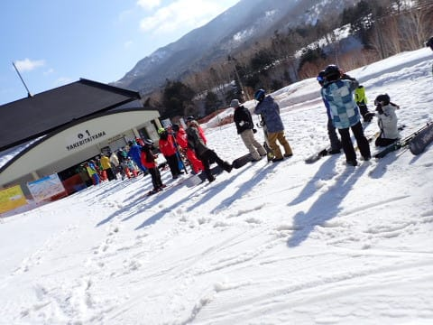

そして．

営業開始のゴンドラで山頂に上がると．

あさイチの気温は+3℃と…

朝からプラスですか（泣）

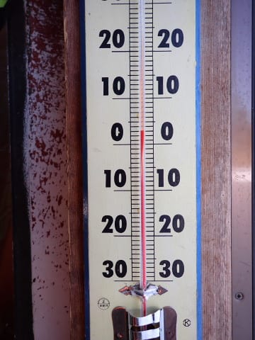

ゲレンデに出ると…

気温が高いのに，朝から強い日差しが

降り注ぐ天気ですね…

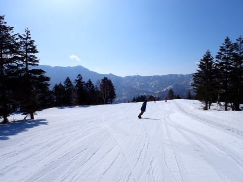

先週でファーストトラックの営業が終ったので，

通常営業スタートからの参戦でも，

シュプールがほとんどついてない

ピカピカバーンを滑れます！！

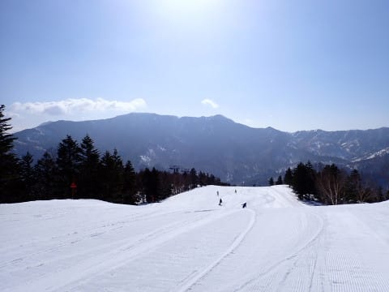

シマシマいいぞ！！

シマシマ最高っ！！

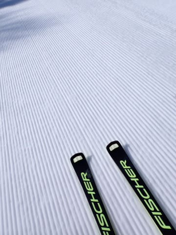

…と，思うところだけど．

夜中にも氷点下に落ちず，

そして朝から+3℃の高温＆強い日差しで…

かなりゆるゆるで板が雪に潜っていく

ようなシマシマ（ちょい涙）

滑った後が深い溝になり，すぐに

ボコボコと深い溝ができたバーンに

なっていき…

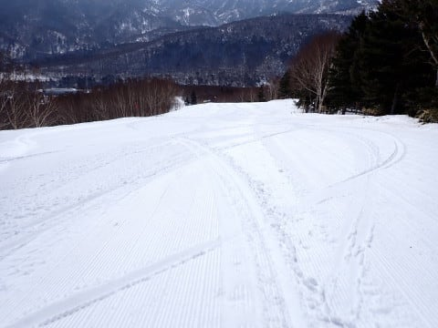

数本滑っただけで，バーンがかなり

荒れてきました…（激涙）

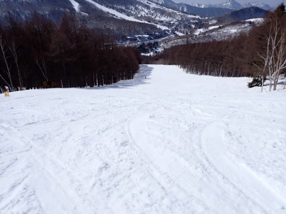

天気はすっきり晴天だけど．

強烈な日差しでゴンドラの中では

暑いくらいで．

気温が高くて雪が解けそうな本日，

日が射すよりは曇ってくれた方が

うれしいんだけど…

嫌がらせのように快晴（涙）

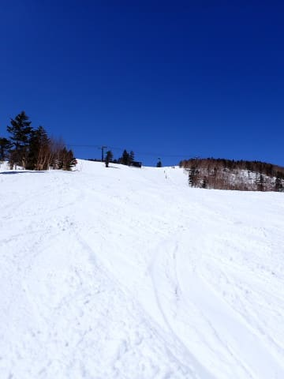

黄砂はそれほど飛んでなかったけど．

日差しのおかげで，午前10時過ぎには

緩斜面で板の滑りが悪い雪になって

きました（涙）

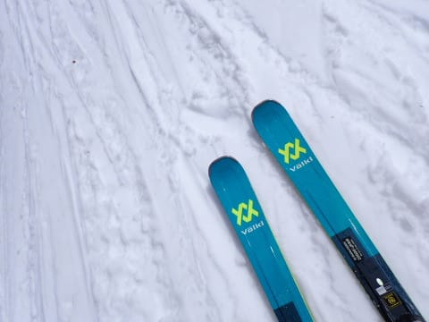

ただ…滑りが悪くてバーンも荒れて

来ちゃったからか．

朝から人が少なかったスキー場．

さらに人が減って…

第2高速は終日ほぼ飛び乗り．

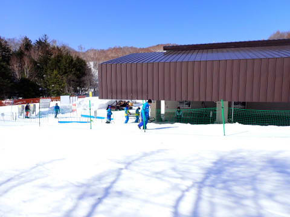

そして，第1ゴンドラもゲートの

外まで列が並ぶことはほとんどなく．

まっても搬器2-3台，

午後は完全に飛び乗り状態になってました…

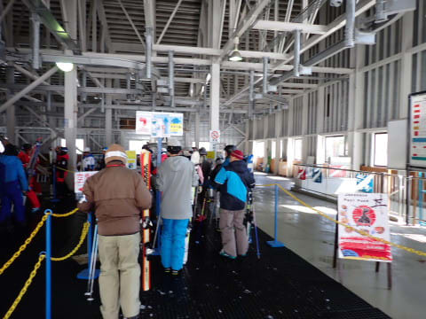

10時を過ぎると．

焼額のGSコースはボコボコバーンと

化していき…

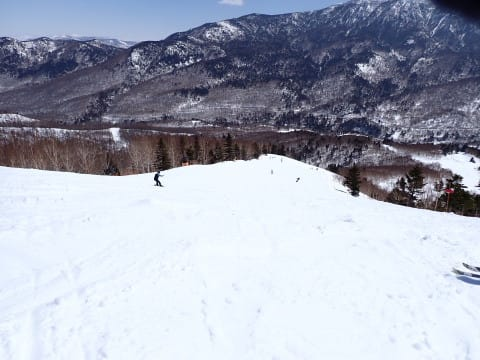

雪も異常に重いザブザブで，

緩斜面では滑りも悪くなってきたので．

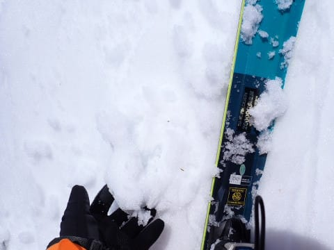

私としては珍しく焼額の呪いが解けて．

本日は一ノ瀬方面に向かってみました～！！

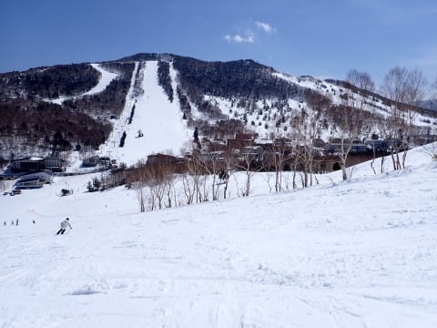

一ノ瀬ファミリーのリフトも，この日は

ガラガラで…

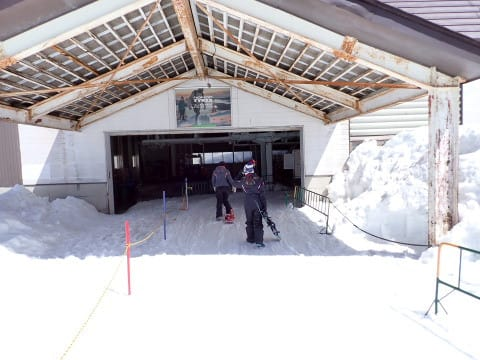

正面バーンを滑っている人も少なめに

見えますね．

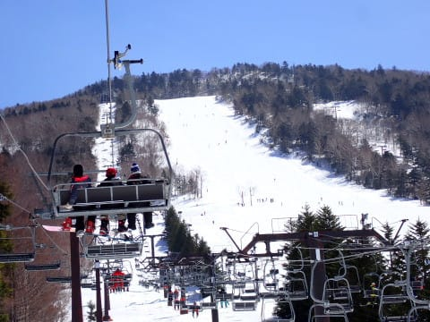

一ノ瀬正面バーンは，朝日の当たらない

西向き斜面なので，雪が緩むのは

焼額より遅く．

11時ごろでも，多少荒れ始めていたものの

まだザブザブボコボコにまでなってませんね…

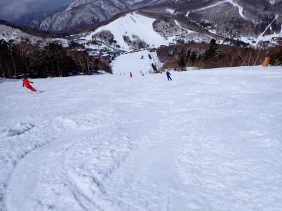

そして，パーフェクターコースへ行ってみると．

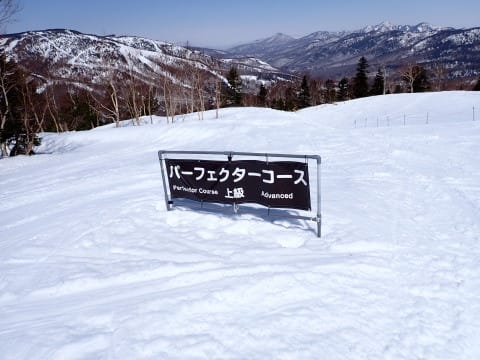

いや…！

ここ，昼過ぎと思えないくらいフラットですよ！？？

かなり気持ちいいハイスピードで滑れますよ！？？

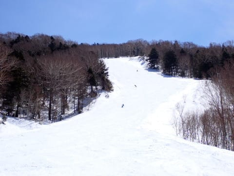

トップシーズンの雪というわけではないけど．

この時期の雪としてはいい感じ…！！

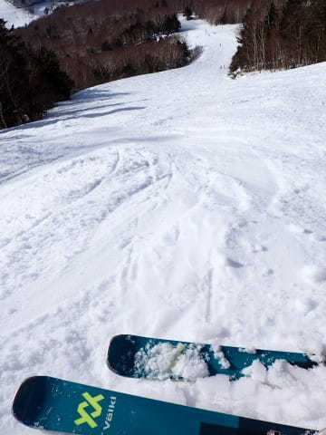

…と，思っていたら．

午後3時ごろには，パーフェクターも

荒れ荒れバーンになっていきました…（泣）

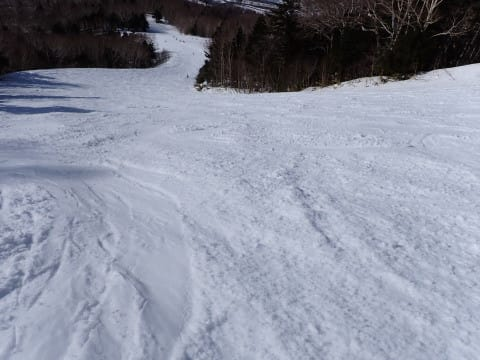

だもんで．

焼額へ戻りますが…

いや．

焼額はもうボコボコですね（涙）

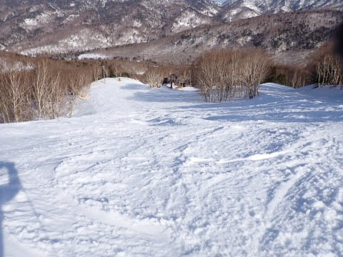

でも．

午後3時を過ぎると，さすがに気温が

下がってきたので，緩斜面でも板がかなり

滑るようになってますよ…！！

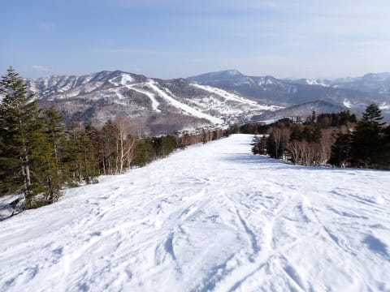

…ってな感じで．

ボコボコバーンではあったものの．

夕方の日がかげり始めるころになっても，

バーンがガチガチに固まることもなく．

終日柔らかい雪のまま，午後は走る

雪になってきて．

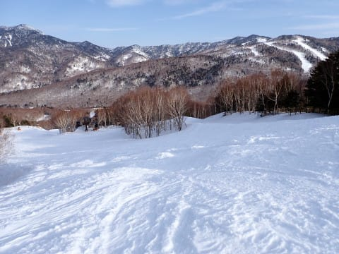

…午後3時以降は人も少なくて，

ほぼ貸し切りとなっていたバーンを，

やっぱり今日もリフト終了まで，ひたすら

滑り続けたのでした…

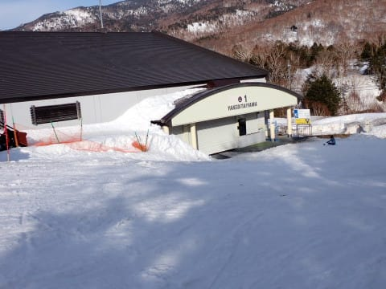

うーん．

でも，昼間は気温が上がりすぎて，

5月並みの高温で，

3月なのに，朝に雪が硬くなるまで

冷え込まないという悲しい状況で，

板の滑りも悪く雪もボコボコに

なっていったけど．

…終日晴れてくれたし．

コースはガラガラだったし．

心配した黄砂はほとんどなかったし．

なんてったって，2月の段階では

ヘタすれば3月末まで営業できないの

では？？？

と心配するほどだったのが，3月に

どっさり積もった雪のおかげで，

まだまだたっぷりの雪で白樺コース

以外のすべてのコースが滑れるし．

まぁ，春スキーを楽しめた

良い週末だったとしておきますか…

でも．

今週も3日（水）の夜から，また雨に

やられそう…（泣）

運が良ければ志賀高原はほとんど降らずに

済む可能性も…

とりあえず．

雨で雪が解けずに，4月もGWまで

問題なく滑れることを祈りましょう…

…最後まで書ききった…

## 💬 コメント一覧

### 💬 コメント by (アツシ)
**タイトル**: Unknown
**投稿日**: 2024-04-02 23:56:51

日曜日は私はダイヤを拠点に滑ってましたが、Sさんにご挨拶をと思い午後にヤケビまで遠征しましたが、ちょうど入れ違いになったみたいですね。

お会いしてお伝えしたかったのですが、場合によっては私もシーズン終了かもです。４月は1週目〜3週目まで毎週仕事が入ってしまいました。あわよくば3週目の仕事はキャンセルできるかも、ですがそれが叶わなかった場合は4週目のGW前半まで滑りに行けないことになります。雪、残ってますかね？

今季は初めてのシーズン券も購入し、１月中旬から3末まで12週連続で週末に大阪⇆志賀に通うことができました。うち11回は1人スキーでした。車の走行距離も12月から3月の4か月でちょうど20,000km。今年買ったスタッドレスは再来年までもつかな？？

ナイターの良さも教わり、初めてのヤケビナイターに感銘を受けました。試乗会にもお誘いいただき、20万円超の板も秒殺でお買い上げしちゃいました。Sさんは本当はエキップ店員なのではと勘違いしそうでした。毎日ブログを拝読し、週末の天気予想も熟読しました。ホントに、今季もいろいろお世話になり、ありがとうございました。

このままシーズンを終えたくはありませんが、GWまで雪が残らなければこれにて終了です。志賀はまだ雪も厚く、とても終わるようには思えませんが、４月の高温でもGWまで雪が残っていることを祈っています。

### 💬 コメント by (Skier_S)
**タイトル**: ＞アツシさま
**投稿日**: 2024-04-03 02:26:30

あら…行き違いになりましたか…残念．

でも大丈夫．

今年はGWまで雪がもつはずです！！（強い願望）

GWまで滑れます！（根拠のない推測）

これで終わりではないはずなので，またGWに焼額でお会いしましょう…！！

…しかし，4か月で2万km走行はすごい…

