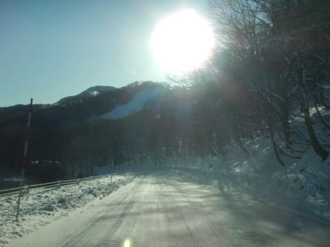
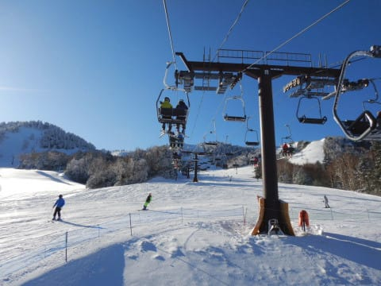
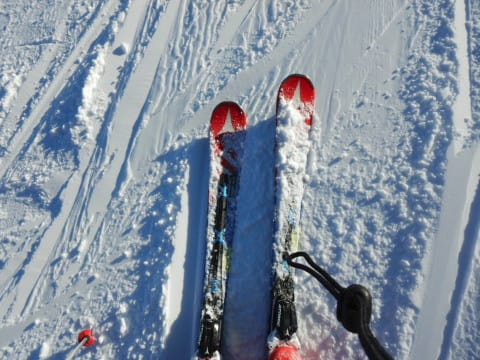
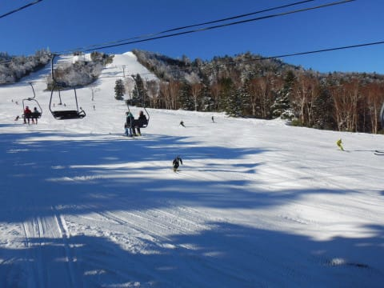
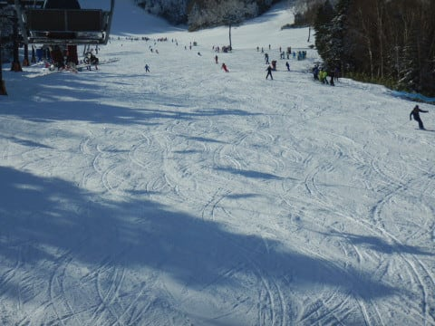
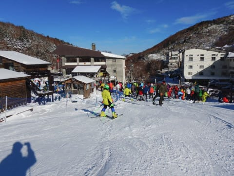
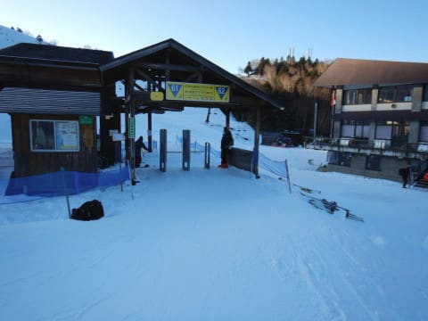
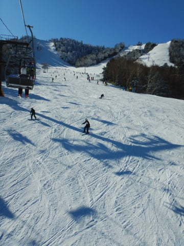
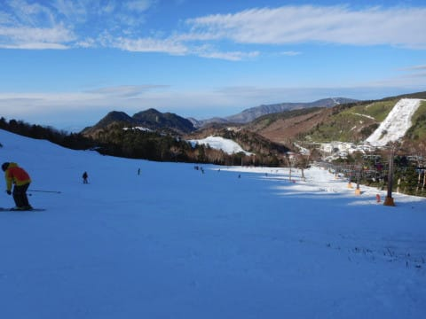

# 2019/12/1(日)の志賀高原，熊の湯スキー場速報レポート！…晴天，雪質Good！ほぼ幅いっぱい滑走可能で思ったよりすいてたよ！

📅 投稿日時: 2019-12-02 01:50:57

🏷️ カテゴリ: [2020スキー滑走日記](c282e9230de179e245c7334eabeb0a3b3.md)

ということで．

本日はどこに行こうか，

朝に高速に乗ったあとになっても

悩んでましたが．

ペアリフトの下半分しか動いてない熊の湯に，

往復9時間以上かけて日帰りってのは微妙だけど．

やはり，志賀高原に忠誠を誓っている（？）

私としては．熊の湯まで

日帰りで行ってくるか…

と．

結局は熊の湯に行ったわけですが．

…結果的に．

大正解

でした．

いや．

意外とコースは幅いっぱい滑れるし．

気温も冷えてて雪もいいし．

朝はちょっと混んだものの，

リフト待ちもそれほどひどくなかったし．

一日晴天で，いい感じのゲレンデを

滑れました～！

…でも．

志賀高原日帰りで，いつも通り最後まで

滑り，いつも通り洗車して帰ってきたので．

今日は朝4時発の，深夜帰宅(涙）．

だもんで．

今日はいつもの速報モードにて…

えー．

まず．

朝の道路は，上林を過ぎたあたりから

路面に積雪が始まり．

途中からは完全な雪道です！

今シーズン初めての雪道運転を

楽しんできました…

そして．

あさイチのゲレンデは…

すっきり晴天！！

朝は放射冷却で冷え込み．

雪質もいい感じ！！

そして．

人工雪を付けた，わずかな幅しか

滑れないだろう…という予想は

いい方向に裏切られ．

なんと，ほぼコース幅いっぱいに

滑れるじゃないですかっ！！！

…天気のいい中，

いい雪質で．

結構な幅で滑れて…

これは，いい！

予想以上に，いい！！

Yetiの100倍楽しいっ！！

あぁ…悩んだけど．

結果的に熊の湯にして，よかった…

朝のうちは，このくらいのリフト待ちがありましたが．

でも，並行しているペアリフトが2本とも

運転しているので，待ち時間は思ったほど

ありません．

昼前には，リフト待ちも減り．

ゲートの外まで並ぶかどうかという

程度で，それほど混んでなくて．

夕方は飛び乗り！

さすがに午後には多少ゲレンデは

荒れてきたものの…

午後には人がかなり減ってきたので，

致命的にゲレンデが凸凹になっちゃう

ことは無く．

午後3時以降は，リフトストップの4:15まで，

ガラガラバーンを思う存分かっ飛ばせた

のでした…

いやーーーー．

久々の志賀日帰りは，やっぱり

きつかったけど．

熊の湯は，予想よりずっと

いいコンディションで．

楽しかった～！

ってなことで．

明日の詳細レポート，お楽しみに～！！

PS.2日（月）は，やはり終日雨（涙）

　でも，2日の深夜から冷え始め．

　3日，4日は日本海側では結構積もりそう．

　志賀はそれほど積もらなさそうだけど…

　2日間で20～30cmは積もるかも！？？

　次の週末は期待できそう…！

## 💬 コメント一覧

### 💬 コメント by (Hide)
**タイトル**: Unknown
**投稿日**: 2019-12-02 07:41:20

S 様

やはり行かれましたね（笑）

思いの他、状況良かったみたいですね。

私も早く出動したいです。

### 💬 コメント by (どこにでも居るスキーヤー)
**タイトル**: Unknown
**投稿日**: 2019-12-02 12:20:12

熊の湯、横手山に行かれたのですね。

熊の湯と横手山は時によって日陰になり寒くなると聞いてます。（スキーヤーの見解）

怪我なく楽しんでください。

### 💬 コメント by (Skier_S)
**タイトル**: 熊の湯，かなり楽しかったよ！
**投稿日**: 2019-12-03 01:34:54

＞Hideさま

やはり，行っちゃいました（笑）．

予想よりずっと良かったです…

行く前は，「熊の湯，ペアだけだとイマイチだしなぁ…」

と思った自分にダメだしをしたいくらいに楽しかったです．

ぜひ，出動機会を見つけて雪山にお出かけください．

＞どこにでも居るスキーヤーさま

初めまして…

でよろしかったでしょうか？？

コメントありがとうございます！

熊の湯は北斜面で，この時期は午後2時になると

日陰で寒くなります．

お互い怪我の無いよう，注意して滑りましょう…！

### 💬 コメント by (炎の北海道民)
**タイトル**: Unknown
**投稿日**: 2019-12-04 15:56:12

いいですね。

自分はまだ1回しか滑ってません。いつも日帰りですか？

### 💬 コメント by (Skier_S)
**タイトル**: ＞炎の北海道民さま
**投稿日**: 2019-12-05 01:07:10

いや，日帰りは前の週末までです．

今週末以降は，基本的に土日一泊二日の予定です

…海外出張が入らなければ（涙）

