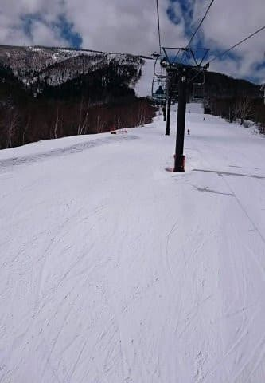

# え？緊急事態宣言後，やはりスキー場が次々と当初予定より早くクローズしていってますね（涙）

📅 投稿日時: 2020-04-12 01:44:45

🏷️ カテゴリ: [日記](cc4b5682fb7b8b144980957a978653fb0.md)

えー．

本日．

志賀高原関係の，ちょっと残念なニュースが

入ってきたのですが．

…そう．

志賀高原の中央エリアの春営業カレンダーに，

変更が入ってました…！

（[志賀高原中央エリアホームページ](http://shigakogen.co.jp/wp-content/uploads/2020/04/2020-%E6%98%A5%E3%82%B9%E3%82%AD%E3%83%BC%E5%96%B6%E6%A5%AD%E4%BA%88%E5%AE%9A%E8%A1%A84.pdf)より）

…上の図だと，どこが変わったか

分かりにくいと思うので．

拡大すると…

…

…えええええ！！！

4月の週末＆GWに営業予定だった，

高天ヶ原の19日以降の営業予定が消えてますっ！！！

高天ヶ原スキー場．

明日12日が，今シーズンの最終営業日に

なるようです…（涙）

なんという事か…！！（泣）

…って．

緊急事態宣言がGW終了まで続くことになった今．

私にはもう関係のない話なんですが…

でも．ちょっと寂しい…

そしてさらに．

かぐらスキー場のホームページを見てみると．

…ふむ．

まぁ，当然っちゃぁ当然ですが．

緊急事態宣言が出た都道府県からの

来場は控えてね，と明示されてますね…

（[かぐらスキー場ホームページ](https://www.princehotels.co.jp/ski/kagura/winter/)より）

そして．

かぐらスキー場が偉いのは，この一文．

（[かぐらスキー場ホームページ](https://www.princehotels.co.jp/ski/kagura/informations/hayawari/20192020/)より）

「来場を控えたせいで使えなくなっちゃった早割券は

　何とかするし．シーズン券も何らかの対応をする

　予定だからね！」

…と．

緊急事態宣言で来れなくなった人に，

ちゃんとリフト券の補償をするつもりだという，

このすばらしさ…！！

「強制じゃなく『自粛』だから保証なし．自己責任ね」

というのが普通のところ，偉いっ！！←だから，なんでいつもそんな上から目線？？

で．

他のスキー場も気になったので，

いろいろ調べていると…

何と．

ARAIも，コロナウイルスの影響で，

4月12日で営業終了ですかっ（涙）！！

うーむ．

ここも普通なら，GW以降まで営業してくれる

スキー場なんですが…

まさか，4月のこんな時期で終わるとは…っ！！

（[ロッテARAIリゾートFacebook](https://www.facebook.com/LOTTEARAIRESORT/?ref=py_c)より）

やはり，ここもリフト前売り券は来シーズン

利用可能なものに変更し，シーズン券は

今後対応予定…

ということで，何らかの補償がなされる

みたいですね…

そして．

そのほかのスキー場も調べてみると…

え？？

GWまで営業予定だった川場スキー場，

知らぬ間に終わってたの？？

一昨日，ひっそりクローズしていたようですね…

（[川場スキー場Facebook](https://www.facebook.com/kawabaski/photos/a.282819858405980/3055340847820520/?type=3&theater)より）

川場も，ちゃんと未使用チケットの期限延長

といった対応をしてくれるようです．

（[川場スキー場Facebook](https://www.facebook.com/kawabaski/posts/3059756880712250?__tn__=-R)より）

さらに玉原も，いきなり4月9日に終わってた

みたいだし…

（[たんばらスキーパークFacebook](https://www.facebook.com/kawabaski/posts/3059756880712250?__tn__=-R)より）

白馬五竜も今週末12日で

終わっちゃうみたいです（泣）

（[白馬五竜Facebook](https://www.facebook.com/hakubagoryuofficial/posts/2799154140181527)より）

白馬47も同じく12日にクローズですか…（涙）

（[白馬47ホームページ](https://www.hakuba47.co.jp/winter/20200412.html)より）

あぁ…

知らぬ間に，予想以上に多くの

スキー場が終わっていっている

ようです…（激涙）

憎い…コロナウイルスが憎い…っ！！

しかし．

これで，激烈豪雪で，まだまだたっぷり

雪があって滑れる状況だったら，

かなり悲惨だったけど．

白馬や群馬方面はかなり積雪が少なかった

ようで，GWまでの営業がかなり

厳しそうだったのが，まだ救いに

なってるかな…

とりあえず．

さんざんだった今シーズンですが．

来シーズンに無事復活してくれることを

祈るばかり！

（いくつかのスキー場，またつぶれるんだろうなぁ…）

ってなことで．

次々スキー場がクローズしていっている

現状を考えると．

まだ高天ヶ原がクローズになったくらいで，

まだシーズン当初の予定から大きくずれてない

志賀高原なわけですが．

特派員からの本日の志賀高原の状況をざっくりと

お知らせすると…

今日は朝から青空が広がってます！

あさイチの気温は，-7℃と

冷え冷えで，新雪が1cmほど

積もっていたようで…

そのおかげで，朝イチは締まっているのに

硬すぎず，しっかりエッジが効く

いいバーンコンディションだった

ようです！

気温はそれほど高くなかったものの，

やはり日差しがあったので，

昼前には結構雪が緩みだした

ようですが．

でも，張り付き雪にならず．

この時期としては結構いいコンディションで

滑れたみたいですね～…

あぁ…

スキーに行けない欲求不満を，何とか

スキー場の写真で癒している今日この頃…

私が次に滑りに行けるのは，一体いつの日か？？

今シーズン中に私がスキーに復活できず．

そして，このBlogの更新が止まったら．

その時は，

「あぁ…Skier_Sはスキーやらないと死んじゃう病で

　死んじゃったのね…」

と思ってやってください…

## 💬 コメント一覧

### 💬 コメント by (地元民(ほぼ麓))
**タイトル**: Unknown
**投稿日**: 2020-04-12 02:23:54

ガマンされてるの立派だと思います。

その姿勢、賛同&尊敬するので、今後もこのブログ応援していきます。

### 💬 コメント by (Reader)
**タイトル**: 白馬八方もリフト券
**投稿日**: 2020-04-12 07:26:37

八方も前売りリフト券は12月31日まで有効と言っています．

志賀は5月6日まで，どこかでスキーができそうなので，対応する必要がないという説明をするのでしょう．

### 💬 コメント by (かず)
**タイトル**: Unknown
**投稿日**: 2020-04-12 09:44:28

終了間際なのにシーズン券の対応ですか…結局しわ寄せが自分に帰ってくるだけのような…

今は来シーズン通常営業できるよう迷惑かけないように他県の人は志賀に行かない！長野に行かない！を徹底です

### 💬 コメント by (オオカミ少年ならぬオオカミ老人レインボー)
**タイトル**: Unknown
**投稿日**: 2020-04-12 11:59:37

志賀高原情報

３度目のシーズンラスト。また来てしまいましたが、もう誰もサヨナラを言ってくれなくなりました。

朝の２時間はアイスバーンに２センチの新雪が乗ってベスト。十時を過ぎると流石にゆるゆるに。それでも11時半まで楽しめました。こんな時期までは初めてですが、いいもんですね。

### 💬 コメント by (Skier_S)
**タイトル**: この4月は奇跡の4月になりそう…
**投稿日**: 2020-04-13 00:09:52

＞地元民さま

ありがとうございます．

これからもこのBlogを引き続き応援よろしくお願いします～！

＞Readerさま

おそらくその通りで，

志賀は来場自粛も言ってなければ，予定通りGWまで営業もするし，

来ない人は各個人の自粛なので払戻す理由が無いよね…

ということだと思います…

＞かずさま

とりあえず，シーズン券の払い戻しやらなにやらは

タダでさえ影響を受けているスキー場が，さらに経済的出費の

痛手を被ることなので，その影響でつぶれたり営業縮小したり

するスキー場が無いことを祈るばかり…

来シーズン，志賀高原のリフト減ったりしないか心配です．

＞レインボーさま

あ，やっぱり今日滑ってたんですね！

予想通りです…(笑)．

せっかく地元にいるんですから滑らないと．

しかし，4月の志賀もいいでしょ？

来シーズンはGWまで滞在してください(笑)．

### 💬 コメント by (レインボー)
**タイトル**: Unknown
**投稿日**: 2020-04-13 08:37:38

月曜日の志賀高原情報

朝の湯田中は小雨。気温は0度。蓮池も0度。蓮池から上はベタ雪で危険。2ゴンＰに2台。立ち話してるのはレジェンドゆ○りんとY口氏。

強風で奥志賀運休、1ゴン運休、2ゴンは平日運休。４ロマに望みをつないで待ったものの、結局は運休。熊の湯も運休。

つまり全山運休！　Ｓ様の嫌な予報がピタリ！　

あえなく散りました。

### 💬 コメント by (Skier_S)
**タイトル**: ＞レインボーさま
**投稿日**: 2020-04-14 02:03:46

まさか今日も行っているとは(笑)．

この天気で，焼額駐車場までいく根性がある人間は

大体いつものメンバーですね．．

最後は天気悪くて残念でしたが，シーズンお疲れ様でした！

