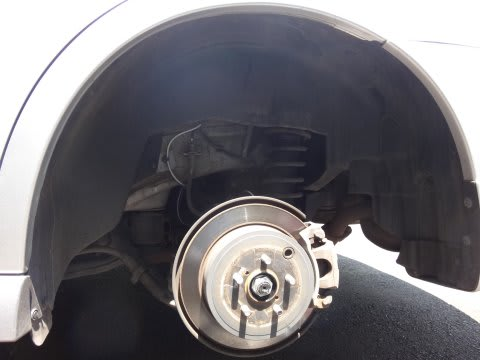
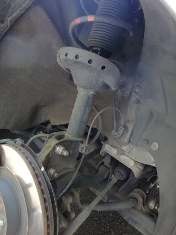
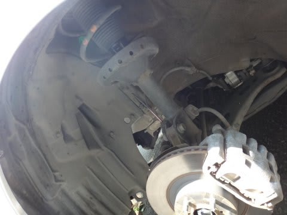
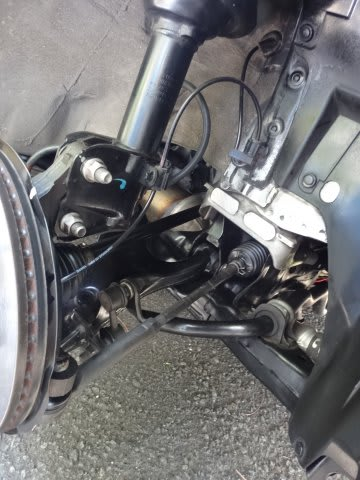
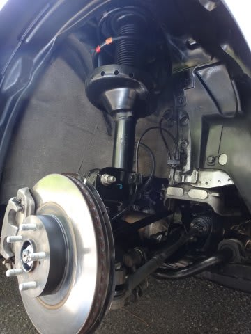
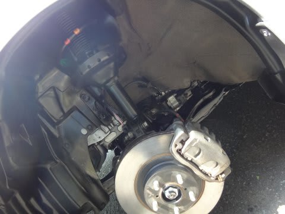
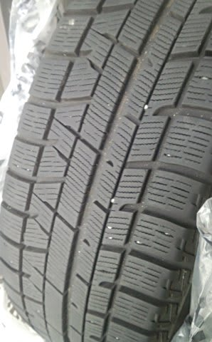
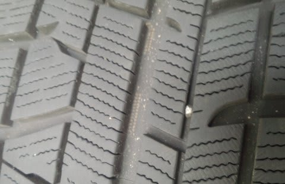
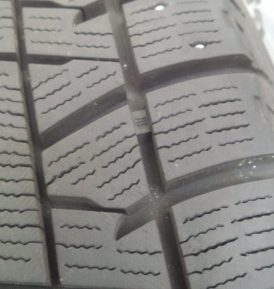
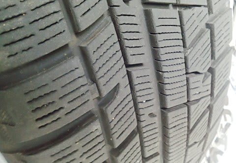

# 1シーズン，約17000km走ったYOKOHAMA iG5PLUSは，どのくらい減ったのか？

📅 投稿日時: 2016-06-22 02:03:26

ということで．

ちょっと古いネタになるんですが…

[GWにスタッドレスタイヤを履き替え](cc4b5682fb7b8b144980957a978653fb0.md)たわけですが．

今回は，悲しい傷の手当てもさることながら．

まぁ，いつも通り，

凍結防止剤攻撃を受けた足回りの錆

下回りメンテも施して…

（メンテ前）

（メンテ後）

そして，タイヤを換えたわけですが．

YOKOHAMAのiG5PLUS．

雪道での効きも大きな不満は無く．

[燃費も結構良くて](e31c35ca3deed012deea99b3659e3218a.md)，結構満足なタイヤだったんですが．

…果たして．

約1.7万kmを走ったスタッドレスタイヤ．

どのくらい減ったのかいな？？？

…と，見てみたところ．

ふーむ．

リヤタイヤのセンター当たり，

まだ新品のころの表面のウェーブが残ってる感じ…

プラットホームもまだまだだし，

いや，ライフも長いかも？？

…と，思ったけど．

やっぱりフロントタイヤの負荷は結構高いのか…

フロントのアウト側は，プラットホームまでの半分よりは

減ちゃってる感じ…（涙）．

うーむ．

やっぱり，私の使い方だと2シーズンが精一杯か…

ローテーションして上手く使えば，ぎりぎり3シーズンもつかな？

お財布に厳しいから，3シーズンは持ってくれると

嬉しいんだけどなあ…

でも．

3シーズンってことは…5万km超えるわけで．

やっぱりそんな長持ちするわけないか…

だれか，10万kmもつスタッドレスタイヤ

作ってくれないかな～？？←雪道で全く効かないか，すごく高いタイヤになっちゃって，2シーズン毎に普通のスタッドレス買い替えた方がいいかの，どちらかになる気がする…

## 💬 コメント一覧

### 💬 コメント by (まいる)
**タイトル**: タイヤ
**投稿日**: 2016-06-22 18:22:58

Sさん、お疲れ様です。タイヤけっこう使いましたね。私は、セット価格に魅了されBS履いてます。タイヤが良いのか車が軽くなったのか、エスティマより、明らかに減りが少なくなりました。長持ちを考えるとピレリーですが、微妙ですかねー

### 💬 コメント by (Skier_S)
**タイトル**: まいるさま
**投稿日**: 2016-06-23 11:59:41

コメント遅れました…

私もレガシィは、前に乗っていたオデッセイより

タイヤの減りが少なめかな～、って思います…

しかし、うちのレガシィは16インチだからいいけど、

18インチとかのスタッドレスを2シーズンごとに

買い替えてたら破産します…( ^_^)

