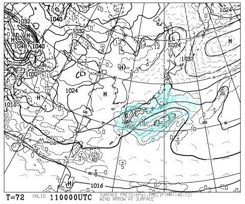

# まだ続く，今週末の志賀高原の天気は…土曜はみぞれ～雪，日曜は晴れ，かな…

📅 投稿日時: 2015-04-09 00:25:04

えー．

この天気予想を見る人が，ガクッと減ってしまう

今日このごろ．

みなさまいかがお過ごしでしょうか…

いや，ホントに．

4月2週を過ぎると．

スキー場の天気を気にする人が一気に減るんですよね～．

なんででしょうね～？？

まだまだ2か月以上，スキーシーズンが続くのに…←いや，もう多くの人がシーズン終わってるから

ってことで．

また，今週末の志賀高原の天気を予想するわけですが…

ふーーーむ．

土曜の850hpa図はこんな感じで…

まぁ，4月のこの時期としては平均的な感じかな～．

でも，0℃線が志賀高原近くまで下りてきてるし．

北風が入ってる感じだし．

で，地上天気図はこんな感じで，

降水が予想される領域．

本州をすっぽり覆ってますね…

だもんで．

おそらく．

土曜の朝は，うっすらと雪が積もっている可能性が…

で．この日は．

残念ながら，太陽は拝めなさそうで．

なんだか一日，降ったりやんだりの天気になりそうですが．

降るのは，標高の高い山頂付近では湿った雪，

低いところではみぞれ～雨…

って感じかな～．

先週に比べると，寒く感じる一日になるのかな？

で．日曜は．

うーむ．850hpaの0℃線は，土曜より北上しちゃいますか…

でも，地上天気図はこんな感じで．

本州は緩やかに高気圧に覆われるので．

まー，日曜は一日晴れそうですね～！

先週ほどではないけど，割と暖かい，

ポカポカ陽気の春スキーの一日かな～

って感じなので．

まとめると．

土曜：朝は雪がちらつく．前日から雪が降り続けているので，

　　ゲレンデは硬い下地の上に，うっすらと重めの新雪が

　　覆っている感じかな．

　　一日降ったりやんだり，太陽は拝めない感じ．

　　降るのは，今の天気図のままだと重い雪～みぞれって感じかな．

　　天気は悪いけど，前日から雪が降るので，ゲレンデ状況は

　　そんなにひどくならずに済みそうな感じ．　　

　　

日曜：朝から晴れそう．朝イチは固めのアイスバーンっぽい斜面かな．

　　午前中にゲレンデは緩み，昼間の気温は10℃近くまで上がる

　　ポカポカ春スキーの感じで．

　　雪は，日差しに暖められて典型的な春の雪に…

　　ゲレンデは，午後に向かって荒れたザラメバーンになっていきそう．

うーん．

土曜が雨にならず，雪になってくれれば．

先週よりましに感じるけど…

今のところ，雨か雪かぎりぎりのところにいるので．

また，直前に最終予想するのかな～．
