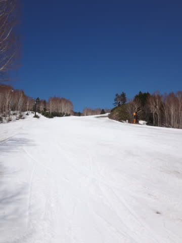
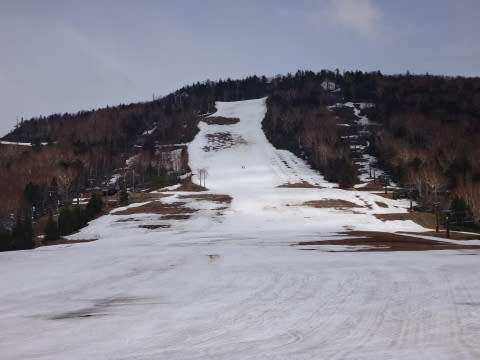
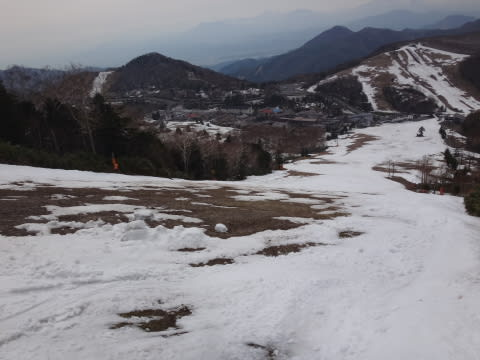
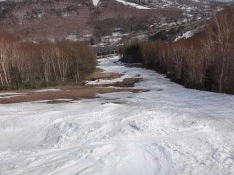

# GW5連休終了！…何とかぎりぎり雪がもってくれた感じかな～

📅 投稿日時: 2015-05-07 01:21:28

えー．

GWの志賀高原滞在も終了し．

ついさっき，帰宅したわけですが…

…今日も朝からすっきり晴天の一日でしたね～！

早朝は楽しめましたよっ！！

…で．

早朝から滑って，日付が変わってからの帰宅という，

いつも通りヘビーな日程だったので．

GW最終日の詳細レポートはまた明日…（眠くて死にそう）．

しかし．

このGW.

何とかぎりぎり雪がもってくれた，って感じですね～．

一の瀬は，正面バーンは何とかぎりぎり今日まで…

明日はもう無理だろう，という状況だったし．

焼額もかなり穴が増えて来て，第2高速は根性を入れて

あと1-2日って感じだったし…

きわどかった．

あと3-4日，5連休が後ろにずれてたら，壊滅だった．

いやー．ヤバかった！

ってことで．

詳細レポートはまた明日…

おやすみなさい…

＃明日ちゃんと朝起きられるのか？？

＃それよりも，ちゃんと社会復帰できるのかなぁ…
