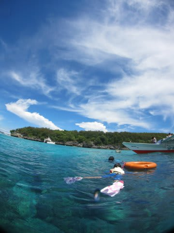
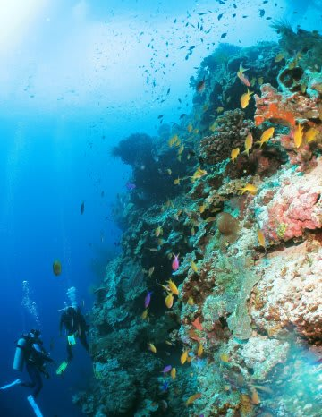
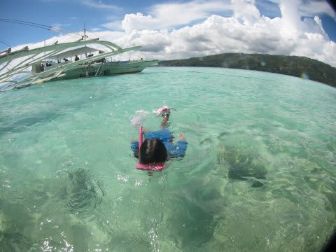
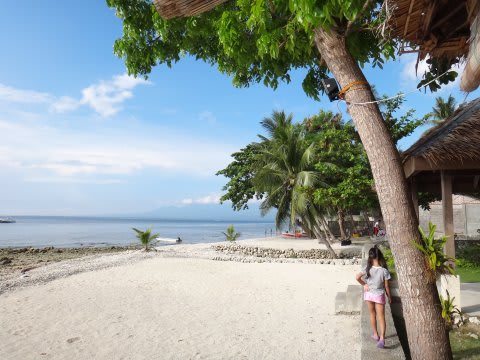

# 2013年11月　フィリピン・オスロブ旅行記，ようやくスタート！

📅 投稿日時: 2014-07-03 03:41:54

ということで．

夏モードに切り替わり．

アクセス数が冬のトップシーズンの半分以下に落ち込んで

しまっている今日この頃，いかがお過ごしでしょうか．

予告通り，本日からは夏モードなわけですが．

ご無体職場に突っ込まれた今年．

私「7月，この時期夏休み取りますから～（笑顔）」

上司「…チミ．その時期，何があるか知ってるよね」

私「この期間，例年通り夏休み取りますから」

上司「…この時期，どれだけ忙しくなるか，知ってるよね」

私「…夏休み取らないと，死ぬかもしれません…」

上司「逝ってよし」

私「え？行っていいんですね！！？夏休みの旅行に」

上司「死ね．100回ほど」

…って会話は実際にはなされてませんが．

まぁ，上司の心の中を文字にするとこんな

感じだった…という会話の結果として．

定例の7月の夏休みパート1の予定がぶっ飛んだ

わけで．

…というより，この職場．

「ホントに夏休み取れるのか？？」という

状況なので．

まだ夏休みの予定が確定していない状態なんですね～（涙）．

んなわけで．

まだ，次のダイビング旅行の予定はないんですけど．

前回の，2013年9月　子連れタイ・タオ島[ダイビング旅行記のエピローグ](e530e98339f87e8dc5e13de072679d584.md)にて．

「そして11月のダイビング旅行記へ…続く．」

…と，予告したっきり，スキーシーズンに突入してしまい．

すーーーっかり放置されていた，その「続き」．

スキーシーズンが終わり，次のダイビング旅行がいつになるか

分からない状況の今．

「果たしてジンベエは見れるのか？

　幼稚園児を連れて，ジンベエを見に行くのはやっぱり無謀だったか？？

　2014年11月　フィリピン・オスロブ旅行記…

　子連れでジンベエを見るぞっ！」

やっと開始です…

＃どうでもいいけど，今日の更新時間にも，職場のご無体さが表れているかも…

