# 2023年8月，座間味で親子3世代ダイビング！その2…那覇到着，座間味へ

📅 投稿日時: 2023-09-09 04:23:43

最後に山を登ってから1か月…

つまり．

肋骨にヒビを入れてから1か月経った

わけですが．

だいたい何をやっても痛みはなくなり，

受傷部を押さえたときにじんわりと

痛みとまでいえない程度の感覚が残る

程度で，ほぼ回復しました～！！

…だもんで．

今週末あたり，山に登りに行こうかと

思ってたんですが…

土曜は台風崩れの熱帯低気圧で

天気がどうなるか微妙なので，

山に行くのは止めました…

なんだか最近また仕事がバタバタしてて，

ちょっと疲れてきてることもあり．

休みたいって気分もあるんだけど．

うーーん．

週末どちらも身体を動かさないと，

むしろ疲れがたまるんですよね…

日曜に山に行けるかなぁ…

ってなことで．

本日も[前回の続き](ee31a45be1f7dd02b268b5acdbae156b9.md)，ダイビング旅行記です…

ーーーー

ってなことで．

実に4年ぶりに乗った飛行機に揺られること

2時間半．

飛行機は那覇空港に近づいてきて…

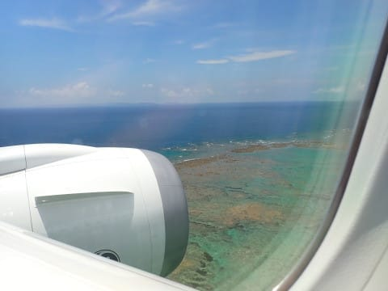

無事到着！

…到着した滑走路は，コロナ禍最中に完成した

新滑走路，36L側へのランディング．

那覇空港の完成した新滑走路，初めて

見ました…

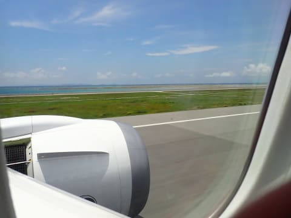

海の上のタクシーウェイを通って，

ターミナルへ向かいますが…

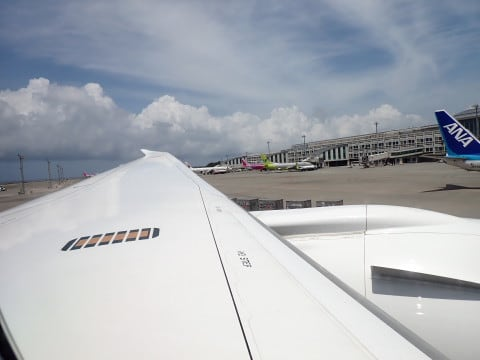

いやー．

実に4年ぶりの沖縄にやってきたよ！！

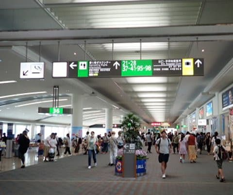

泊港16時発の高速船で座間味へ移動するので，

空港から泊港へ移動しますが…

今回，5人という大人数でダイビング器材も

あるので，ぜいたくにジャンボタクシーで

移動！

…でも5人だと，ゆいレールで行くのと

そんなに値段が変わらないです…

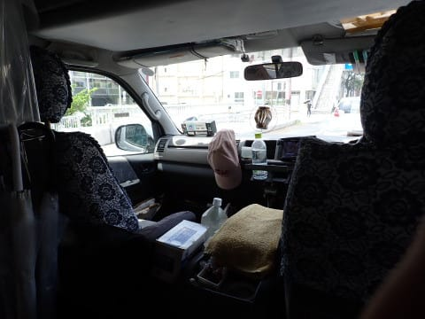

で，午後2時ごろに泊港に到着したので．

遅めのお昼ご飯にしよう…と思ったら．

とまりん内のレストランがみんな閉店してる！

コロナ禍でお客さんが減ったからかなぁ…

喫茶だけは開いてましたが，

お昼ご飯が食べられない…（泣）

とりあえず，飛び込みでとまりんの近くにあった

沖縄ソバやさん，「我部祖河食堂」に入って

みましたが…

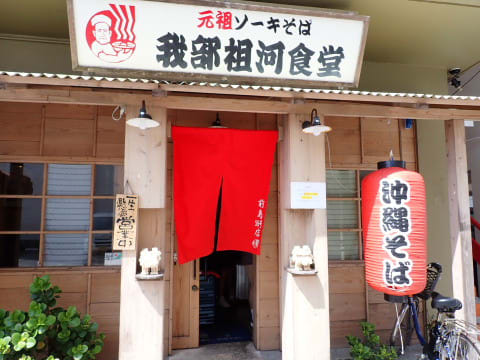

ソーキそばが予想よりおいしくて満足！

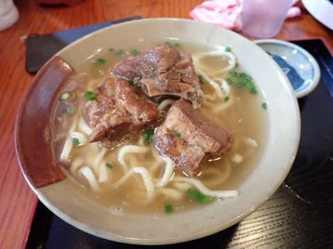

そして，出港30分前の15時半には…座間味行き

高速船，クイーン座間味の乗船開始です！

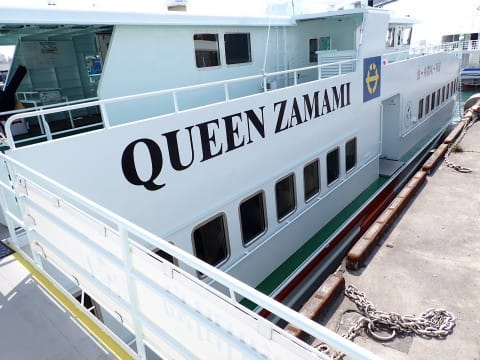

…この船も，

私の知らぬうちに新造船に切り替わってました…

うーむ．

私が旅行していなかったコロナ禍のうちに，

飛行機も新しいのが入り，那覇空港も新しくなり，

さらにクイーン座間味も切り替わっていたのか…

時代に取り残された感…

さすが2022年に就航したばかりの船，

内装もきれいですね～…

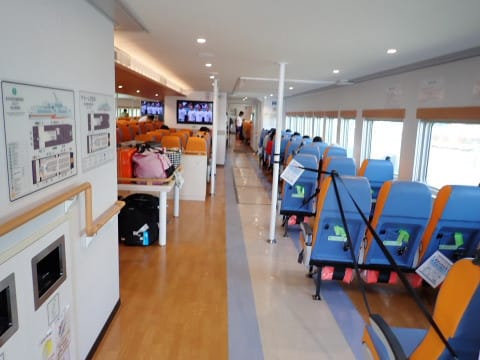

ってなことで．

定時の16時に，泊港を出港し…

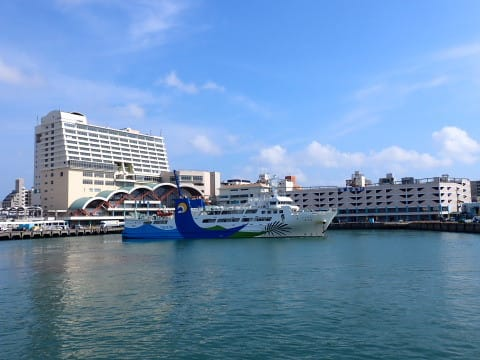

いざ，座間味島へ！！

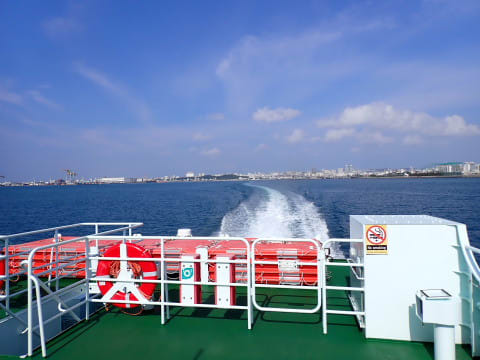

海は台風も過ぎ去り，外海に出ても

ちょうどべた凪のいい感じ！！

天気予報ではこれから台風の発生もなさそうだし．

ちょうどいいタイミングで沖縄にこれたな～

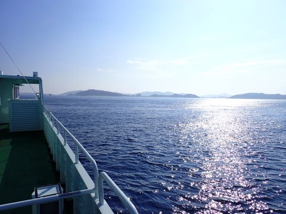

という感じで．

久しぶりの沖縄の海．

船室に入るのはもったいない感じで，

娘と一緒にずっとデッキから海を眺めて，

沖縄の海の景色を満喫してましたが…

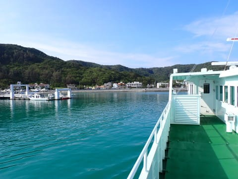

17時に，座間味港へ到着…！！

いや．

4年ぶりに戻ってきたよ～！

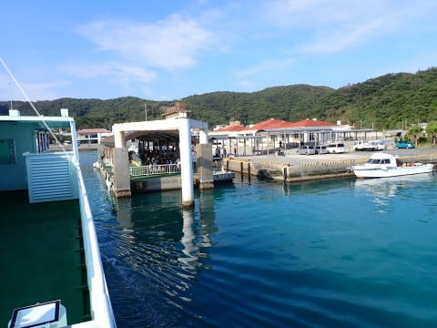

座間味港も何か変わったかな？？

と心配したけど．

座間味港は何も変わっておらず，

ちょっと安心…

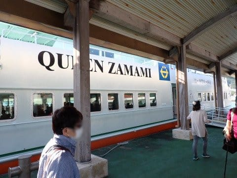

港には，ザマミセーリングさんが出迎えに

来てくれていて．

宿のペンション星砂さんまで，荷物を

運んでくれました…

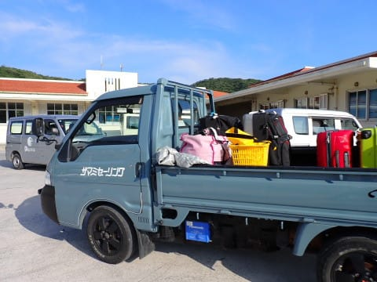

座間味港は変わってなかったけど．

知らないこんな石碑ができてたり…

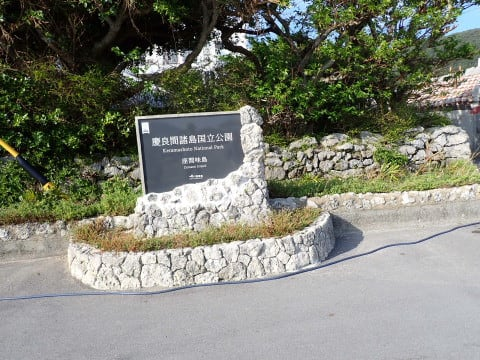

港の前の，座間味島唯一の信号機が

LED信号機に変わっていたり．

やっぱり，4年の時の流れを感じます…

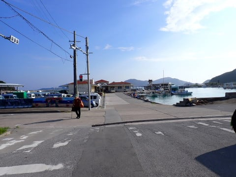

ということで．

いつもの星砂さんへ到着！！

これから4泊，お世話になります～！！

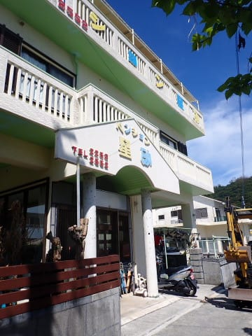

（[続く](e6b47d5e9790e7970739ccc33b112b493.md)）
