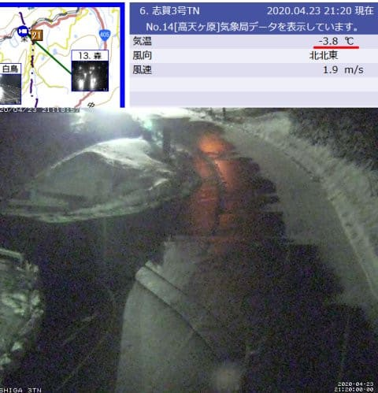
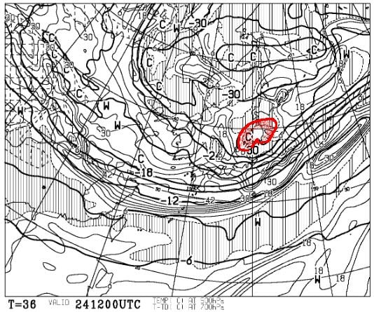
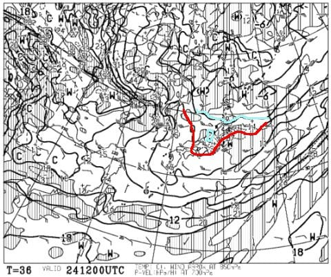
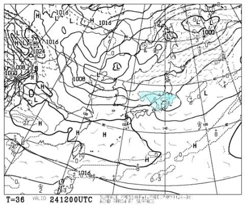
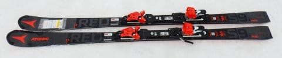
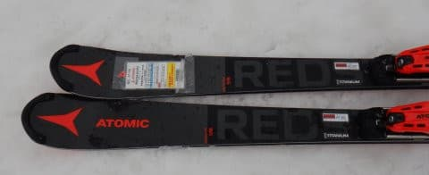
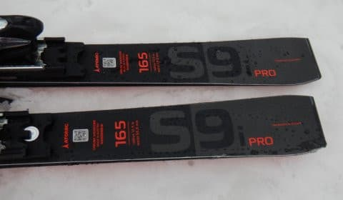
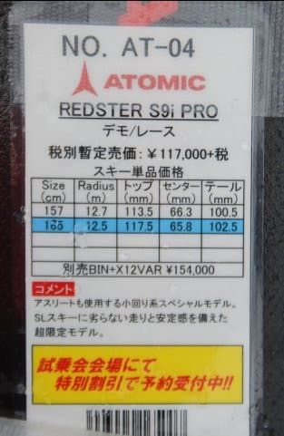
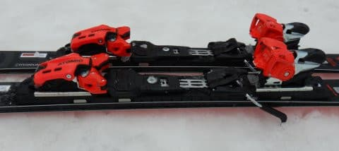

# 2021シーズンモデルのスキー板，試乗レポート…ATOMIC Redster S9i Pro

📅 投稿日時: 2020-04-24 00:03:53

えー．

まず．

昨日の記事の中にあったクイズの答えは，

[昨日の記事のコメント](eeb684c478255cfab52c0b4bc023f3d47.md)に書きましたので，

皆さん答え合わせをしてやってください（笑）．

で．

この4月．

奇跡の4月となってるわけですが．

なんだか，今日もうっすらと雪が積もった

ようですね…！！

路面の一部，雪がうっすら積もってます！

（[北信建設事務所道路気象情報ページ](http://hokushin.pref-nagano-roadcamera.jp/)より）

一昨日の記事にも，

23日，24日は季節外れの積雪

になっても不思議じゃなさそう…

と書きましたが．

実際に今日23日（木）の昼間もチラチラ降って

積もったみたいですし．

明日24日（金）の昼間も，雪がちょっとだけ

積もりそうな感じです…！

なんてったって，24日の500hpa図を見ると…

なんと．

真冬でもそうそうやってこない寒気，

そこそこの雪が降る目安の-30℃の線が

本州にかかってます！

そして，850hpaでは，赤い0℃線は

本州太平洋側まで下がり，

志賀高原には水色の-3℃線がかかって

いるので…

明日の志賀高原は，4月としてはありえない

朝は-5℃近い冷え冷え，昼間もマイナスキープの

一日になりそう…！！

地上天気図でも，プチ低気圧が

通過して降水量がありそうなので．

24日は，昼間の低気圧が通過する際に

雪がちょっと積もりそうな感じ…！

うーむ．

これで西風じゃなきゃ，志賀高原は

ちょっとだけじゃなく，結構積もってた

だろうなぁ…

…と．

志賀高原がすでに営業終了している

という事実をまだ飲み込めず，

相変わらず天気図を読み続ける，

Skier_Sなのだった…

ってなことで．

本題へ．

本日は，2021年シーズンモデルのスキー板

試乗レポートの続きです．

今回はアトミック編．

では，どうぞ～！

○ATOMIC Redster S9i PRO 165cm

基礎小回り用

以前，競技用セカンドモデルの[S9に乗りました](e32527a543e652cf67baac3a1e6c2168e.md)が．

この時試乗したこのS9から，コアを

軽量カルバコアに変えた板が，S9i．

そして今回試乗したこちらのS9i Proは，

SLトップモデルのS9 FISのコアを

軽量カルバコアに変えたモデルで，

サイドカーブはS9 FISと同じです…

去年のS9i Proは，S9 FISとは違ってサーボテックの

棒が着いてましたが，

来年はS9 FISと同様に，サーボテック無しに

戻るみたいですね…

軽量なTL GWビンディングが着いているS9iと違い，

S9i Proは重量級のVARビンディング付きになります．

軽量カルバコアを利用している板ですが…

持った感じずっしり重く，

履いてもかなり重いです．

…まぁ，VARビンディングが重いんですが…

滑ってみると，まず感じるのが，この

重さからくる安定感．

勝手にスキー板が雪面を捉えて，

サイドカーブでするする回る板ではありません．

何もしなくてもオートマチックに切れ上がって

いくような，勝手に回っていく感は弱いです．

谷回りで何もしないとまっすぐ進んで行きます

まず，谷回りで自分で動かしてたわみを

作っていく必要がある，マニュアル操作な

感じの板．

板の張りがかなり強いので，普通の

ゲレンデで気楽に滑る程度の速度では，

小回りをしようと思うと

一定のドリフトアングルを保って

板を動かし続けていく必要が

あります．

ただ，スピードを出していくと，

グーッとグリップして板が回り始めます．

コアとメタルの張りが強いので，

求めるスピード域，外力は結構高め．

返りは結構早いですが，私が

普段履いているSXほど強い返り

ではなく，板がすっ飛んでいくような

返りではありません．

この板のどっしり感と強さで，

ハイスピードでも板が叩かれることなく，

どっしりとした安定感がある小回りが

できます．

山回りでテールを抑えるとしっかり

切れていきますが，強い板にありがちな，

板のエッジグリップが強烈すぎて

どうしようもなく板なりに回されて

しまう板ではなく，

山回りでガッツリグリップした中でも

板を動かして，好きなラインを狙って

いけます．

エッジというより，面で抑えていく板．

自分で動かしていければ，すごいいい感じで

たわみ，すっごい回ってきます．

かなり玄人好みの板かも…

重いので安定感はありますが，

重い板を自分で動かしていくための

かなりのパワーを必要とする，

結構疲れる板．

オートマチックに板が勝手に回っていき，

脳内麻薬が出るままに傾いて行ける…

という板ではないので，

気楽にゲレンデを滑る…というのには

あまりおススメしかねるけど，

この板を履きこなせれば，かなり

体力・技術レベルともアップするかも…
