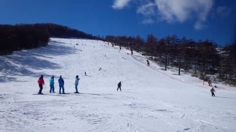

# 12月1日の日曜は，予告どおりアサマ2000へ行ってきた

📅 投稿日時: 2013-12-01 23:13:57

はいはいはいはい．

行ってきましたよ～．今週もアサマ2000へ．

…八方がコンディションいいようなコメントももらったので，

一瞬，「日帰り八方か？？」

…という禁断の思いが脳裏をかすめましたが．

今週から第1，第2リフトの2本，リフトが動くようだし．

無難にアサマにしておきました…

さてさて．

朝，アサマへ行く道は…

峠を越えると，今日も雪道ですね～．

気温も車の温度計でマイナス2度．冷えてます．

ちゃんとスタッドレスを履いていきましょう～

で．

ゲレンデに到着すると…

うむ．

先週より雪が減ったなぁ．

レストハウスから滑っていけなくなってる…

んでも．

ゲレンデはこんな感じで…

人工雪をしっかりつけてあるので，

バーンの雪はばっちり！

見てるだけでよだれじゅるじゅるモノ…

この，朝イチぴかぴかバーンを狙って，リフト開始前だというのに．

リフト，こんなに待ってるよ…

で，8時半リフト運転スタート！

5分ほど待ってリフトに乗り込むと…

うほう！

ぴかぴかバーン！

気持ち良さそう～！

朝のうちは，人工降雪にきれいに圧雪がかかり，エッジが効く

超快適ハイスピード大回りバーン！

今シーズン，これまで体験したことの無いトップスピード！

天気もいいし，なんて気持ちいいの！

アサマって，朝のうちは気持ちよくても，昼前にはところどころ

硬い雪が出てきて，大回りするには苦しくなることが多いけど．

今日は午前中いっぱい，快適大回りバーンが続いて，

シアワセ…．

昼過ぎになってから，上半分は硬いところも出てきましたが…

下半分には，先週はその姿を現し，数多くの人を

絶望に追い込んだ小回りレーンがまったく姿を見せず…

午後になっても大回り可能！

そーいや今回．

先週はなかったこーんな看板がリフト乗り場にあって．

「コブは作らないでください～」

って感じの放送が何回か流れてましたが．

昼ごろには，やっぱりコース端に1本，コブラインが掘削（自然発生？）

されてましたね～．

んで．

…リフト待ちは，午前～午後2時ごろまで，平均してこんな感じ，

5分前後ってところ．

先週より混んでるけど，短いと2-3分待ちで乗れることもあったので，

ぜんぜん許せるレベル．

で．

日が隠れる午後2時近くになってもまだ大回り可能！

…上から見ると，ちょっと荒れ始めてはいるので…

ハイスピード大回りするには，多少の精神の強さが必要ですが…

んで，日が隠れる2時過ぎにはコースの人が減っていき…

しばらくたつと，リフト待ちも完全に0！

そして．

昨日まではリフト券が3000円と安いかわりに，3時に終了でしたが．

本日から，リフト券3900円と値上がりした代わりに，

1時間半営業時間が延びて．

4時半まで営業！

がらがらになった2時過ぎ以降も．

それから2時間近く滑ることができ．

だーーれもいなくなるリフトストップまで滑り続けたのでした…

いやーーー．

今日は，午後まで大回りできたし．

リフトも2本動き，第2リフトは上級者ばっかりだったので，

人が多くても滑りやすかったし．

今日は満足！！！

＃今日「も」満足でしょ←とりあえず自己突っ込み

## 💬 コメント一覧

### 💬 コメント by (Goku)
**タイトル**: Unknown
**投稿日**: 2013-12-02 19:00:12

アサマ良さげですね～（＾ｖ＾）

私はようやく今週末開幕です。

### 💬 コメント by (Skier_S)
**タイトル**: Gokuさま
**投稿日**: 2013-12-03 01:02:14

いやー．

夕方もつんつるアイスバーン地獄に

ならなくてよかったですよ！

今シーズンはそんなに滑れないみたいですが，

ようやくシーズンインですね！

また志賀高原ですか？

