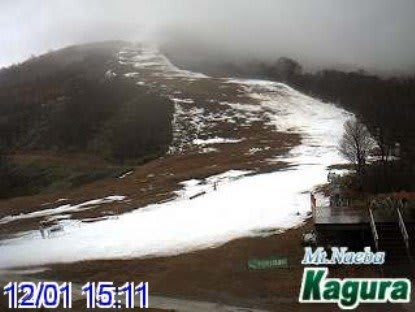
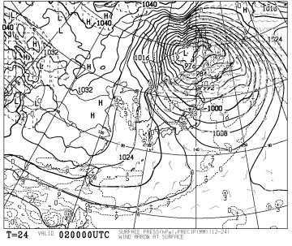
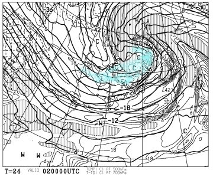
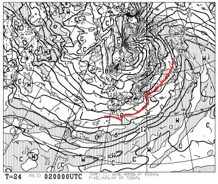
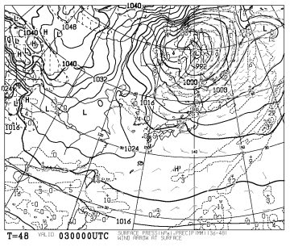
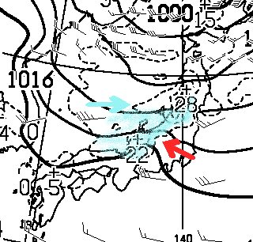
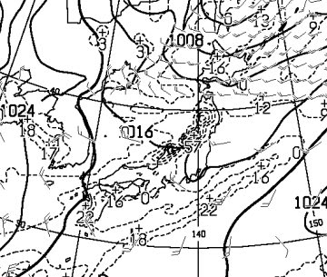
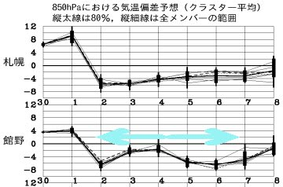
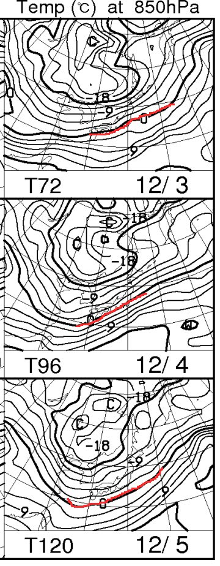
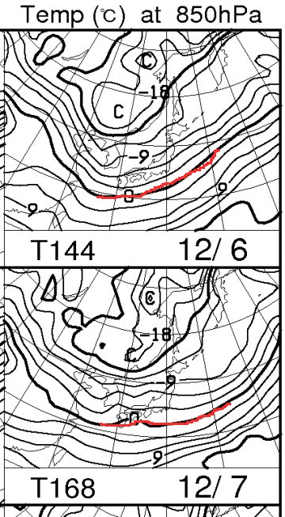

# 今週はすごい冷え冷え！この週末に大期待っ！！

📅 投稿日時: 2014-12-02 01:09:31

えー．

今日の高温＆降雨のために．

スキー場は，トドメを刺されてしまった感じで．

[鹿沢](http://www.kazawa.com/snow/)も，[アサマ2000](https://www.facebook.com/asama2000park/posts/1008999799125461)も，[丸沼](http://www.marunuma.jp/news/2745/)も．

12月2日は，営業をあきらめたようです…

かぐらは，かなり気合が入っているのか．

こんな状態になっても，2日に営業するようですが…

でも．

予告した通り．

2日から，冷えます．

激烈に，冷えます．

ってか．

1日深夜の現時点で，もうかなり冷えはじめてます．

…そして．

その冷え込みは．

この週末の7日まで，ずーーーーっと続きます．

で．

日本海側は，雪が降り続けそうです…

まずは，2日の地上天気図ですが．

…976hpaっていう，台風並みに低気圧が

発達してます…

この低気圧．

強烈な寒気供給で発達している低気圧です．

上空500hpa気温図を見ると．こんな感じで，

真冬でかなりの雪が降る目安，

-30℃の寒気が，北陸地方近くにまで入り込んでますね～．

うーむ．

2日は，北陸～東北，北海道地方は，激荒れですな．

で．

こんな感じで，2日の850hpa気温図も．

0度線は本州南側まで下がっているので．

スキー場では，降れば雪です．

雨になる心配は全くありません．

そして．

翌3日になっても，爆弾低気圧は

まだそのまま停滞を続けますね…

これは，信州も大雪になるに違いない！

と，思いたいところですが．

こんな感じで，風向きは青矢印で示したように，

見事に西向き．

…なので．

赤矢印で指し示す信州部分は．

雪雲が北アルプスでブロックされてしまい，

雪雲が届かず．

水色で塗った降水量のある領域．

信州には届いていません…（残念）．

でも．マイナス30℃の寒気が入ってくるレベルだと．

一部根性のある雪雲が，北アルプスを越えて

流れ込むレベルだろうから．

2日，3日とも，時折雪が舞う…という程度には

降ってくれるかな．

さらに．

4日の朝の降水量の予想ですが…

うわ．これはすごい．

点線で囲まれた降水域．

新潟-秋田近辺，24時間で最大57mmの降水が予想されてます．

…これ，積雪量に直すと57cmなんですが…

3日～4日にかけて，日本海側の山沿いでは50cm級の降雪が

あるかも！！

…でも．

やはりこの日も，信州には降水が予想されていないのが

ちと悲しい感じ（残念）．

そして．

この寒気は．

日曜7日まで，休みなく続くのだ．

こんな感じで，平年比8度～2度ほど低い日が，

これから7日まで，ずっと続くのだ．

850hpaの0℃線も…

こんな感じで，7日までずっと本州より南まで下がっているし．

信州は大体マイナス3～6度線がかかってます．

明け方の志賀高原．マイナス10℃近くまで

冷える感じですね～！！

って感じなので．

この一週間，新潟の日本海側．これは，積もります．

ガンガン降ります．

…だのに．

信州は，あまり降雪がなさそうなのが，痛い…

でも．

全く積もらないわけではありません．

一週間もありますから，ぼちぼち積もってくれるとは思います．

あとは，人工降雪機がガンガン動かせるので．

まぁ，今週末は．

壊滅的状況は，かなり改善されるでしょう…

ということで．

数日前から繰り返してますが．

今週末に，期待！

## 💬 コメント一覧

### 💬 コメント by (フナ)
**タイトル**: 期待((o(￣ー￣)o))
**投稿日**: 2014-12-02 01:40:46

こんばんは(^^)

寒気に歓喜して今日は夕方から天気予報をずっとチェックしてしまいます～～(^-^;汗！！！

根性のある雪雲(笑)(笑)

頑張って白馬に雪を届けておくれ！！！

### 💬 コメント by (Skier_S)
**タイトル**: フナさま
**投稿日**: 2014-12-02 12:54:50

う～ん。

予想通り冷えましたが、

やっぱり信州は雪が降ってませんね…(;_;)

根性のある雪雲、カモーン！

### 💬 コメント by (Goku)
**タイトル**: 信州の空は
**投稿日**: 2014-12-02 20:35:54

えー信州から実況ですが、今日は長野市から志賀高原がくっきりと見えました。なので日中は降っていません(T_T)

逆に戸隠～白馬方面は一日を通して雪雲に覆われていましたね～

冷え込みはあるので人工降雪機に頑張ってもらいましょう。

### 💬 コメント by (Skier_S)
**タイトル**: Gokuさま
**投稿日**: 2014-12-03 01:10:30

現地レポーターのGokuさーん．

お天気レポートありがとうございました～．

…でも．

やっぱり．

信州は降りませんでしたか…

明日も降りませんよ．たぶん…

明後日4日から5日は，降るかも…って感じです．

とりあえず．

人工降雪機，頑張れっ！！！

