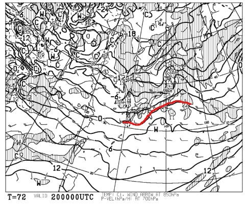
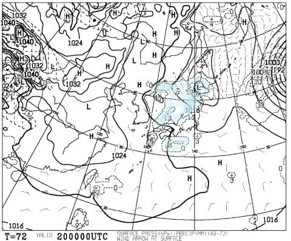
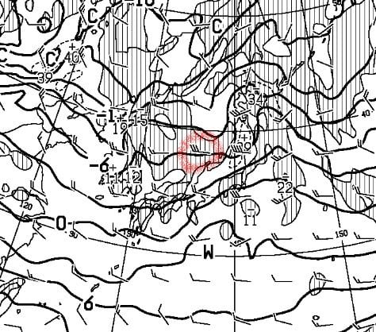
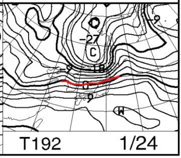
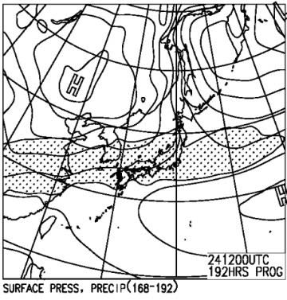
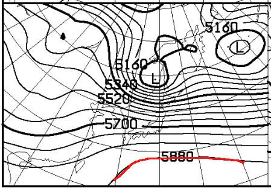
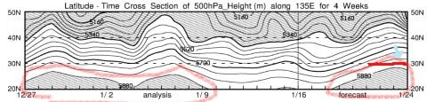

# 今週末も志賀高原，2日とも冷え冷えながら積雪なしの予想（涙）…そして，来週の志賀高原の天気は，雪が積もらず，雨が降るのか？？

📅 投稿日時: 2020-01-18 00:26:23

🏷️ カテゴリ: [日記](cc4b5682fb7b8b144980957a978653fb0.md)

ってなことで．

今週末もいつも通り，志賀高原に滑りに行く

わけですが．

予想はおおむね昨日の通り．

土曜，日曜とも朝は-8℃，昼でも-3～5℃程度と

そこそこ冷え込み，

どちらもおそらく曇りの一日になりそうです．

…この土日は基本的に曇り空で，雪が積もる

気配は全くありません（涙）．

けど，そこそこ冷えてくれるので，

志賀高原は先日積もった雪でゲレンデ状況も

良くなったみたいだし，まぁまぁ楽しめそうな

週末です…

が．

雪が降るかも…と，この日の記事で

予告した20日．

この日の天気図を見ると．

確かに0℃線は志賀より南で．

降水域は日本海側にかかっている

予想ですが…

天気図を詳しく見てみると．

うむむむ？？？

志賀近辺，見事な西風なのですが！？？？

ってなことで．

そこそこ冷えて，日本海側は雪が

降りそうですが．

西風なので，志賀は積もらないパターン…（涙）

今シーズンは，冷えると降らないという

嫌なパターンに入りつつあります…（泣）

それどころか．

次の24日は…

うむむ？？？

うむむむむ！！！

ヤバい…

この日はヤバいかも．

そもそも．

この日の850hpa高度図を見てみると．

なぬ？？

5880mの線が，こんなに北に！

この，5880mの線って．

ほぼ，夏の空気だと思っていいレベルで．

この5880mの線が，北緯30度を

超えるようになると，

「あぁ…夏が近いな」

と思っていいんですけど．

24日は

この線が北緯30℃近くまで北上してきます（涙）

もう，天気図上では，冬どころか，

夏が近いよ…（泣）

この下に示すのが，FXXN50に書かれている，

500hpa特定高度線の位置の日ごとの変化を

示す図ですが．

この図に，赤く括ったように，

1月前半と後半に，5880mの線が

現れてきてます…

5880mの線がこの図に現れてきてるだけで，

冬とは思えない状況なのに．

それどころか，

水色矢印で示したあたり，

1月23日～24日のころは，

5880mの線が北緯30度まで北上

していて．

…こりゃ，ほとんど夏にしか

見られないレベル（泣）

普通の冬で，5880m線がここまで北上

したのを，見たことありません…（涙）

ダメだ．

どうも，今シーズンはダメっぽい…（止まらない涙）

## 💬 コメント一覧

### 💬 コメント by (m&t)
**タイトル**: Unknown
**投稿日**: 2020-01-18 00:45:16

アサマ2000ホームのm&tです。

日曜日にはリフトストップ後、駐車場で皆さん集合しているところ、突然話しかけてすみませんでした。

その時お話した通り日曜日(月曜日も)に再び志賀高原に行きます。

朝イチは奥志賀スタートですが、ヤケビではチャンスがあればSさんの後をつけてみます。あっという間に視界から消えて行くSさんが想像出来ますが・・・。

ではまたお会いしましょう!

### 💬 コメント by (ゴン太@SALLOT CLUB)
**タイトル**: Unknown
**投稿日**: 2020-01-18 07:56:35

今週末は休みを取って、金曜から月曜まで滞在しています。金曜のゲレンデは人もガラガラでバーンも最高でした。

来週末は雨ですか。以前お話ししたニューチームウェアが、近日中に到着予定で、来週末から着用予定でしたが...。

### 💬 コメント by (ぽん)
**タイトル**: Unknown
**投稿日**: 2020-01-18 12:11:06

20000メートルクラブの山口さんが、先週、杉山スクールに入ったそうです。

奥志賀でのクラス分けの時に、「ゴンドラ下まで滑って良いですか？」との質問に先生はビックリしたそうです。

クラス分けでは、真ん中のクラスに入ったそうですが、その後、どうなったか？

Sさんの取材でブログでレポートしていただけると幸いです。

久しぶりの20000メートル倶楽部のネタ。お願いします。

結構、上達？したとの噂もあります。

それとも、先生が呆れてしまったのか？？？

### 💬 コメント by (Skier_S)
**タイトル**: 今日の志賀は良かった…
**投稿日**: 2020-01-18 22:53:01

＞m&tさま

先週は，わざわざ駐車場終礼中に立ち寄っていただき

ありがとうございました～！

明日は奥志賀スタートですね？

私は相変わらずヤケビスタートで，イチゴングルグルしてると思います．

明日は，一緒に滑っている人の関係でゆっくり滑っているかもしれません．

私が他の人といても，気にせず声をかけてください～！

＞ゴン太さま

3泊4日ですか…

いいですね～．

一番雪が冷えていいタイミングの4日間をえらんだのではないでしょうか．

＞ぽんさま

そこまでの情報を知っているということは，現場を見てこられたのではないのでしょうか(笑)．

私もスクールに入っているのをちらっと見ましたが，

きわめて普通にうまく滑っていたので，あまり面白いネタがなくて残念に思っているところです．

結構上達したのでは，という話なので（なぜか伝聞形）

スクールにいった価値は十分あったのではないでしょうか…？

残念ながら，今回はすごい伝説になりそうなネタはなかったです…

### 💬 コメント by (学生)
**タイトル**: Unknown
**投稿日**: 2020-01-19 22:56:53

月末にスキー行く予定です、、、((((；ﾟДﾟ))))ｶﾞｸｶﾞｸﾌﾞﾙﾌﾞﾙ

### 💬 コメント by (Skier_S)
**タイトル**: ＞学生さま
**投稿日**: 2020-01-20 01:46:28

月末ですか…

まだ，今週末の25日ごろじゃないだけマシだと思います…

ただ，スキー場はどこでしょうか？

志賀ならまだ多少雨が降っても雪が残ると思いますが，

他のスキー場だと，かなりヤバいかもしれません．

営業中止になったり，滑れるゲレンデが限りなく少なくなる

可能性も…

