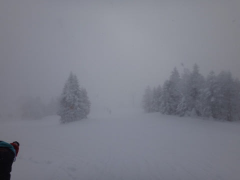
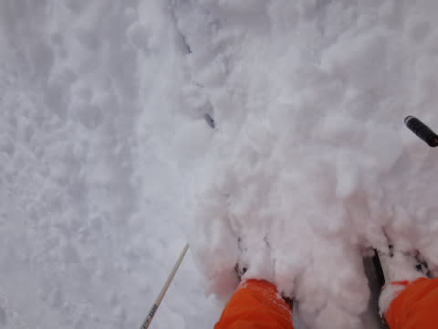
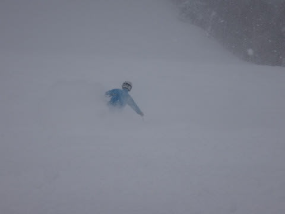
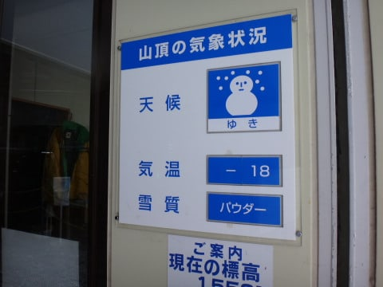
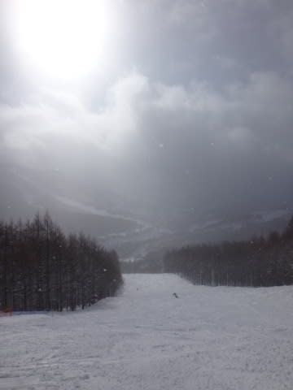
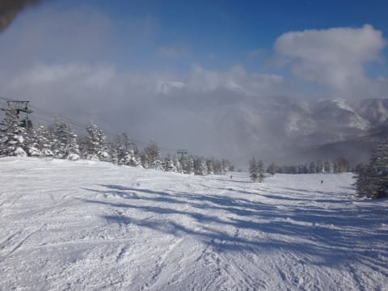
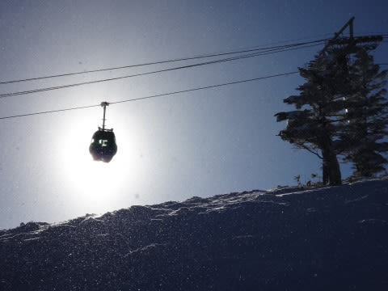

# 1月13日，3連休最終日の志賀高原速報

📅 投稿日時: 2014-01-14 00:19:46

🏷️ カテゴリ: [2014スキー滑走日記](c992167609b6415052179ee69ea1ea7d8.md)

えー．

いつもどおり．

今日も夜遅いので，速報モードで…

今日は，朝は雪が降っていて…

非圧雪コースは，ブーツ～膝下くらい積もっていて…

底付きのする浅いパウダーだったけど．

うほー！

(この写真だと，すごい深いパウダーに見えるなぁ…)

午前中は雪が降り続け，かなり寒かったけど…

昼ごろから薄日が射し…

午後は晴れましたっ！

…どうでもいいのですが．

ほとんどの写真に，ほかのスキーヤーが写っていないことから

分かるように．

がらがらでしたよ～！

詳細は，また明日…

