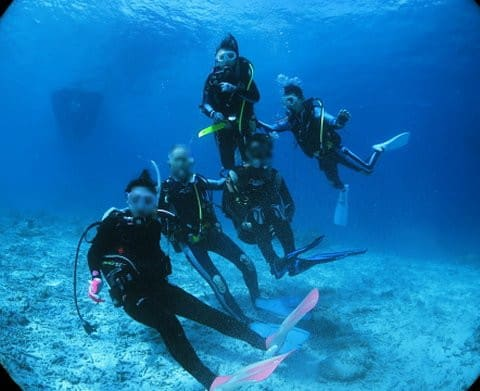

# 2023年8月，座間味で親子3世代ダイビング！…エピローグ

📅 投稿日時: 2023-10-16 00:24:49

ってなことで．

コロナ騒ぎやら娘の受験やらといった

いろんなことで，実家への帰省すらできず．

どこにもいかない夏休みを3年間

過ごしてしまったわけですが…

ようやく今年．

実に4年ぶりに，家族で夏休みに

泊りがけで旅行に行くことができ．

実に4年ぶりの飛行機，

4年ぶりのダイビング，

4年ぶりの沖縄…

さらに，

4年ぶりの座間味の海，

4年ぶりの星砂さん，

4年ぶりのザマミセーリング…

娘にとっては，最後に行ったのは

小学生のとき．

今回，高校生となってようやく再訪と

なったわけだけど．

みんな以前と同じく，変わらず

歓迎してくれて．

座間味の海も変わらずきれいで．

「あぁ…変わらないな…」

と，ほっとしたわけですが．

その一方で．

子供が小学生の頃は，

「いつか親と一緒に旅行に行って

　くれなくなる日が来るんだろうなぁ」

と，はるか遠くの将来のことだと

漠然と憂いていたことが．

さすがに娘も高校生ともなった

今回の旅行で．

その日が「あと4-5年くらい」という

単位で，リアルに目の前の現実として

近づいていることを感じ始め…

娘が中学生だった3年間，家族で

旅行できずに失ったのは痛かった

と，改めて思い知らされた，

今回の旅行だったわけで…

今回の旅行があまりにも素晴らしくて，

いい思い出になったんだけど．

…この楽しい思い出を作るチャンスを，

まるまる3年分失っていたのか…！！

と，愕然としたのでした…

いくらお金を積んでもこの3年間は

戻ってこないので．

これから，お金がかかっても

もっといっぱい娘と遊びに行こう

と思ったんだけど…

この3年間で，ご無体兼務も増えて，

仕事が殺人的に忙しくなってしまい．

以前みたいに夏に2回ダイビング遠征に

行くなんて，夢のまた夢の忙しさ（涙）

あぁ…

娘と一緒に旅行に行けるのがあと4-5年と

考えると．

娘と一緒にダイビングに行けるのも，

あと4-5回か？

…と，寂しく思ってたけど．

今回．

我が両親と潜りに行って．

3世代で潜ったことを考えると．

実は，娘が結婚して子供が生まれても．

そのあとでもまだまだ一緒に潜りに

行くチャンスがあるのかも？？？

とりあえず．

我が両親を見習って．

孫がCカードを取ってダイバーになる

まで，元気で潜れるように鍛えておこう…

と思った，Skier_Sだったのでした…

（おしまい）

## 💬 コメント一覧

### 💬 コメント by (1kamakura)
**タイトル**: Unknown
**投稿日**: 2023-10-16 08:41:51

きれいな海で

娘さんとの良い思い出が作れて、

本当にようございました❣️

我が家は息子29娘27ですが、今でも家族旅行にはホイホイくっついてきますよ。

息子は今年5月に結婚したから、私たち家族四人での旅行はもう難しいかも。

Sさんちも大丈夫じゃないかな。

娘さんも親と一緒ならお金も出してもらえて、ダイビングができるし、行きたいと思いますよ〜。

娘さんはスキーは？

### 💬 コメント by (mae)
**タイトル**: Unknown
**投稿日**: 2023-10-16 23:54:35

私も同じことを今まで考えてきました。

長女が高校生の3年間は、本当にコロナで失われました。

私自身も、命、時間、自由、お金、仕事など、人生の価値を見つめ直しています。

今回の旅行が、これからの人生をどう生きていくか

考えるきっかけになったのではないでしょうか。

仕事が殺人的に忙しいようですが、本当のところは分かりませんが..

会社の奴隷にはならなければ、と感じてしまいます。

### 💬 コメント by (Skier_S)
**タイトル**: 今週末にはもうスキーシーズン！
**投稿日**: 2023-10-17 01:36:15

＞江戸の秋さま

あら…そんなお子さんが大きくなってからも一緒についてきてくれるとは，うらやましいです…

我が家の娘も，大人になっても一緒に来てほしい気もあるけど，いい大人になったら

家族よりいい相手を見つけて，その人と一緒に行って欲しいかも…という

矛盾した思いもあったりします（笑）．

娘はスキーも大好きなので，スキーはちゃんと毎年行ってます～！！

ただ，部活があったり土曜に学校があったりで，それほど回数は行けませんが．

＞maeさま

そうですよね…

このコロナで失われた3年間は大きかったですよね…

久しぶりの沖縄旅行で，いろいろ考えさせられました．

早く早期退職してゆっくり過ごしたくなってきました（笑）．

