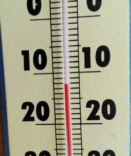

# 2/23の祭日もSkier_Sは志賀高原に行っているとお思いでしょうが…

📅 投稿日時: 2022-02-23 02:59:39

🏷️ カテゴリ: [日記](cc4b5682fb7b8b144980957a978653fb0.md)

おそらくこのBlogを読んだ人のうち，

100人中1億2000万人くらいの人が，

23日もSkier_Sは志賀高原へ滑りに

行っていると思っているでしょうが．

なんと．

どうしたことか．

23日の祭日はスキーに行かず，仕事です…（涙）

家で必死に仕事やっつけてます．

あぁ…

明日もそこそこのパウダーで

滑れそうだったのに．

…もしかすると，今シーズンラストチャンスの

軽いトップシーズン新雪だったかもしれないのに．

家でお仕事とは…（涙）

とはいえ．

おそらくこの睡眠不足状態で，

往復10時間近く運転して，日帰りで

志賀で滑ってたら死んでしまう

気もするので．

まぁ，家で仕事してるのが正解でしょう…

ちなみに，本日の志賀高原ですが．

いつものおこみん特派員によると…

あさイチではないけど，朝2くらいの

気温は-12℃．

予想よりちょい高かったかな？

天気は終日雪降りで，朝までの積雪は

50cm以上あったようです！

オリンピックコースは太もも~腰パフの，

激軽パウダーで最高だったようですが…

圧雪コースも全面軽いパウダーで

覆われていたみたいですね．

昼間の数時間でこれだけ積もるくらいの，

激しい雪降りの一日だったみたいです…

そして，明日も冷え冷え雪降りの一日．

朝までのパウダーは本日22日ほどの積雪

じゃないけど．

20~30cmは積もってくれてるかな？

昼間も雪が降り続けます…

時折弱まったり，うっすら日が射したり

するかもしれないけど，基本的に

雪降りの一日．

激冷えデーです！！

うーん．

滑りに行きたかった…

今週末心置きなく滑れるように

明日はしっかり宿題をやっつけるのだ！！

…って，明日一日じゃやっつけられない

仕事量なのは，気のせいか…（涙）

## 💬 コメント一覧

### 💬 コメント by (みこみん)
**タイトル**: Unknown
**投稿日**: 2022-02-23 08:52:40

おはようございます☀

お仕事お疲れ様です(＞人＜;)

はい！　勿論！　今朝も、もう既に滑ってられるものだと思っていました〜笑笑

今季ラストかもしれないパウダーなんですね💦

私は、週末に行く予定ですが…

どうか、このパウダー状態が続いてくれますよう…

祈るのみです🙇‍♂️

今後のゲレンデ状況も、予報よろしくお願いします🙇‍♂️

### 💬 コメント by (レインボー74)
**タイトル**: Unknown
**投稿日**: 2022-02-23 18:16:51

水曜日の志賀高原情報

湯田中の新雪は3cm。上林-5℃　蓮池-11℃。状態はいい。

まずはパノラマからしらかば。一番だ。圧雪の上に数センチの新雪。滑りやすい最高の雪。

GSサイドはまっすぐなボード跡が何本も。50cmはある深い溝があるけど、おかげで止まらない。ふかふかの浮遊感が味わえて幸せです。

ウオールにはすでに多くの踏み跡が。

やけびで楽しく遊んだあと、何人もの仲間と高天の銀嶺へ。

そこで５年ぶりくらいに、旧友とばったり。

昔、いつもご教授いただいた師匠です。

午後は一緒しました。80歳なのに衰えていない。ベルガーの講習を受けていた人なので、まあ次元が違うんですが、背筋はピシッ！体幹は安定。夏は自転車で鍛えておられるんです。それは真似できないけど、74歳の若輩者にはとってもいい目標ができました。

また、銀嶺では女性初の20000mのかたにお声かけいただきました。おかげで夜の晩酌がハイテンションで弾んでいます。ありがとうございます。

今日も楽しい一日を過ごさせていただきました。

### 💬 コメント by (やす)
**タイトル**: Unknown
**投稿日**: 2022-02-23 18:57:08

S様ご無沙汰しております。

生息地か違うため、なかなかお目にかかれませんが…

私もS様が志賀にいらっしゃるのでは？と思った1億2000万人のうちの一人です。

本日はレインボー74様に遂にお会いすることができました。銀嶺さんで勇気を持って声をかけてみて良かったです。レインボー74様、突然のお声掛けに応じて下さりありがとうございました。そしていつも志賀高原情報をありがとうございます。

混雑を避けてS様がお留守の平日にヤケビをウロウロしていることもありますので、今後ともどうぞよろしくお願いいたします。

### 💬 コメント by (Skier_S)
**タイトル**: 滑りに行きたかった…
**投稿日**: 2022-02-24 02:56:16

＞みこみんさま

今週はパウダーではないけど，そこそこいい感じの週末になりそうです…

3月も冷えてパウダー積もってくれることを期待してます…

＞レインボー74さま

今日もコンディション良かったみたいですね…

そして，いろいろな人との出会いもあったみたいで．

いい一日でしたね！

＞やすさま

お久しぶりです～！

なぜレインボーさんが分かったのか不思議ですが…

なにかオーラが出てましたでしょうか（笑）．

長らくお会いしていませんが，今度は休日にヤケビへ遊びに来てください！

…私も時々高天ヶ原へ出張しているんですが…

### 💬 コメント by (みこみん)
**タイトル**: Unknown
**投稿日**: 2022-02-24 11:43:15

わーい🙌

❄️パウダー期待して、行きまーす🤗

ありがとうございます♪

### 💬 コメント by (Skier_S)
**タイトル**: ＞みこみんさま
**投稿日**: 2022-02-25 02:27:52

今週末は土曜は晴れ，日曜は曇りなので，残念ながら新雪はなさそうですが…

来週以降にパウダー期待！！！

