# 3月4日(日)の志賀高原速報モード…晴天なれど朝からプラス気温で，4月下旬か？？という雪に（涙）

📅 投稿日時: 2018-03-05 01:43:23

えー．

本日．

すごかったです（泣）

ええ．

すごかったです…

何がってですか？？

それは，もう．

これはGWか？？？

というくらいの暖かさで．

もう，雪もすごいことに…（涙）

ってなわけで．

本日もラストリフトまでしっかり滑って．

いつも通り深夜帰宅なわけなので．

一体どんな状況だったのかを，

日曜定番の速報モードにて…

まず．

朝8:30の朝イチゴンドラで登った山頂で，

すでに気温がプラスなんですけど…！？？？

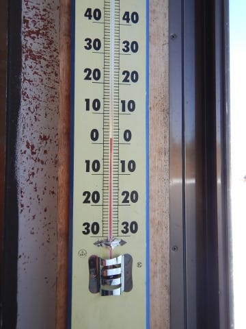

朝イチで，プラス2℃！？？

…3月上旬に，朝イチの山頂の気温がプラスだったことが，

かつてあったろうか…（泣）．

そして．

ゲレンデはピカピカ晴天…

というより，強烈な日差しが照り付けて．

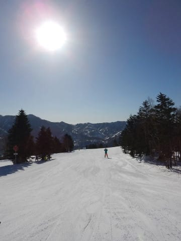

そのおかげで，朝早い段階から雪は

しっとりした感じになって固まりはじめ…

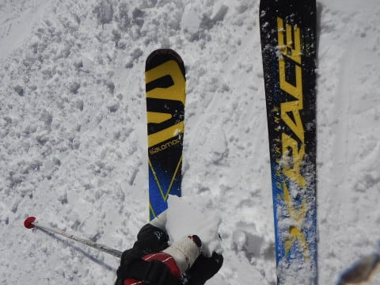

人が多かったというのもあり，

焼額のオリンピックコースやGSコースは，

重い雪がところどころ溜まっていくような，

とても3月上旬と思えない荒れたバーンに

なっちゃってます（涙）．

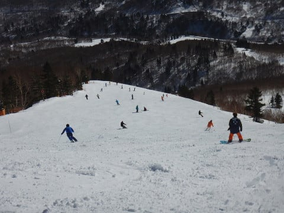

それどころか．

11時近くになると，雪の表面が水を吸ったような

かなり湿った感じになっていき…

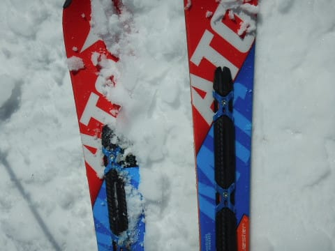

激烈にスキー板に張り付く，

強烈ブレーキ雪になっちゃいました…（泣）．

なぜ…

なぜ，3月第1週に，こんな4月並みの雪に

なっちゃうのか…（激泣）．

この日は終日，恨めしいほどのすっきり

晴天で．

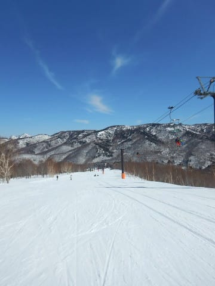

強烈な日差しにより，焼額だけではなく奥志賀も，

高温で固まった重い雪がところどころに溜まっていく，

かなり滑りにくくて残念なバーン状況に…

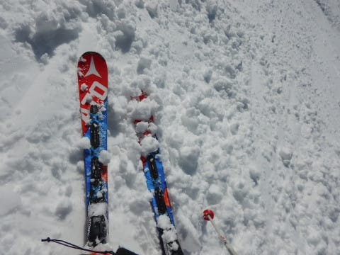

なんてこった…

西斜面で，朝日があたらない一の瀬ファミリーは，

午後1時近くまで結構コンディションが続いたものの．

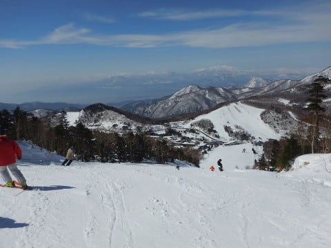

ここも，午後2時ごろにはかなり重くて

貼りつく雪に…（残念）．

そのあとに移動した寺子屋は，春っぽい

雪ながらも，最後まで何とかスキー板に

張り付くことがなくて．

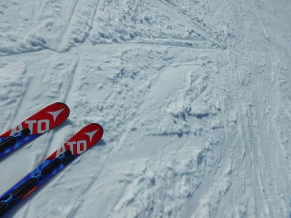

いやーー．

ヤバかった．

寺子屋が無かったら，今日は志賀全山貼りつき

雪だった…

ってな感じで．

夕方のラストは焼額に戻りますが．

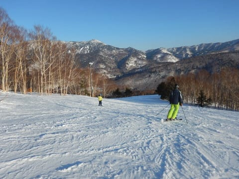

…日が陰ると，雪玉大量発生＆荒れ荒れバーンの

まま，凍っていくんですが…（涙）．

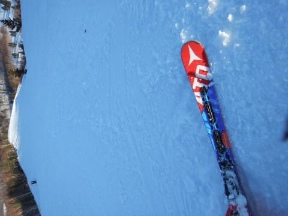

なぜ？？

なぜ，普段ならまだハイシーズンの雪でいてくれる

3月第一週なのに．

昼は貼りつき雪，夕方は荒れ荒れのまま凍った

カリカリゴロゴロバーンで滑らなきゃいけないの…？？？

と，悲しさに涙をこぼしながら，

夕日が暮れるリフトストップまで滑った，

Skier_Sだったのでした…

PS.

月＆火曜の予想気温が，当初より下がってきました…！！

月曜は，降り始めは雨っぽいけど．

焼額の山頂くらいだと，ギリギリ雪になるかも？？

低気圧がわずかにずれるかどうかで，雨か

雪かが変わる，難しい状況ですが．

月曜に滑っている人の行いが良ければ，

雪になってくれそう…

月曜の夜は確実に雪になりそうですね．

で，月曜の夜に雪が降って．

火曜の朝にはやんで，火曜は晴れそうになってきましたよ！

この月・火も，当初予想よりは

かなりマシそうになりそうな予想になってきたんですが．

月曜が雨にならず，雪になるようなら．

その際は．

スキーヤーの熱い願い（呪い？）がこもった，

冷え冷え踊りの効果だった可能性が…

さて．

月曜の志賀の天気や，如何に！？？

## 💬 コメント一覧

### 💬 コメント by (つーちゃん)
**タイトル**: 超悲報
**投稿日**: 2018-03-05 11:25:36

えーこちら志賀高原

朝から小雨、更に強風でゴンドラ運休

さきほど３高も運休しました。。。

雨の降りも強くなってきたような気が

戦略的撤退を検討中です

ｳﾜｧｧｧﾝヽ(｀Д´)ノ

### 💬 コメント by (はなげ親分)
**タイトル**: だ、だめだ!!
**投稿日**: 2018-03-05 11:32:35

雨と強風とゴンドラ運休の三重苦です！

おまけに、避難していた第三高速まで10時

過ぎには運休となり、泣きながら移動中の哀愁スキーヤーとなってしまいました(泣)

日頃の行いが悪いのは私だったんですか～

？？

### 💬 コメント by (Goku)
**タイトル**: 寺小屋万歳
**投稿日**: 2018-03-05 23:01:36

昨日はお疲れ様でした～

しかし３月とは思えないほどの気温でしたね(TT)

本当に寺小屋には救われました。

で、本日の長野は朝から雨、雨、雨…

週間天気予報も傘マークのオンパレード

どうしましょう(TT)

### 💬 コメント by (はっち)
**タイトル**: 横手山・渋峠も
**投稿日**: 2018-03-05 23:30:56

お昼を過ぎたころから急にシャーベットになりました。　標高が高くても南斜面の渋峠は早いうちからアウト。　暑さと重い雪でバテました。。。

### 💬 コメント by (ほっぽ)
**タイトル**: 意外なところで
**投稿日**: 2018-03-05 23:43:02

Ｓさん

昨日は意外な所でお会いしましたね。

まさかの１ゴン以外、２高と寺小屋で二度もお会いするとはビックリしました。

２高でお会いしたあと、知り合いに会うためジャイアントまで移動してアップルパイを食べたあとに寺小屋を目指したら、GOKUさんご夫妻、サクラちゃん父子、そして知り合いの片足スキーヤーのご夫婦と、皆さん集結されていて考えることは同じなんだと思いました。(^^;I

今週末、来週末と志賀高原お休みなので、次回は月末になってしまいますが、コンディションが復活していることを祈ってます。

昨日の滑走記録をアップしておきました。

http://www2.tokai.or.jp/nana_hoppo/

### 💬 コメント by (Skier_S)
**タイトル**: 残念だ…今日の天気は残念だ．
**投稿日**: 2018-03-06 04:07:06

＞つーちゃんさま

えー，特派員のつーちゃんさま，

雨は夕方まで降り続けたのでしょうか…？

それとも夕方にはやんだのでしょうか…？

…あるいは戦略的撤退によりレポート不可能でしょうか？？

レポートお待ちしています…

＞はなげ親分さま

…残念ながら，日ごろの行ないが悪いことが

証明されてしまったようです…

いや，私は志賀高原にいませんでしたから．

日ごろの行いが悪いのは私じゃないことが

明らかになりました！！

＞Gokuさま

今週もヤバそうです…

水，木と冷えても雪が降りそうにありません．

それどころか金曜はかなりヤバそう…

うーん．

今年はすでに，去年の4月2週の雪の感じですね…

＞はっちさま

熊の湯・横手も貼りつく雪だったのですね…

残念でしたね…

この日は意外と寺子屋が良かったです．

いつものメンバーが自然と寺子屋に

集まってきていたのが笑えました…

今週末もゲレンデコンディションは厳しそうですね…(涙）．

＞ほっぽさま

週末はお世話になりました～！

日曜は，寺子屋に全員集合って感じ

でしたね～．

寺子屋以外全滅でしたから…

でも，今週末もゲレンデコンディションは

回復しそうにないので．

月末までに回復するよう，踊り続けていてください…

