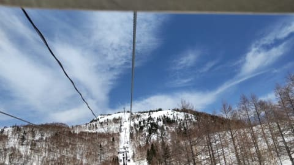

# 4月9，10日の週末の志賀高原の天気は…5月並みの激烈高温の晴れ．GWより暖かい…というより暑いくらい

📅 投稿日時: 2022-04-07 02:42:33

🏷️ カテゴリ: [スキー天気予想](c6554f5c3c106093b511a8daae23757e8.md)

ってなことで．

地獄の年度末を乗り越えたわけですが．

これで楽になったわけではなく．

新年度の始まりにも，なんだかよく分からない

仕事が大量にあるわけで…（涙）

　

そレだけじゃなく，しばらく前のこと．

偉い人「…Sくん，Sくん」

私「え…何ですか？」（いつもながら，この人に

　捕まるとろくなことがないんだよな…)

偉い人「チミに素晴らしいプレゼントがあるんだよ！」

私「え！プレゼント？？」

偉い人「そうだよ．チミが喜ぶと思ってね」

私（やな予感…）「まさか，プレゼントは五つ目の兼務

　とかじゃないですよね…？」

偉い人「残念ながら，兼務は4つが上限なんだよ．

　これ以上の仕事はプレゼントできないんだな…」

私「残念ながらって…

　5つ目の兼務が出せなくて残念ってことは，

　制度が許せば5つ目もあったってことですか…（ちょっと恐怖）

　で，兼務の仕事じゃないとすると，

　一体何がもらえるんですか？」

偉い人「チミに勉強の機会を与えよう！

　4月から1年間の研修コースの

　プレゼントだよ！」

私「え？えぇぇええ？？1年間？？」

偉い人「そんなに嬉しそうな顔をしてくれると

　私も嬉しいよ．

　1年間，毎週ひとつの課題のレポートを

　書き続けるという素晴らしい研修だよ！！」

私「全然嬉しそうな顔してませんけど！？？

　毎週課題って…ただでさえ多忙なのに，

　そんなことしたら死んじゃいますよ！？？」

偉い人「死ぬほど喜んでくれるか！！」

私「無理…リアルに死んじゃう…」

ってなやり取りはおおむねフィクション

ですが．（一部リアル）

新年度から余計な研修が増えてしまい（泣）

さらに睡眠時間が削られて，

ここ数日まともにBlogを書く時間が

取れなかったSkier_Sです…

…これから，Blog更新できなくなる日が

増えるかも…

Blog更新が無かったときは，

「あぁ，Skier_Sは死にかけてるんだな」

と暖かく見守ってやってください．

ってなことで．

今日も，いつもの特派員からの志賀高原

情報ですが．

まず．本日は朝からプラス気温（涙）

朝のうちは雲が多く，バーンもちょっと

カリカリしていたようですが…

じきに晴れてきて，高温＋日差しで

完全なユルユル雪になっちゃったようです（涙）

あまりまともにBlogの更新時間が取れない

今日この頃ですが．

今日は宿題をさておいて，水曜深夜恒例の

週末の志賀高原の天気予想です…！

…でも．

そろそろこの時期になるとスキーに行く人も

減ってくるだろうから，スキー場の天気が

気になる人も少なくなってきていると

思うけど…

でも，このBlogを読む人はGW以降まで

スキーに行くような，おかしな人が多いと

思うので．

読んでいる人も多いはず…！

なので，睡眠時間を削っても書く！←いや，寝ようよ

ってなことで．

まずは7日，木曜の850hpa図から見てみると…

この日は赤い0℃線は東北南部．

志賀高原には，+3℃線がかかってるレベル．

うーん．この時期としては平均的か

ちょっと高いくらいの気温．

そして，地上天気図は…

調度本州のど真ん中に低気圧の「L」

マークがあって．

こいつが午後にむけて発達するので，

…朝は晴れてても，じき雲が出て，

夕方から夜にかけて降り始めるかな？

続いて8日金曜の850hpa図ですが．

赤い0℃線がちょうど志賀高原にかかるくらい．

だいたい平年並みからちょい低めくらい．

これで，地上天気図には水色の降水域が

ギリギリ志賀高原にかかる程度なので…

7日夜から8日明け方にかけてパラパラ雪，

でも，西から高気圧が近づいているので，

午前中にはすっきり晴れになりそう…

そして，肝心な週末，9日土曜の

850hpa図を見ると．

…うぎゃーーーーー！！！！

なんだこりゃ！！！

赤い0℃線は北海道より北．

水色の+6℃線も津軽海峡近辺．

志賀高原は昼間は+10℃を越えそう…（泣）

そして，地上天気図を見ると…

高気圧に覆われてるので，すっきり晴れそう．

これだけの高温で晴れると…

おそらく朝から雪はザブザブの

重い雪ですね（涙）

気温が高い日は，晴れないで

曇ってほしい…

次に，10日の日曜の850hpa気温を見ると．

…ダメだこりゃ．

赤い0℃線ははるか北…

そして水色の+9℃線ですら，津軽海峡くらい

まで北上しちゃってます（激涙）

これ，志賀では，山頂でも確実に

+10℃を越えます．

激烈な高温です．

暑いくらいです…（泣）

そしてこの日も高気圧に覆われるので．

晴れそうですね．

ダメですね．

雪質は期待しちゃいけませんね（涙）

土日とも朝からGW並みのザブザブ雪

確定ですね…

ってなことで．

まとめると．

7日(木)：朝イチの気温は0℃前後．

　朝はカリカリバーン．

　じきに緩む．

　朝は晴れてるかもしれないけど，

　じき曇り空になり，リフト営業まで

　曇り空．夕方~夜に湿った

　雪が降り始める．

8日(金)：明け方までパラパラ雪が降る．

　朝の気温は-3℃と久々に冷えそう．

　あさイチは硬い下地の上にうっすら

　1-2cmの新雪．

　あさイチはかなり良さそう．

　朝は曇りかな？でもすぐ晴れる．

　その後ずっと日が射す一日．

　早いところは朝に，遅いところでも

　昼ごろには日差しで雪が融け，

　貼りついて板が滑らない雪に…

9日(土)：朝から晴れ．

　朝から気温は+5℃近く．

　早朝営業の早いうちはちょっと

　締まってるかもしれないけど，

　通常営業の時にはユルユルの雪．

　昼間は+10℃くらいまで上がり，

　GW並みの春スキーに．

10日(日)：この日も朝から晴れ．

　朝から気温は高く，早朝から

　雪は緩めかも．

　通常営業開始の頃にはユルユルで，

　もうバーンは荒れ始めてそう．

　昼間は+10℃を超えて暑いくらい．

　雪は板が埋もれるようなザブザブに

　なっていく．

…って感じでしょうか．

週末は天気は良さそうですが，

気温は5月中旬並みに上がりそうで，

それで晴れちゃうので…

雪質は期待できないです(涙)

まぁ，スキーしにいくというよりも．

日向ぼっこでもしに行くつもりで，

早朝勝負で滑った方が精神衛生上

良さそうです…

うん．

雪があるだけマシ．

雪があって滑れるだけ，シアワセ…！！

…と，自分を騙して滑り続ける

週末になりそう…(涙)

## 💬 コメント一覧

### 💬 コメント by (Northfox)
**タイトル**: Unknown
**投稿日**: 2022-04-07 09:57:56

う〜ん、、一昨年のような奇跡の四月を期待していたのですが…🥲

来週以降、また冷えて欲しいですね。

### 💬 コメント by (さち)
**タイトル**: Unknown
**投稿日**: 2022-04-07 10:38:07

ご無体な仕打ちに年々拍車がかかっている気がするのは気のせいでしょうか･･･？

土日ザブザブなんですね（涙

先週でシーズン終えるのにはあまりに悲しい出来事があったので、今週で締めようと思ったのですが･･･

今週こそやけびにお邪魔したいと思います！

### 💬 コメント by (はなげ親分)
**タイトル**: Unknown
**投稿日**: 2022-04-07 14:18:47

S様

命を削ってのスキーとお仕事お疲れ様です

泣きたくなるような高温続く4月ですね～

雪がGWまで持つか心配になってきました

### 💬 コメント by (レインボー74)
**タイトル**: Unknown
**投稿日**: 2022-04-07 15:08:49

木曜日の志賀高原情報

昨日はヤケビ休業のため野沢へ。野沢は営業を30分前倒しにしてくれているので、意外と楽しめました。でも、やまびこだけですが。

今日はヤケビへ。でもイチゴンの機嫌が悪く、なんと20分遅れのスタート。

コースはGS、オリンピック、パノラマの３つしかなく、適当にぐるぐるしました。

奥志賀は第４が停止なので、奥志賀へ行った友人はバスで戻ってきました。

雪はすぐに緩みましたが、妖怪も出なかったので、まずまずでした。ただ最後に連絡路で少しブレーキが。

そうなると未練はありません。昼には撤退して関英ドライブイン直行です。

帰路の上林は+15℃でした。

### 💬 コメント by (ikkun)
**タイトル**: Unknown
**投稿日**: 2022-04-07 19:38:39

それだけ「アテニサレテイル」証です❗ コロナ前からなかなかの仕事の………羨ましいので( *´艸｀)  後は横手で終わりかもですね❗ 先週土曜で良かったです

### 💬 コメント by (Skier_S)
**タイトル**: ヤバい．ホントにヤバい
**投稿日**: 2022-04-08 02:12:12

＞Northfoxさま

奇跡の4月になるように，みんなで踊りましょう…！

＞さちさま

ホントにだんだんご無体になってきます…

けど，5年前にも一度ものすごいご無体ピークがあって，

毎週末スキー場の駐車場や帰りの車の中から電話会議に出ていたような頃は，

過労でものすごい血尿を出してしまったこともあり．

そのころに比べればまだ大丈夫…のはず．

＞はなげ親分さま

ホントに命を削ってスキーしてる感が出てきました…

そろそろ休まないとヤバいかも

しかし，この4月はあったかすぎる．

GWまで，雪がもってくれるよう祈るばかりです…

＞レインボー74さま

奥志賀第4止まってるんですね！

1ゴン動いてるんだから，動かしてくれるとありがたいんですけどね…

今日は板掴みが出なかったようですが，明日は大量発生しそうなので

お気を付けください…

＞ikkunさま

アテニサレテイルというより，いいように使われているという方が

正解かも…

今シーズンはあと横手だけですか？まだGWまで焼額も奥志賀も滑れますよ～！！

先週土曜は滑って正解だったと思いますよ．

