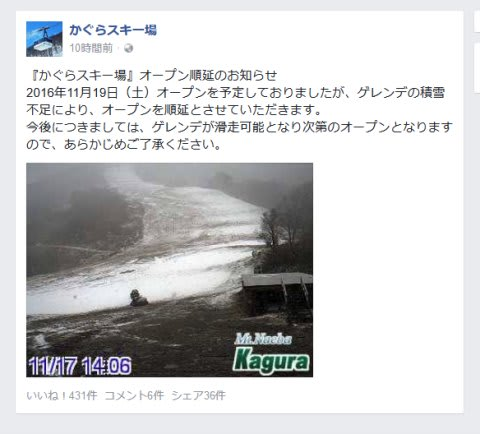
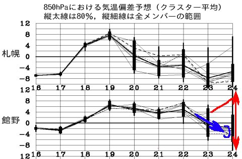
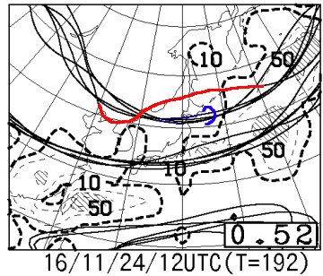
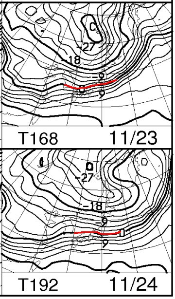
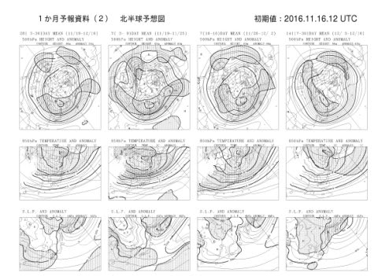
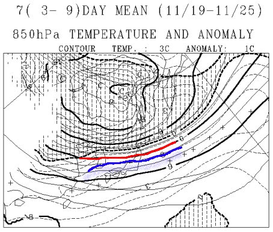
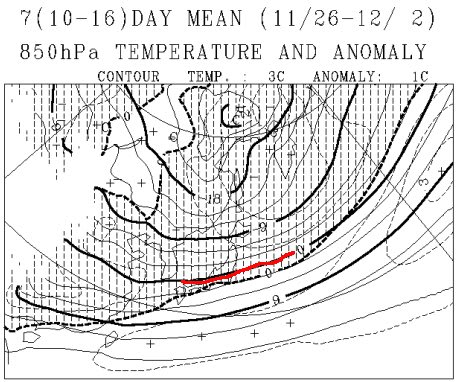
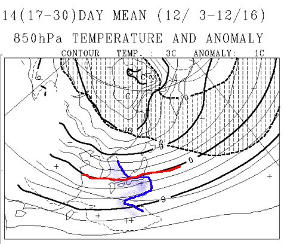
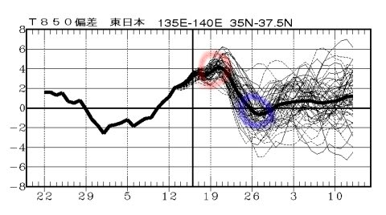

# これから12月上旬にかけて冷えるのか？…長期予想天気図を読み解いてみる

📅 投稿日時: 2016-11-18 01:53:41

えー．

なんと言いましょうか．

ついに．

かぐらも19日のオープンをあきらめたようです…（激涙）

熊の湯は，明日の朝に19日営業可否を判断する，

ってなってますけど．

…期待しない方が吉ですね（泣）．

19日は高温＆雨なので，オープンは厳しいでしょう…（涙）．

あぁ．

まさか．

今年もこんなスタートになろうとは…っ！！

…だれか，日ごろの行いが激烈に悪いスキーヤーがいる．

いるに違いないっ！！！←だから～，それ，自分でしょ（お約束のツッコミ）

とりあえず．

このようなスキーヤー殺しの天気が．

これから先も続くのか，ひっじょーに

気になるところなので．

3日連続の天気ネタですが．←そろそろ天気図は見飽きた，という声が聞こえる気がする…

これから12月中旬までの天気を，

一か月予想図から読み解いてみるのだ…

…と，その前に．

最新のFZCX50から，850hpa気温の週間予想を見てみると…

うむ？？

23日から24日．

青矢印で示したように，気温が下がりそうな

傾向になってます！

ただ…一番右端の赤矢印で示したように．

24日の予想範囲．

平年比+12℃～-8℃までの，異常に広い

ばらつきが予想されています…

…これって，私が天気図を読み始めてから最大の

予想ばらつきなんですが…

最悪，平年比+12℃になりうる，という可能性も

あるっていうことだな…

ただし．

平年より高くなる予想は，赤線1本．

他の線は，すべて青矢印で示した，平年より

低くなる方向に行ってます．

これをちょっと専門的に解説すると．

FZCX50から，特定高度線のクラスター間

ばらつきを見てみると…

5400mの特定高度線．

赤線で示した1本だけ，他の青で囲った線と

違う傾向を示してます．

つまり，複数クラスターのうち，一つだけ

変な予想になっているということで．

それ以外のクラスターは，だいたい同じ予想に

なっています．

だもんで，おそらくこの一つだけ変な

クラスターのような天気になる可能性は低いと

言えます…

その変なクラスタ―（ちょいと特定高度線が北に

ずれている=高温になる）の気温予想が，

…こいつの赤線に当たるわけで．

…こいつは，[気象庁の週間解説資料](http://img.n-kishou.co.jp/image4/lfax/skaisetu_201611171000.pdf)でも，

「1クラスターだけ他と違った予想がある…」

ってことが書かれてるくらいなので．

まぁ無視しても大丈夫かな．

ということで．

おそらく，23日の夜あたりから，ぐぐぐっと

冷え込んできます…！！

FXXN519の，850hpa予想を見ても．

23日から24日にかけて，0℃線は信州まで下がってきますね～！

うむ．

来週末には，期待…っ！

＃今週末はダメだけど（涙）．

ってことで．

さらに先の予想を，一か月予想図から見てみましょうか．

このBlogで時々出てくる，FCVX12という天気図です…

で．

こいつの11月19日～25日までの，850hpa気温と

平年比の図を見てみると…

…

まぁ，分かっていることですが．

だめだ．

これは，ダメです．

山での雪の目安，赤でマークした0℃線は東北地方で，

信州には+3℃線がかかっているし．

それどころか．

青で示した平年比＋3℃を示すエリアが，

信州に掛かってます…

信州は，平年より3℃以上高くなります．

週間の平均気温が+3℃って，異常高温です．

19日～22日に気温が上がる予想が，ここに

如実に現れてますね…（涙）

しかし．

この期間がおかしいくらい暖かくなるのは，

もう週間天気図から分かっていること．

それ以降の期間を見てみるのだ！

はたして，11月26日以降は冷えるのか…？？？

11月26日から12月2日までの予想を見てみると…

…

…うむ．

赤で記した0℃線は，信州に掛かっているし．

日本全域，平年より気温が低いことを示す

網掛けエリアに入ってます！

…激烈な冷えではないけど．

平年並みか，それ以下に冷えてくれて．

…12月第1週にかけては，そこそこの雪＆

人工降雪の積み増しが期待できそう！！

焼額のオープンには，なんとか間に合いそうな

感じです…

…ちょっと安心…

で．

さらに，それ以降．

12月3日から16日，12月上旬の予想を見てみると…

うううーーーむ．

0℃線は信州に掛かっているけど…

この時期だと，もう少し南に下がってほしいところ．

青で示した，平年比+1℃のエリアが信州に

近づいているので，平年よりわずかに高めで

気温が推移しそうです…

…

うーむ．

激烈な冷えはなさそうだけど…

平年比より＋1℃以下であれば，

ギリギリ許容範囲って感じか…

激烈高温な12月上旬，って感じには

ならなさそうな感じ．

で．

FCVX14から，850hpa気温傾向を見てみると．

赤くマークした19日前後の平年比+4度という

異常高温のあとは，

青くマークした26日前後，わずかな冷え込みが

予想されており…

それ以降は，大体平年と同じくらい，

それよりちょっと高めで推移する感じですね…

まぁ，強烈高温でないだけマシですが．

激烈冷え込みもなさそうな12月上旬ですか…

ってことで．

来週にいったん冷え込んだ後．

12月はだいたい平年並みになりそうで．

まぁ，昨シーズンほどの雪不足に悩むことは

なさそうな感じかな～．

12月に，奇跡の大雪はなさそうだけど．

雪不足になることもなさそうで，ちょっと

一安心した，Skier_Sだったのでした．

## 💬 コメント一覧

### 💬 コメント by (yama)
**タイトル**: 今週
**投稿日**: 2016-11-18 10:21:00

何時もの天気予報ありがとうございます｡週末は熊の湯も無理そうなので、明日は病院、あさっては神田にしようと思います。イエティは行ったとしても日曜日のナイターかな？23日は朝からイエティの予定です｡23日は気温も低く11月3日の再来を期待しています。都合が合えばまたご一緒させて下さい。

### 💬 コメント by (Skier_S)
**タイトル**: yamaさま
**投稿日**: 2016-11-19 01:15:18

熊の湯，ダメでしたね…（涙）．

こちらは，おそらく土曜のナイターか…

まだ，今週末いつ行けるか未定です．

23日は朝からの予定ですので，またご一緒

お願いします～！

