# 1月16，17日の週末の志賀高原スキー場の天気は？…土曜朝は気温高めで午後雪降り，日曜朝は積雪30cmくらいの冷え冷え！

📅 投稿日時: 2021-01-14 03:02:06

🏷️ カテゴリ: [スキー天気予想](c6554f5c3c106093b511a8daae23757e8.md)

えー．

今日の志賀高原．

朝からすっきり晴天だったようです！

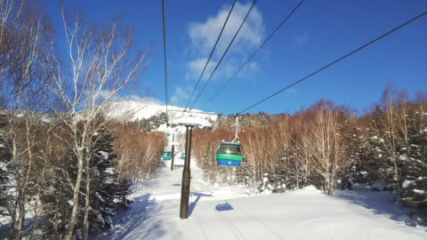

…ちょいと昼間は気温は高めだったようですが，

0℃を超えることはなく．

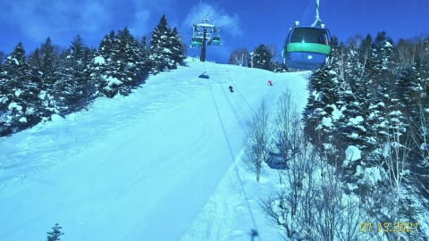

あさイチは最高シマシマだったようで…

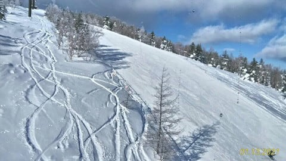

奥志賀のエキスパートも．

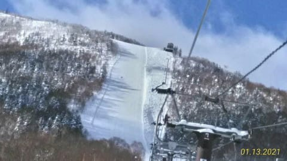

高天ヶ原も．

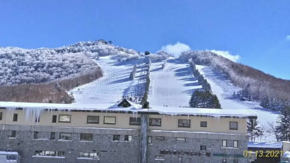

今日はすっきり晴天の，絶好の

スキー日和だったようですね…

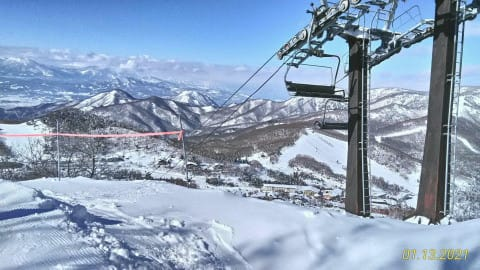

うがーーー！滑りたいっ！！

こんなスキー日和なのにガラガラなんて

勿体ない…

あぁ…コロナが憎い…

ってなことで．

特派員からの写真でスキー気分を味わったところで．

今週末も私はスキーに行けないけど．

地元の人のために，今週も志賀高原の天気予想を

するのだ！

…とはいえ．

自分が行かないとなると，

天気図の読み込みが甘くなる

のは人の常．

自分のためじゃないと読み込みに気合が

入らないので，いつもより精度が落ちてるかも…

とりあえず，まずは14日の木曜の850hpa図を見ると．

0℃線は太平洋側で，まぁ志賀は昼間も0℃を

わずかに超えるかな…という気温になりそうで．

これまでの冷え冷え祭り期間に比べると，

気温が高めの一日になりそうですね…

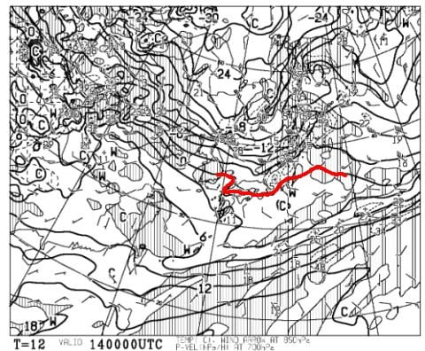

この日の地上天気図を見ると．

降水域は志賀高原にかかってないので．

晴れ時々曇り，という一日かな…

気温が上がるので，太陽が射さない方が

良さそうなんだけど．

この日は日が当たるところは

雪がちょいと緩みそう．

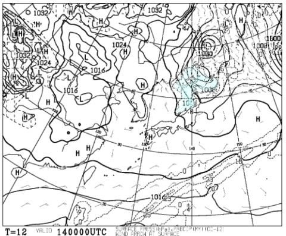

そして，15日の金曜．

850hpa気温図を見ると…

うーむ．赤い0℃線，ギリギリ志賀高原にまで

近づいてますね…

これは，かなり気温が上がりそう．

昼間は志賀高原のスキー場山頂でも，

確実に0℃を突破します．

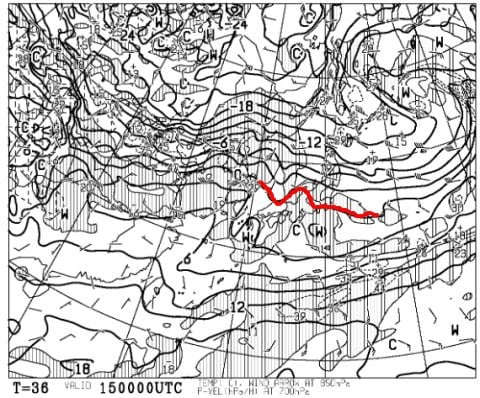

そして，地上天気図は…

降水域が全くかかってないので，

晴れそうな予感…

うむ．

この日は，標高の低い西館より下は

結構雪が重くなりそう…

一の瀬・焼額も，日が当たるところは

しっとり湿った雪になるかも．

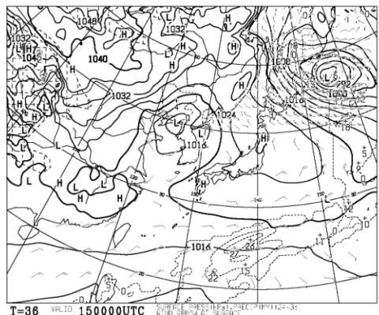

で．

週末の土曜日，16日．

朝9時の850hpa気温を見ると…

うーーーーむ．

赤い0℃線は志賀高原より北！

でも，わずかに北なので，朝は

ちゃんとマイナスまで冷えてくれます…

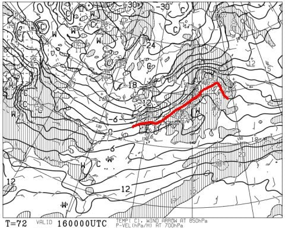

そして，16日の夜9時になると…

赤い0℃線は関東付近まで下がり，

水色の-6℃線が志賀に近づいてくるので．

この日は朝から午後にかけて気温が

ぐんぐん下がっていきますね…！

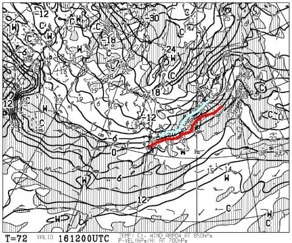

そして，土曜16日の朝9時の地上天気図では，

志賀高原に降水域がかかってないのですが…

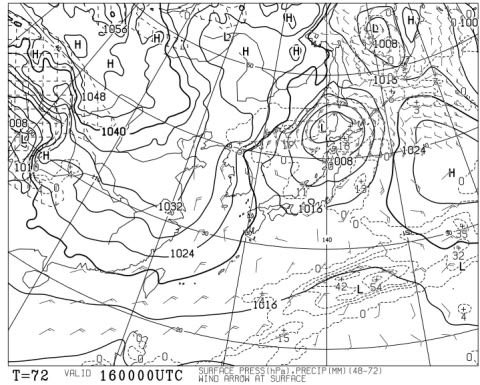

夜9時の天気図では，志賀高原に降水域が

かかってきてます．

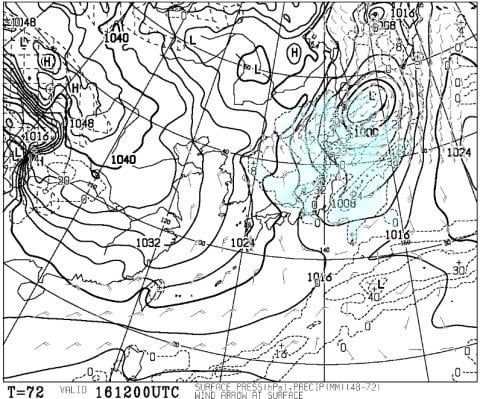

うーむ．

この日は，午前は晴れ～曇り空，

昼過ぎから雪がぱらつき始め…

午後は結構冷えた雪降りになるかな？

風もちょっと強め．

そして，日曜17日の850hpa気温図を見ると…

おお！

水色の-9℃線が志賀高原に！

これは，またかなりの冷え冷えですね…！

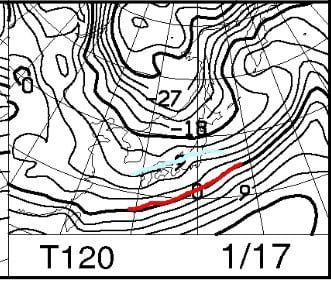

でも，地上天気図では，そんなにきれいな

縦縞の等圧線じゃないので…

そんなにドサドサ積もらないかな．

でも，朝までに20～30cmくらいは

積もってそう…！

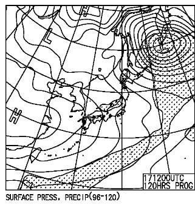

ってな感じで，まとめると．

14日(木)：晴れ時々曇り．

　朝は-5℃くらいだけど，昼間は0℃くらいに

　上がるか…

　あさイチは最高シマシマだけど，

　昼ごろには日が射すバーンは雪が緩む．

15日(金)：晴れ

　朝から気温は高め．-3℃くらい？

　あさイチは締まった最高のシマシマだけど，

　昼間は+2～3℃まで気温が上がる．

　西館，ブナや丸池など，標高が

　低いところは重い雪に．

　焼額も日が射すバーンはしっとりした

　雪になりそう…

16日(土)：朝は晴れ，気温は-2℃くらい？

　あさイチは硬めに締まったシマシマ．

　ちょいと風が強めだけど，ゴンドラは

　止まらないと思う…

　東館ゴンドラはヤバいかも？

　昼前は0℃近くまで上がりそう．

　昼に向かって雲が増え，昼過ぎに

　雪がぱらつき始める．

　午後は気温がぐっと冷え，雪が結構降ってくる．

17日(日)：雪降りの一日！

　朝は-10℃近くまで冷える．

　ちょいと重めかもしれないけど，

　あさイチの非圧雪コースはブーツ

　～脛パフ！

　圧雪コースも上にうっすら新雪が！

　昼間は雪が降ったりやんだり．

　気温は-6℃くらいまでしか上がらない

　冷え冷えデー！

ってな感じでしょうか…

金，土とちょっと気温が上がりそうだけど，

土曜午後からぐっと冷え込んでいき，

日曜に新雪も積もりそうなので．

週末も雪は良さそうかな…！

…でも．

どうせ今週末もスキーに行けない私にとっては．

今週末，むしろ志賀高原に槍やミサイルが

降ってくれれば，

「あぁ…行けなくて良かった…」

と，あきらめがつくのかもしれない

…というのは心の中で思うだけにして，

口には出さないでおこうと思った

Skier_Sだったのでした←ここに書いている時点で意味がない

## 💬 コメント一覧

### 💬 コメント by (アリス)
**タイトル**: 天気予想ありがとうございます
**投稿日**: 2021-01-14 07:30:24

Skier_S様

週末も期待できるコンディションのようですので、15日から志賀高原に行っちゃいます。

さすがに、槍やミサイルが降ったら中止にしますが・・・

幸い、私の在住県は緊急事態宣言外ですので知事の要請範囲外で。

写真とレインボー様の情報から、GSとエキスパート好き放題飛ばせそうです。

ヤケビとオクシーの上部連絡路ですが、数年前にロープトゥが設置してあったと思うのですが、見たことありませんか？

### 💬 コメント by (横須賀のウルトラセブン)
**タイトル**: あきらめがつく
**投稿日**: 2021-01-14 07:46:58

Ｓさんおはようございます、スキーに行けないもんもん

とした日が続いています。セブンは正月スキーで不覚

にも肩を骨折しました～(´；ω；`)ｳｯ…板とヘルメットに

ヤケビオールスターのシールを貼っていながら、遠く富

良野の地で・・・家族や職場の同僚からは、コロナ緊急

事態より先に緊急事態になって良かったね～と笑れて

ます。確かに自分としてはあきらめが付いて静かに再

起を待ってます。

そこでＳさんにブラックアドバイス～1か月位で治ってス

キーはできない骨〇をすれば、日々穏やかに過ごせる

と思います。Ｓさんの心中お察し申し上げます（笑）

### 💬 コメント by (レインボー73)
**タイトル**: Unknown
**投稿日**: 2021-01-14 18:25:59

木曜日の志賀高原情報

レインボー（２時）少し前までは、好天で視界良好でしたが、私らが帰ったらすぐに、ガスって楽しくない状況になったとか。まあ私らはしっかり楽しめました。

平日ガラ空きなので、スピード好きの隊員が、オリンピックで、116km/hを出しました。かずさんのよく知っている男です。最後の急斜面に入ったら誰もいないので、ごく浅い２ターンで降りたそうです。まあ真似したくないですね。

今日は目標にしていたチウホテルが休みとの情報を得たので、『ロードトゥベルグ』。

やっぱり快適なヤケビは、今日も裏切りません。奥志賀もかっ飛ばしても恐怖を感じないコンディションの良さ。

でも、ここから73歳の誕生日を迎えた私に、過酷な試練が待っていました。

スケーティングのレクチャーを受けて臨んだ奥志賀連続路。昨日の２分からは大幅短縮したものの、体力は限界。やっとたどり着くと待ちくたびれた隊員はスタート。ヘロヘロで白樺からダイヤ、ファミリー、タンネ、高天へ。

さあ第２鬼門の高天原連絡橋。勢いつけて橋はなんとかクリアしたものの、その後のちょっともきつい。

西館様を降りると、さあ第３鬼門のジャイアントへ。勢いつけてもやっぱり途中でストップ。みんなは既に待っている。またまたヘロヘロ。なんとかノロノロリフトに乗ってベルグまで滑り降り。ジャイアントは快適でしたが、リフトに2回は乗りたくないし。

今日も1350円のかつ重。でもよく考えてみると、痩せた老人はそんなに食べるべきではないと、あとで悟りました。

食後、パルスゴンドラ往復で遊んで、ニゴンに戻りました。それにしても今日も人がいない。子供の団体がいたのが僅かな光明かな。

みなさーん、志賀に来てくださーい。できる範囲でかまわないから。

### 💬 コメント by (かず)
**タイトル**: Unknown
**投稿日**: 2021-01-14 19:40:41

若Sさん今日誕生日なんですか？？？おめでとうございます 本日パーティですね  笑  仕事のトラブルなければ土曜から行きます！

### 💬 コメント by (Skier_S)
**タイトル**: 今日も志賀はいいコンディションだったようで…
**投稿日**: 2021-01-15 02:51:28

＞アリスさま

15日から志賀ですか！

感染防止にお気をつけて，楽しんできてください．

またレポートお待ちしてます~！

＞横須賀のウルトラセブンさま

ええええ！

骨折ですか！それも富良野で！？？

それは大変でしたね…

入院はしなくても済んだのでしょうか．

くれぐれもお気をつけて…

…とりあえず，私は痛いのが嫌なので，骨はおりたくないです（笑）．

＞レインボー73さま

レポート写真，ありがとうございました～！

今日も使わせてもらいました．

かなりコンディション良かったんですね…うらやましいです．

しかし，116km/hって…

スピード違反で捕まりそうですね（笑）．

＞かずさま

日曜はそこまで深くないけど，30cmくらいのパウダーになりそうです…

降り始めは気温が高いので，ちょっと重いかも！？？

