# 2013年9月　子連れタイ・タオ島ダイビング旅行記　その4…ショッピングセンターで暇つぶし

📅 投稿日時: 2013-10-07 01:10:16

🏷️ カテゴリ: [ダイビング日記](ce3a7a8d424d112fce83ee85c81a0e344.md)

えー．

スキーシーズンも近づき．

こんなものが我が家に届く季節になりましたね…

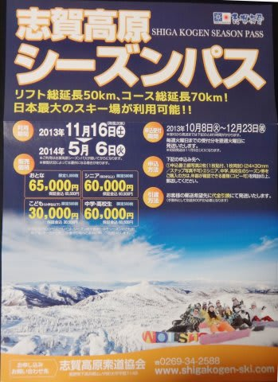

当然，今シーズンも夫婦2人分購入予定なわけですが．

…お財布に，痛いっ…(涙)

…うーん．でも．今シーズンはまだ夫婦2人分でいいけど．

来シーズンからは，さらに子供の分も買わなきゃ

いけなくなるのかっ…！

い，痛い…(大出血)．

…とりあえず．

着々とスキーシーズンが近づいてますが．

このBlogはまだ夏モード．

ってことで．

タオダイビング旅行記へ，Go!

----

つーことで．

船の出発時間までの暇つぶしで立ち寄ったショッピングセンターですが．

ここには，食料品が何でも揃っているスーパーもあれば，

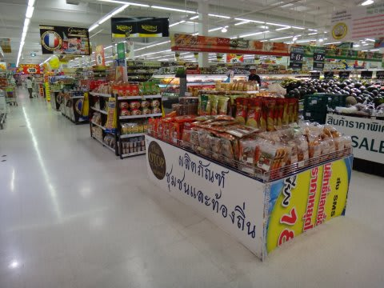

電化製品から

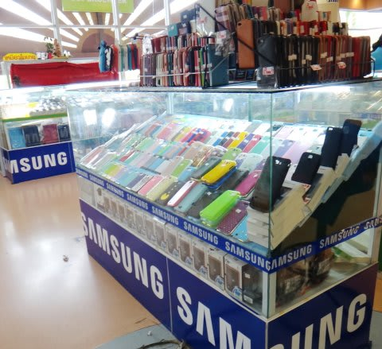

アクセサリー類，

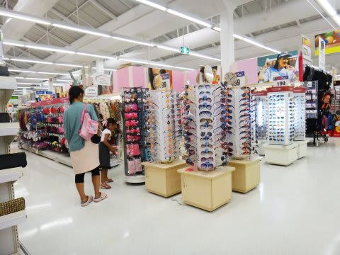

さらに自動車まで，いろんなお店が揃っており．

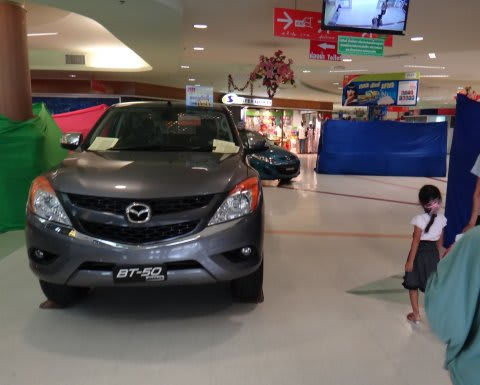

見ていて面白いですね～！

さらに，いろんなお店が並んだフードコートもあって．

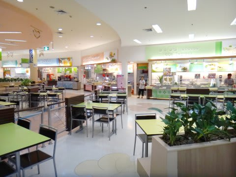

食事や休憩にも便利．

なんだか．

ミスタードーナッツもありますね～．

娘がこれを見つけた瞬間．

「ドーナッツ食べる～っ！！」

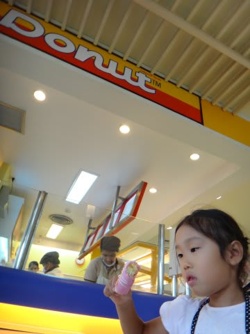

…おまえ，何もタイまで来て

ドーナッツ食べなくても…

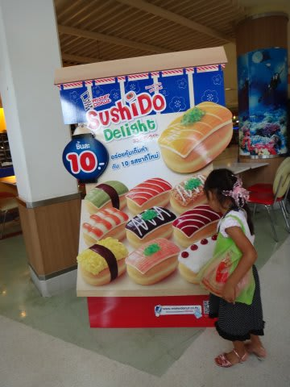

でも，この「SushiDo」って，お寿司みたいな形のドーナッツ．

日本にはないぞ…

とりあえず，ドーナッツで軽く腹ごしらえをしてから，

店の中を冷やかすと…

電気製品は日本と同じくらいの値段だけど…

食料品，安っ！

…でも，この食料品．

なんだか怪しい日本語が書いてあるものが多いなぁ…

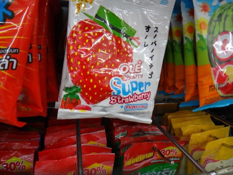

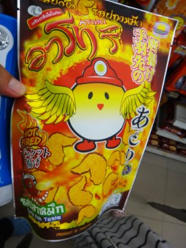

で．ショッピングセンターの中にゲームコーナーがあって．

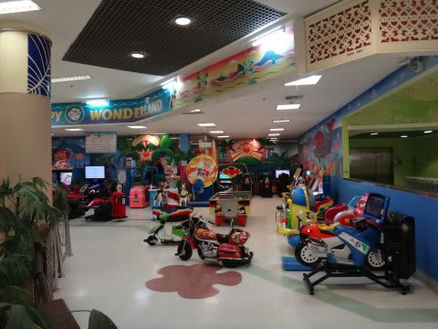

幼児向けの，滑り台とかボールプール，マットとかがひいたコーナーがありますね～．

娘はこれを見つけた瞬間

「これやるー！やるー！ぜったいやるー！」

…やっぱりな．予想通り(-x-;

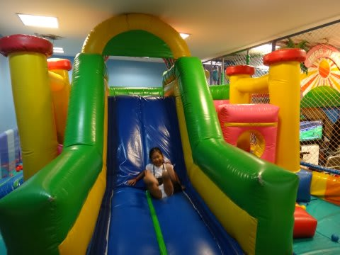

でも，45分，40バーツ(約120円）と．

まーまー安かったのでよしとしておこう…

って感じで．

買い物したり遊んだりしてると，お昼前．

フードコートでお昼ご飯…

いろんなお店がありますが．

今回はこーゆー麺類を選んでみました．

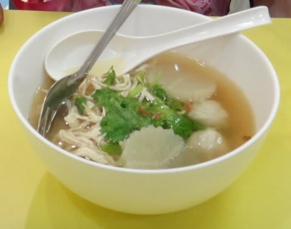

こんなのが一杯50バーツ，150円くらい．

安っ！！！

家族で2杯食べても，たったの300円でお昼ご飯が済んじゃいます…

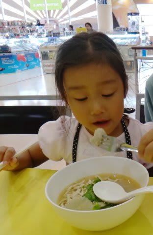

お昼を食べると，タオ行きの港へ向かう時間．

娘，昨晩からあんまり寝てないけど．

眠ったりぐずったりすること無く，5時間の待ち時間を

過ごせて，良かった…．
