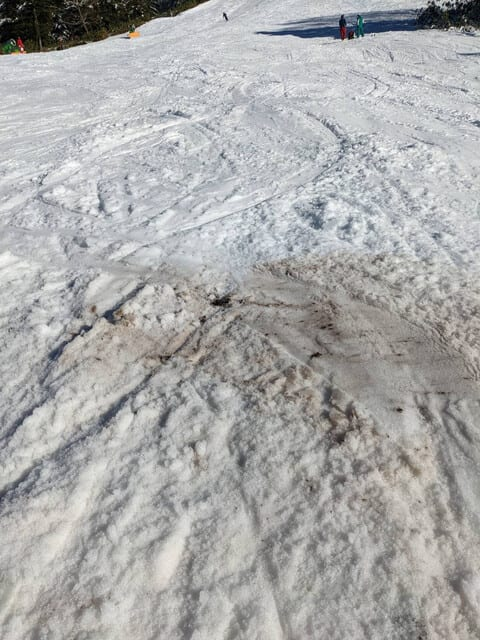

# 2022/11/25(金)志賀高原横手山スキー場特派員レポート！…朝雪が積もってコース幅は広め！でも最後の落ち込みが雪薄め

📅 投稿日時: 2022-11-26 02:49:49

🏷️ カテゴリ: [日記](cc4b5682fb7b8b144980957a978653fb0.md)

えー．

今日も，志賀高原にはとある特派員が

滑りに行っており．

また，いっぱい写真を送ってもらいました～！！

昨日の記事に書いたように．

木曜深夜から積もり始めた雪は，

大量ではないにしろ積もったようで…

なんと．

これは完全積雪＆凍結路面ではないですか！！

そして，道路上の温度計もマイナス気温！！

ただ．雪が降ったのは深夜から

明け方の短い時間で．

朝にはもうすっきり晴れ上がってる

ほどだったので…

足跡を見ても，積雪は10cmに満たない

くらいだったみたいですね…（ちょっと残念）

でも．

積雪があったおかげで…

うほーーーー！！！

ゲレンデは人工降雪しているところ以外も

真っ白！！

人工降雪を打った廊下以外も，雪は薄いながら

滑れたみたいです…

そして．

はるか遠くまで見渡せるすっきり晴天！！

…ただ．この時期は，どちらかというと

晴れなくていいから，朝に止まずに雪が

降り続けてほしかったところ…

で．

雪が薄めで圧雪車がしっかり入れられて

ないようで．

朝のうちは

「ボコボコのままガチガチに凍ってて，

　その上に新雪と人工雪が乗っている

　ワイルドなバーン」

とレポートされてました…

うーん．ワイルドっぽい…！！

そして．

だんだんコース中央部は削れてツルツルに，

コース脇は蹴散らされた雪でモサモサに

なっていったようで…

午後2時ごろになっても，

上部は硬いバーンを維持して，

雪が解けなかったらしいのですが．

気温が上がった本日．

中間点から下はちょっと緩んだらしく．

最後の落ち込み手前と落ち込み中ほどで，

ちょっと土が出て茶色い雪になってきてた

みたいです…（涙）

人工雪が打ってないところは，

さすがに結構茶色くなってきてますが．

ただ，これを見ると全面茶色くなったり，

コース幅いっぱい避けようがないほど

ブッシュが出たりしてるわけでは

なさそうですね…

人工雪が打ってある中間点は，ちょっと

小回りレーンになったものの，壊滅的な

穴が開いたりしているわけでもなさそうだし．

まぁ，この雪が少ない時期でこの程度なら．

予想よりかなりいいですね！！

ただ．

さすがにラスト近くになると．

小回りレーン＆荒れ荒れになってきた

みたいで…

うーん．

午後になっても，結構ワイルドな感じの

バーンですね…！！

で．平日になっても意外とリフト待ちが

あったようで．

午前はピークで10分ほど待ったみたいですが．

ゲレンデは幅があって，コース上がイエティほど

激込みにならないのはうらやましいところ…

気温は上がったけど．

夕方になってもコース外の天然雪が

解けてないのが，さすがに横手山…！！

ってなことで．

営業終了の頃には，多少雪が薄くなった

ところもあったものの．

おそらく整備すればまだ大丈夫そうだし．

営業終了時でこのレベルだったら，

横手山，かなりいいコンディション

なんじゃないでしょうか？？

で．

27日の日曜の朝は冷え込んで，

積もるほどでは無いけど天然雪も

降りそうだし．

人工降雪も打てそうだし．

この週末は無事乗り越えられるかな？

ただ，土日は混むんだろうなぁ…

ってなことで．

横手は滑れますが．

私は明日，イエティで滑ってます～！！

…って．

もう3時だよ…

あと2時間半で出発．

また睡眠時間が…（涙）
