# 2013年9月　子連れタイ・タオ島ダイビング旅行記　その21…4日目の午前

📅 投稿日時: 2013-11-07 00:44:33

ってことで．

ちょっと残念だった1本目を終えた後．

2本目は，妻が潜りに行く番なので．

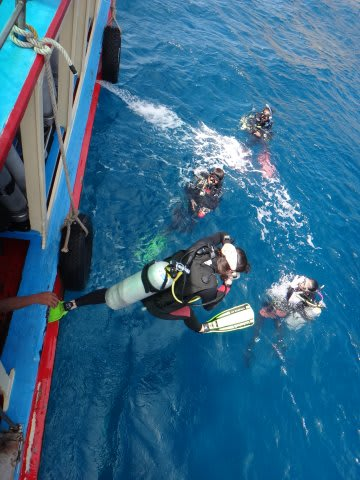

潜りに行く妻を見送ります…

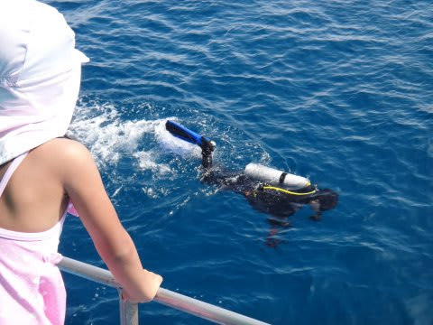

「いってらっしゃーい！」

…どーでもいいけど．

本来，今日は．

クルーズ船に同乗して，外洋の有名ポイント「セイルロック」に

出るはずだったところ．

波が高くクルーズが中止になり，いつもの船で沿岸のポイントに来て

潜ってるわけですが…．

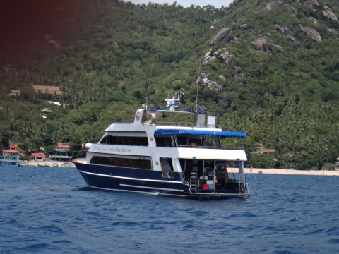

なんだか，本来乗るべきだったクルーズ船が，同じポイントに来ていますね…

やっぱり，波が高い日は潜れるポイントは限られるので，

おんなじところに来るんだな～．

その後，船の上で休んでいると…

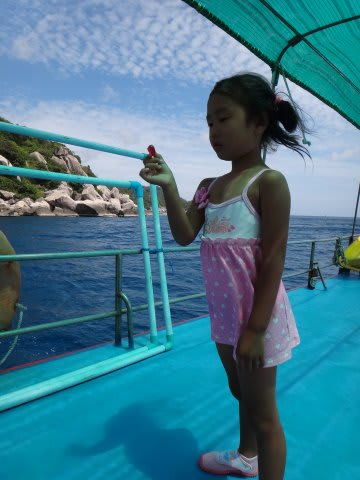

なんと，

キャプテンがランプータンをくれました！

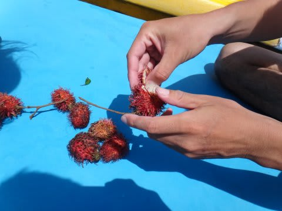

これ，すごくおいしいっ！

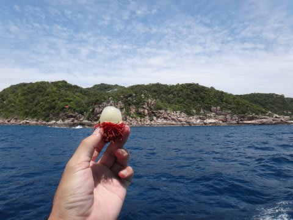

このキャプテン，本当に優しい人で，娘に良くしてくれるのに，

娘はなぜかなつかなかったんですが…

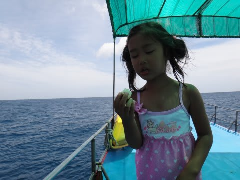

でも，もらったランプータンは，超気に入ったようで．

ひたすらパクパク食べてます．

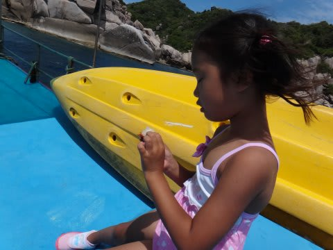

…キャプテン，いい人なのになぁ…

ってことで．

ランプータンを食べつつ，日向ぼっこしていると．

フロートが上がってきて…

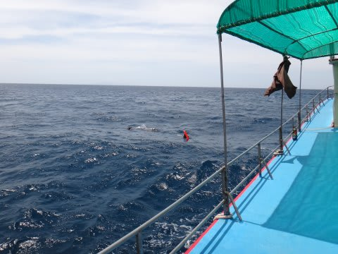

妻が浮上してきました．

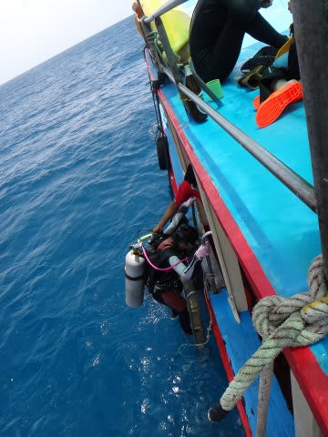

ってことで．

午前の2本のダイビングを終えたので．

船は，ホテル前に戻っていく…のですが．

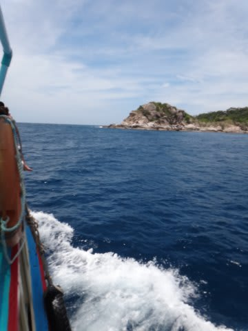

ガイド「今日も，波が高くてホテル前に帰れませ～ん！」

…またか…（泣）．

でも．

荒天に呪われ続けている今回．

いまさら．

なにが起きても驚かない．

…驚かないぞ…(あきらめの感情)
