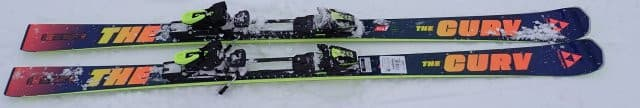
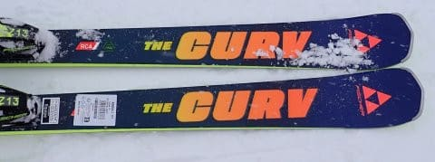
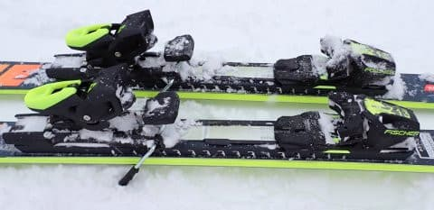
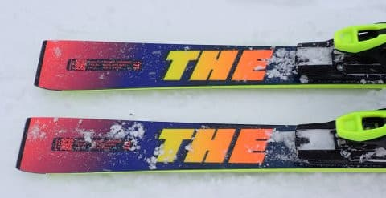
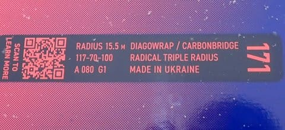

# 2025シーズンモデルのスキー板，試乗レポートその5… FISCHER The CURV

📅 投稿日時: 2024-05-23 00:50:42

えー．

今週末は，そこそこ天気がよさそうで．

土曜の朝はちょっと雲かガスがのこり，

平年よりちょっと気温も低めで肌寒さも

感じるくらいかもしれないけど，

午後は日が射していき．

日曜は晴れそうなので，

まぁ，日曜はいい感じの月山スキー日和

になるんじゃないでしょうか…

とりあえず．

今週末は月山へ行く予定！！

普段，かぐらがこんなに早く終わることは

無いので，5月の月山は初めてですねぇ…

ってなことで，本題へ．

今日も2025シーズンスキー板の試乗レポート．

前回に引き続きフィッシャー編です！！

〇FISCHER The CURV 171cm

オールラウンド板

オールラウンドと言っておきながら，

レースモデルに近い作りになっていて，

センター70mmと幅広ではあるものの，

フレックスやエッジグリップがかなり

しっかりした，どっちらかと言えば

整地向けた板であるこのモデル．

4シーズン前にRC4 SC/RCもウクライナ

製になったにもかかわらず，

こっちのThe CURVはしばらくレース用と

同じオーストリア製だったけど…

昨シーズンから，The CURVもウクライナ製に

なりましたね．

ってなことで．

履いて滑ってみますが…

うーん．GSモデルやSLモデルよりお高い

定価25万する板だけあって，やはり

いい板ですね…

結構張りが強い感じだけど，傾きの量で

ある程度ターン弧が自由に作れて．

傾けなければかなり縦目に落とせるし，

ガッツリ傾いていけば，そこそこ小回りに

近いミドルまでもっていくことができます．

板は軽快というよりしっかり重さが

ある分，安定感は高め．

グリップも結構強めなので，その名の

通りガッツリカービングさせて，

高い安定感を楽しむようにゲレンデを

ハイスピードでクルーズする板．

フレックスもグリップも強い板だから，

ハイスピードで滑るときに体力や気合が

要るかというとそうではなく．

単に板の上に乗って傾くだけで

安定感のあるハイスピードターンが

できる，難しさのない板．

板のトップ目・テール目のどこに

乗っても滑っていける板なので，

板の上で傾くだけでハイスピード

クルーズができます．

振動吸収性も強く，板の安定感もあり，

ハイスピードが全然怖くない板です．

ただ，トップスピードまで出していくと，

171cmだとミドルくらいのターン弧に

なっていく感じかな…

あと，基本的にグリップ力が強いので．

カービングで滑っているうちはいいけど，

ずらそうと思うとちょっと力がいります…

急斜面とか，ずらしで滑っていこうと

思うと，板が重めでグリップが強い分，

体力がない人はちょっと手ごわく

感じるかも．

基本的に脚力・体重がそこそこある人

向けの板ですね．

とはいえ．

カービングに結構特化した感じではあるけど，

整地スペシャル化というとそうではなく．

多少荒れた斜面や新雪が蹴散らされた

バーンでも，適度な安定感があり，

センター70mmということもあり，

多少荒れた程度の斜面ならいけます…

ただ，柔らかすぎるバーンで板がグリップ

しない所ではあんまり楽しくない感じ．

コブとかも突っ込もうと思わないし，

やっぱりカービングスペシャルかな～…

とりあえず，そんなに荒れてない

フラットなロングコースを，どこに

乗ってもちゃんと曲がってくれて，

傾くだけで安定感のあるハイスピード

ロング～ミドルで滑っていけて．

いつもより高いスピードでも怖さを

感じることなく滑っていける．

そんな感じの板でした…
