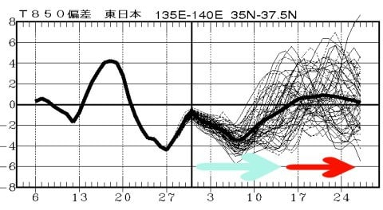
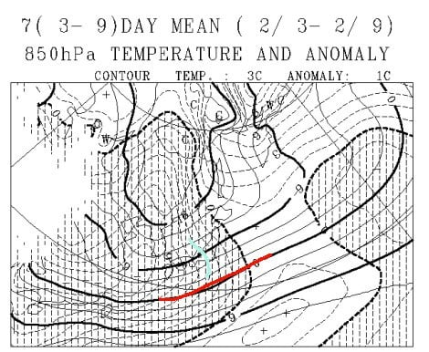
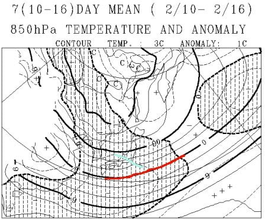
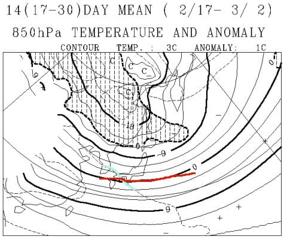

# なんと！もう2月だよ…この2月は冷えるのか？1か月予想図を読み解いてみた

📅 投稿日時: 2018-02-02 06:10:56

🏷️ カテゴリ: [スキー天気予想](c6554f5c3c106093b511a8daae23757e8.md)

えー

今日もちょっとご無体時間に更新です…（泣）

我が家の周りも，なんだか真っ白になっているこの時間．

積雪10cmほどかな…

でも．

やっぱり志賀高原はそんなに降っていないようですね．

首都圏の方が降ってたりして…（泣）．

…でも．

昨日も書いた通り，やはり日曜4日の志賀の

天気は微妙な状態…

北風でかなりの雪になるか，

西風で晴れるか．

低気圧がわずかにずれるとコロッと変わる

微妙な位置なので．

もしかすると4日は雪になる可能性も…

また明日，最終予想しますね～！

ってことで，本題．

なんと．

もう2月ですよ！！

2月っ！！

早いな～．．．．

早くも2018年，一か月が終わり．

私のスキーシーズンも，始まって4か月が

経とうとしてます…

ってことで．

この2月が冷えるのか，あるいは気温が上がるのか．

1か月長期予想を読み解いてみました…

今日は帰宅時間がご無体なので（涙）．

手短に行きますね．

一か月の850hpa気温予想を見ると…

水色矢印で示した，これから2月15日あたりまでは，

平年より冷えそうな予想ですが．

赤矢印で示した2月15日以降は，平年比1℃くらい

上がりそうな予想ですね…

うーむ．

2月後半は，ちょっと気温が高めになりそう…

2月3日から9日までの，850hpa気温平均値は

こんな感じで．

赤く示した0℃線は日本のはるか南．

そして，水色で示した平年比-3度のラインが

志賀高原にかかっているので…

9日までは冷え冷え！！

というか，一週間平均で平年比-3度って，

異常低温レベルです…

9日まではめちゃくちゃ冷えますね

…でも，志賀高原にはそんなに積雪は

なさそうですが…（ちょい涙）．

2月10日から16日の一週間平均を見てみると．

こちらも赤い0℃線はかなり南なので，

雨になるような心配は無いのかな～．

で，平年比-1℃の水色線が志賀に近いので．

2月中旬は，平年よりわずかに低い程度の

気温ですか…

そして，2月17日から3月2日までの2週間の予想は…

まだ，赤い0℃線は日本より南ですが．

ありゃ．

平年より1℃高いラインが，日本にかかってます．

うーむ．

2月後半，平年よりわずかに高めの気温になりそうです…

ただ，致命的なほど高温が続くってわけではないかな．

ってことで．

2月も10日以降は，

12月から正月みたいに，平年よりむちゃくちゃ冷えて

ドサドサ雪が降り続けるって感じではなさそうですが．

まぁ，平年並みで推移してくれるのかな～．

…しかし．

首都圏で雪が降らなくていいから，スキー場で

ドサドサ積もってほしい…（懇願）
