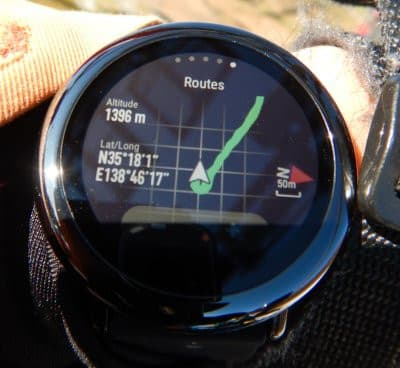

# スマートウォッチ，Amazfit PACEを買ってみた，その5…スキーで使う機能は盛りだくさんで楽しめるよ！！！

📅 投稿日時: 2020-05-16 02:33:17

いつもなら花粉症が終わっているこの時期に，

なぜかまだ花粉が飛んでいる気がする，

Skier_Sです…

えー．

本日の志賀高原，横手山の特派員レポートですが．

朝から気温が+15℃程度と，かなり

高温だったものの．

曇り空で日が射さなかったので，

昼間もそんなに気温が上がらず，

雪はそれほど状態にはならなかった

ようです…

とはいえ，雪は着実に減っていますね（涙）

明日は雨になりそうってのもありますし．

横手山は，あと一週間，来週末まではさすがに

厳しそうな感じかな…

でも，渋峠は来週も大丈夫そうなので．

このまま6月までもってほしいところ…

いや．

7月…8月までもってほしい…！←無理だから

ってなことで，本題へ．

まだまだ続く，Amazfit PACEの使用レポート．

[前回](e3928a10367db811404c9ce7b1d95f3fe.md)は，時計本体のバンド交換と，

設定画面の説明までで終わっちゃったので…

今回は，時計本体の機能を紹介します！

このスマートウォッチ．

ホントに機能が多いんですよ…

まぁ，基本の時計画面と，

設定画面については，前回紹介したので．

今回は運動記録，特にスキーに使った

時の機能についての紹介です！

まず，時計画面を右スワイプすると

現れるのが，このスマートウォッチの

基本と言える，運動記録画面．

この画面では，スキーとテニスモードの

起動ボタンが見えますが…

・Running　（ラン）

・Walking　（徒歩）

・Cycling　（サイクリング）

・Indoor Cycling　（室内サイクリング）

・Treadmill　（トレッドミル…室内ラン）

・Tennis　（テニス）

・Soccer　（サッカー）

・Elliptical Trainer (クロストレーナー)

・Climb（登山）

・Trail run　（トレイルランニング）

・Skiing（スキー）

・Jump rope　（縄跳び）

という，12種類の運動の記録ができます…

Amazfit GTRには，テニスとかサッカーとかの記録モード，

無いんだけどなぁ…

その代り，50m防水のAmazfit GTRにある，

屋外スイミングとプールスイミングの

記録モードは，IP68防水のAmazfit PACEには

無いので，一長一短ですね．

あ，Amazfit PACEの防水モデル，

Amazfit Stratosってのがあるんですが．

こいつには，屋外スイミング＆プールスイミングと

トライアスロンモードがあるようです…

で，SkiモードをONにすると．

まず，GPSを捕まえに行きます…

GPSを捕まえる前からGoボタンを押して

ログ取得スタートできますが，

最初の位置データがずれちゃうので…

GPSで測位完了通知が出てから（大体30秒ほど待つ），

Goボタンを押しましょう．

Goボタンを押すと，スキーモードだと

こんな感じの情報表示画面になります．

一番上の赤帯の中に，現在時間が出ます．

…Amazfit GTRの大きな欠点の一つが，

スキーモードではいちいち画面を

フリックしないと現在時間が見れない

というところですが…

このPACEではスキーモードでも時間が

見れます！素晴らしい！

この画面では，上の列に開始からの時間，

真ん中の列の左から現在速度（リフトに乗ってるので，リフトの速度が時速約7kmと出てますね…），

最高速度，この1本での滑走標高差，

一番下の列に，左から今日の滑走本数，右にこの1本の滑走距離が

表示されてます．

ここから画面をスワイプしていくと，

次の画面で．

この画面は，上から今日の滑走距離，

真ん中が左から現在の標高，心拍数，本日の消費カロリー，

一番下が，滑走平均スピード（下っている間の平均スピード）

が表示されてます．

さらに次の画面にスワイプすると…

過去20分間の，速度のグラフ．

そして，最後の画面が…

なんと．GPS軌跡を見ることができます…

（クイズ：このスキー場はどこでしょう？）

ちなみに，このAmazfit PACE．

普段のモードでは，数秒間操作しないと

時計表示のロック画面

（タッチパネルが効かず，表示書き換え頻度も

1秒1回程度に落ちる，低消費電力状態．

ボタンを押せば解除される）

になっちゃいますが…

スキーモードなどの運動記録時は，

表示されている画面そのままで，

低消費電力状態になります．

ってことで．

普段はこの画面をずっと表示させておけば，

常時，滑っているスピードが何km/hなのかを

見ながら滑ることができます！！

腕に着けたスピードメータを見ながら

滑っている気分で，なかなか面白いですよ，これ！！

Amazfit GTRは，現在速度は見れないし．

そもそも操作していないと画面が消えちゃうので，

GTRではできない芸当ですね…！

…あと，GPS軌跡も，Amazfit GTRでは

滑っている途中には確認できなくて（記録終了後に，

後から呼び出して見ることは可能）

Amazfit PACEならではの機能ですが…

まぁ，別に地図が出るわけではないし，

GPS軌跡って，滑っている間に

見ることはほとんどないですよね…

で．

滑り終わったら，ログとして記録して．

それを後で呼び出して見れるわけですが…

…ちょっと長くなったので，

ログ表示モードはまた次回…

## 💬 コメント一覧

### 💬 コメント by (しんちゃん)
**タイトル**: クイズに挑戦
**投稿日**: 2020-05-16 02:56:52

ゲレンデ当てクイズに挑戦します(^^)/

静岡県の「スノータウン・イエティ」、と思います～(^^♪

当たっていたら、来シーズンのヤケビ限定シーズン券をプレゼントしてくださ～い（なんちゃって～笑）

### 💬 コメント by (Skier_S)
**タイトル**: ＞しんちゃんさま
**投稿日**: 2020-05-17 02:39:03

正解です！！

…って，経度と緯度が出ているので絶対当たりますよね…（笑）．

正解ですので，ヤケビ限定シーズン券を出題者にプレゼントする権利を与えます！（なんのこっちゃ）

