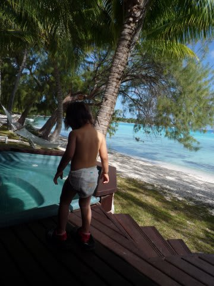

# 2009年　初の海外子連れダイビング旅行記　26　Last night

📅 投稿日時: 2012-09-26 00:22:16

あー

あれですね．

今年の冬は．

…

暖冬のようですね（涙）．

スキーヤーにとっては，うれしくないニュースですが…

スキー場にはいっぱい雪が降ってくれることを祈りましょう．

では，今日も続きを行って見ましょうか…

----

で．

この日はダイビング開始が遅かったので，ダイビング終了時は夕日が傾いてます…

プールで遊んでいた娘＆妻と一緒に部屋に戻り．

乾かさなきゃならない器材を部屋のデッキに広げて，

ジャグジー＆シャワーでくつろぎタイム．

…娘よ…

このジャグジーの贅沢さが分かってるのかい？？

んで．

今晩は，ホテルのレストランでタヒチアンダンスショーをやるらしいので，

今日の夕食は，外のレストランには行かず，ホテルのレストランに行くことにしてみました．

食事はビュッフェスタイルBBQでした.

この写真のほかに，魚やら肉やら，いろいろ目の前で

焼いてくれます．

いろいろ種類があって，贅沢なんですが．

でも，これまでの夕食がレベル高すぎたなぁ…

普通のバーベキューは，所詮バーベキュー．

これまでの高度な料理に比べると，ちょいと物足りない感…

うーーーん．

タヒチ．

海も景色も食事もレベルが高いので，だんだん普通では

満足できなくなっていくという，恐ろしいところだ…

んでも，タヒチアンダンスショーを見つつ，のんびり夕食．

あああ．

贅沢だこと…

娘はダンスが気に入ったのか，一緒に踊って大喜び．

とりあえず，昼のプールから夜のショーまで，

娘もむちゃくちゃ楽しめた一日だったようです…．

って感じで．

ランギロアでのラストナイトも暮れていったのでした． 

