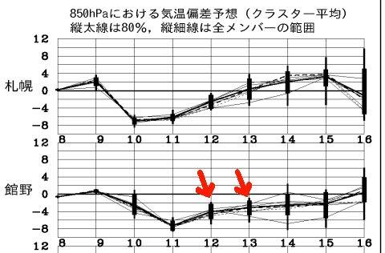
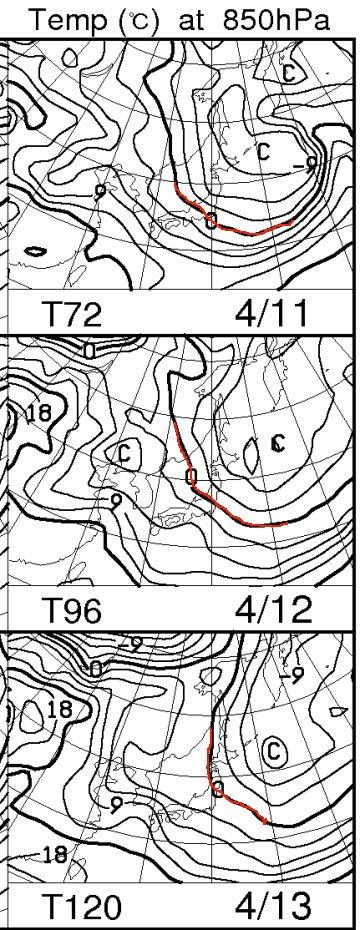
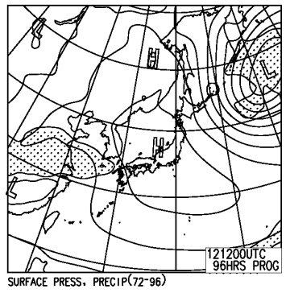
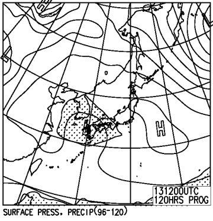

# 恒例！この週末の志賀高原の天気は…晴天なれど，それほど暑くならないなー．

📅 投稿日時: 2014-04-10 01:15:16

えー．

例年より雪が多く．

Yetiも今週末まで営業を延長したらしい，

今日この頃．

皆様いかがお過ごしでしょうか．

…ってことで．

恒例の今週末の天気予想をば…

えー．

ふむふむ．

…

この土日，結構気温は低そうですな～．

こんな感じで…

土曜12日，日曜13日ともに．

平年より4度くらい低い温度ですね～．

前の日の金曜日は，平年比-8度くらい冷え込みそうで．

木曜の雪が

で，恒例の850hpa気温は…

こんな風に．

土日は，志賀高原に0度線がちょうどかかるくらいなので．

この時期としては結構冷えてますね～．

で．さらに．

地上天気図を見ると…

こんな風に．

土日とも，高気圧に覆われていて．

網掛けの降水域は，志賀高原にはかかっていないので．

土日とも，晴れますね～．

で．

Skier_Sの天気予想は．

土日とも冷えて晴れ…ってだけでは情報にならないのだ．

雪質まで，しっかり予想しないといけないのだ．

…これまでの経験則をフル活用して，天気＆ゲレンデコンディションを

予想すると，だ．

土曜：朝からすっきり晴れ！朝のうちはマイナス気温で，

　　結構いい感じの，硬くしまったバーン．

　　気温が低めなので，雪はなかなか緩まず．

　　10時ごろに，日が当たるところが緩み始めるかな～．

　　昼間，表面が緩んだとしても．

　　ところどころ下地に硬い感じが残ってるかな～．

　　…一の瀬の下とかは緩んでも，正面バーン上部は

　　緩んだ雪の下に，硬い感じが残りそう．

　　午後3時ごろから，日が傾き始めるとカリカリに

　　なっていくでしょう．

　　この日は一の瀬無料ナイターがありますが．

　　…かなり硬めのアイスバーンでしょう（涙）．

日曜：朝から晴れ．朝はマイナス気温．

　　この日は，朝からかりかりアイスバーンですね～．

　　標高によるけど，午前はしばらく硬いままで続き．

　　昼前には緩み始めますか．

　　土曜よりちょっと気温が高めになりそうで．

　　昼間はクリーミーな感じの雪になります．

　　夕方は，やっぱりカリカリザラザラバーンになっていくか…

　　

って感じで．

2日とも，ドボドボザブザブな，ストップスノーにはならないで

済みそうかな～．
