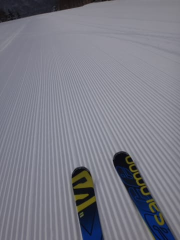

# 2月11日の志賀高原，速報モード…もう，超サイコー．言葉が無い…

📅 投稿日時: 2015-02-12 01:43:43

あー．

今日は朝3時に家を出たというのに．

帰ってくると深夜0時を過ぎているのは，

なぜだろう…

そろそろ，起きてから23時間経ってるような気がするのは，

なぜだろう…

関東圏内の何人かを拾って走ったのが

マズかったか．

家から直接往復すれば700km程度のところ．

日帰りというのに，800km近く走っちゃったのは．

なぜだろう…

＃それも運転手は私一人（涙）

だというのに．

こんな時間にBlogを書いているのは，

なぜだろう…

とりあえず．

死ぬほど眠いので．

速報モードで．

本日は．

朝はちょっと雲が多かったものの，

朝から気持ちよく日が射し…

朝イチは，もうどうしようもないシアワセ最高

ピカピカ圧雪シマシマバーンっ！！

朝イチはちょっと雲が多かったけど，

9時過ぎには快晴になり…

平日の合間の祭日というのもあり．

ありえないほどゲレンデががらがらで．

午後まで，大回り板を履いて気持ちよくかっ飛ばせる，

無人快適フラットバーン！

ゴンドラストップまで，「平日より人が少ないんじゃないか？」

と経営が心配になるガラガラ，最高雪質のゲレンデを

一日中，ひたすら[Gokuさんと自由落下を繰り返し](http://red.ap.teacup.com/gokurakuskier/352.html)…

日が暮れるまで，大回り板を履いたままで

トップスピード滑走を続けられた，

超シアワセラッキーハッピーな一日だったのでした…

いや，シアワセだった…

でも．

ホントに死ぬほど眠いので．

…詳細レポートは，また明日に…

明日仕事に行けるかなぁ…

## 💬 コメント一覧

### 💬 コメント by (Goku)
**タイトル**: しあわせでした
**投稿日**: 2015-02-12 06:03:07

昨日もお世話になりました。

サイコーな一日でしたね♪

### 💬 コメント by (はなげ親分)
**タイトル**: 幸せでしたU+2161
**投稿日**: 2015-02-12 13:46:38

きのうは、第一ゴンドラに16時過ぎまで張りついていました。S様を見つけた後、お会い出きるかと思っていましたが、残念ながらタイミングが合いませんでした。ただ、妻(はなげの女房)が、滑っていたらオレンジの弾丸が横をすっ飛んで行ったと話してありました(笑)

昨日から日曜日まで平日極悪(？)スキーを楽しみます((女房も本日めでたく還暦となりましたので…)

### 💬 コメント by (れお)
**タイトル**: 幸せそう～!!
**投稿日**: 2015-02-12 21:02:55

サイコーな感じですね!!

あ～、やっぱり私も頑張って行けば良かったかも… 泣。

でも、運転800kmって…。やっぱりSさん凄すぎです。

今週末こそは、志賀に行きたいです!!

雪も降りそうですが、風も強そうじゃないですか？

とりあえず、志賀高原の天気予報楽しみにしております～♪

### 💬 コメント by (Skier_S)
**タイトル**: 毎日こんなシアワセならいいのに…
**投稿日**: 2015-02-13 01:17:20

>Gokuさま

お世話になりました～！

また，サル化しちゃいましたね～

こちらのSkilineもいい感じになってます…

http://www.skiline.cc/skiing_day/vjcu78qegi

お昼休みがもったいなかった！

で．

残念ながら，この週末は天気悪そうです（涙）．

>はなげ親分さま

いやー．

探したんですが，見当たりませんでした…

Gokuさんと一緒に，かっとんでました（笑）

しかし，5連休ですか！！？？

う，うらやましすぎる…

私はまた土日に志賀高原へ舞い戻ります．

こんどは，子連れで滑ってます…

あと，奥様に「誕生日おめでとうございます」と

お伝えください！

＞れおさま

いやーー．

ホントに．

800km往復する価値はありましたよっ！！！！！

最高でした…

今週末は，残念ながら，天気悪そうです．

うーん．

でも，日曜朝はパウダーかも？？

