# 2022/5/22(日)かぐらスキー場ファイナルデーの詳細レポート（後編）…営業最終日の雪の状況など

📅 投稿日時: 2022-05-26 01:28:21

🏷️ カテゴリ: [2022スキー滑走日記](cc9cb73e4320f6a97af6fccc37587a61a.md)

ってなことで．

あまりにも写真が多すぎて，

[昨日の記事](ea153fb8c98aa7b9261bc8367d2e64101.md)で書ききれなかった

2022シーズンかぐらファイナルデーの

ゲレンデ状況レポート．

今日は後半戦です！！

…で．

まだ一見雪がたっぷりあるように見える

かぐらメインバーン．

ただ，昼ごろにはコブコブになり…

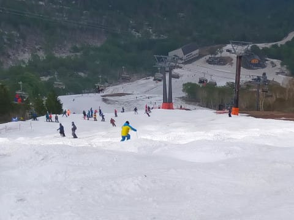

そして．

コブコブになってきたら，コブの溝部分，

結構雪が薄くなってきました（涙）

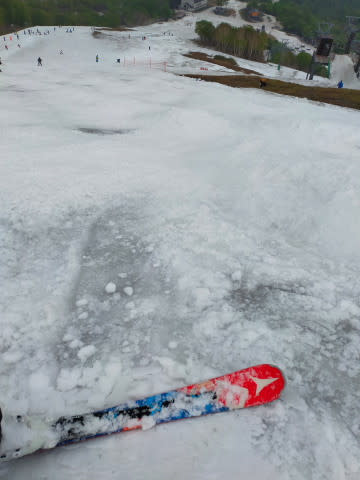

コース中間点，ペアリフト降り場付近が

一番ひどい感じで．

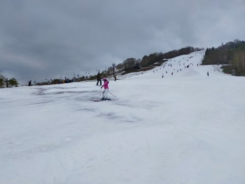

最後の落ち込み部分も，結構

ヤバそうな感じに…

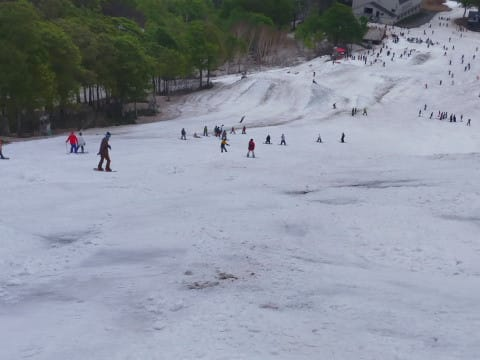

ただ，コースの上の方はまだ雪が

十分残っていて．

この写真の左側に一部雪が薄くなっている

ところがあるものの．

人工降雪がしっかり乗っている右側は

コブ溝にまだ土は出て来てません！

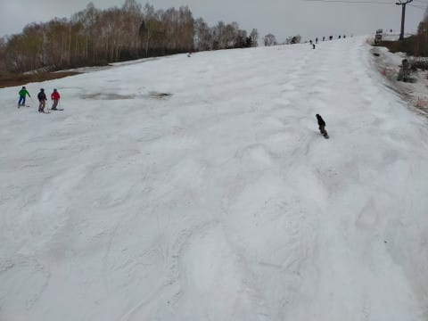

ファイナルデーの営業終了時間でこれなら，

やっぱり雪が多いですね…！！

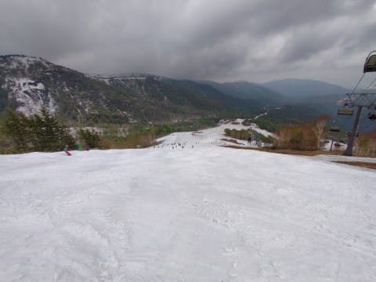

ファイナルデー，営業終了時間の

メインバーン中央はこんな感じで…

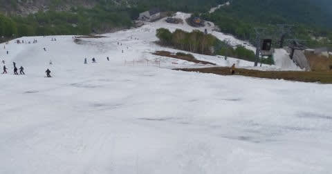

最後の落ち込み部分はこんな感じ．

結構土が出てきた部分も多くなって

きました…

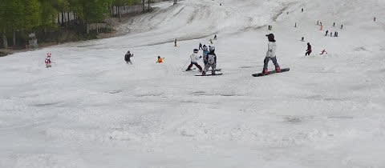

まだ雪は多いものの．

さすがにこれだと，捨て板で来た方が

いい感じですね…

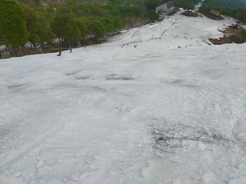

でも，最後までパークも残ったのが

すごい！

ってなことで．

15:30に2022シーズンのかぐらメインバーン，

営業終了！

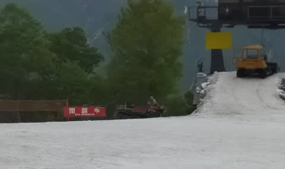

これが，2022シーズン営業終了直後の

メインバーンです…

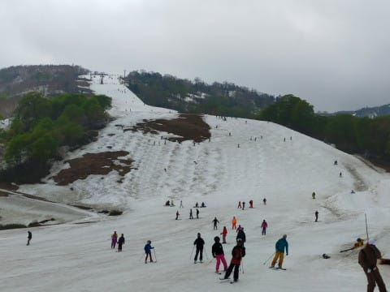

で．

この日はまだゴンドラコースも滑って

降りることができて…

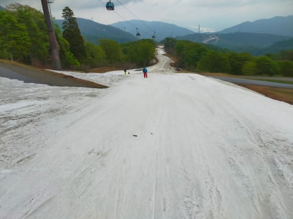

いつもなら切れかけてるゴンドラコース．

今日はまだ切れそうなところは無く．

あとまだ数日は営業できそうな感じ…！

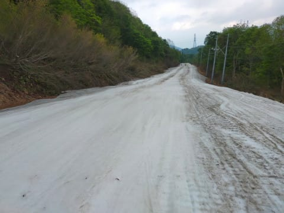

ゴンドラコース一番下まで，雪が

薄くなってるところもなく，ちゃんと

このくらいの幅のコースが続いていて．

これで今日営業終了なのはもったいない…

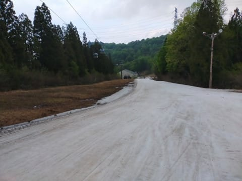

ゴンドラコースを降りきったら，

みつまたペアに乗ってみつまたゲレンデへ

向かいますが．

（指が写っちゃってる…（涙））

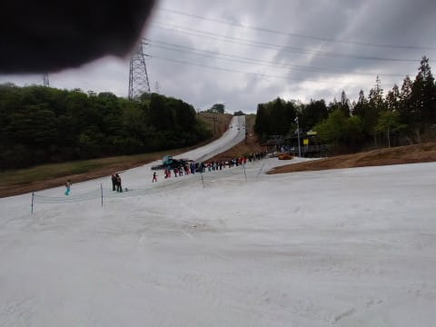

ここから先は滑って行けないので．

スキー板をロープウェー乗り場まで

運んでくれるキャリーサービスに

板を預けて…

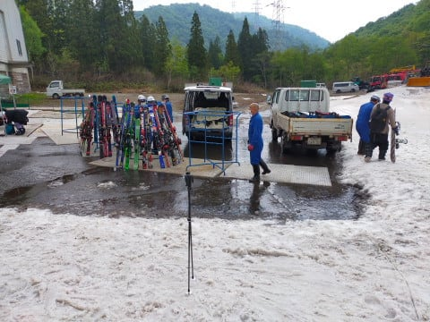

ストックだけもって，ペアリフトに

乗ってみつまたゲレンデへ向かいます．

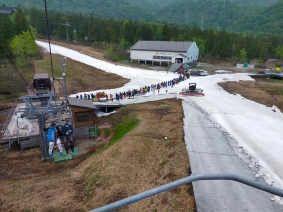

うーん．

しかし．

ゴンドラ連絡コースもまだ雪がついていたし．

これでファイナルとは，勿体ない…

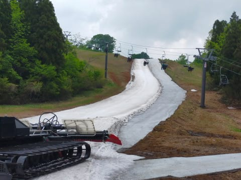

そして．

みつまたペアリフトを降りたら，

歩いて下りリフト乗り場へ向かって…

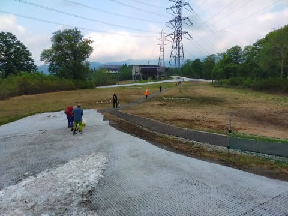

クワッドリフトへ下り乗車！

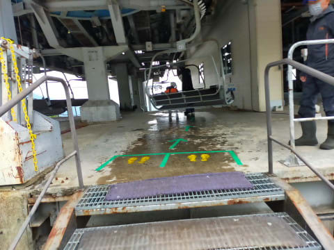

下りのリフトって，なんだか

怖いんですよね…

さすがにこのあたりはもう雪が

全然残ってませんね．

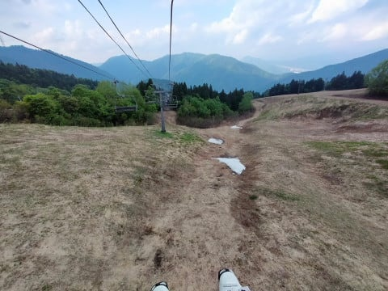

で．

ゴンドラ降り場で預けた板は，

リフトを降りたすぐのこんな

ところで返却されてますが…

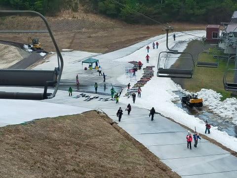

うーん．

板をもってこれだけの坂を登らなきゃ

ならないので，できればロープウェー降り場まで

板を運んでほしかった…

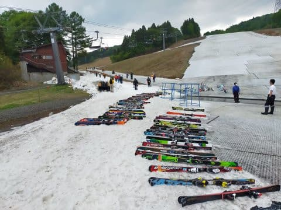

ロープウェー降り場からみつまたクワッド

乗り場まで雪が残っちゃったので，

ロープウェー前まで車が入れなかったのが

敗因か…

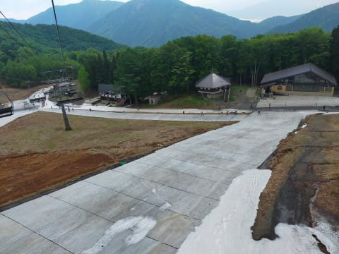

というわけで．

これにてかぐらファイナルが終了！！

いつもなら5月最終週までやってくれる

かぐらスキー場．

今シーズンは，5月最終の1週間前に

終わっちゃいましたが．

フタを開けてみると，5月最終週まで

十分営業できた感じでしたね～…

これで，残すは月山と渋峠．

あぁ…

スキーシーズンが終わっていく…（涙）

なんで一年中スキーができないんです

かね？←一年中スキーができたら経済的に破綻するから，そ

うならないように神様が気を使ってくれたのでは？
