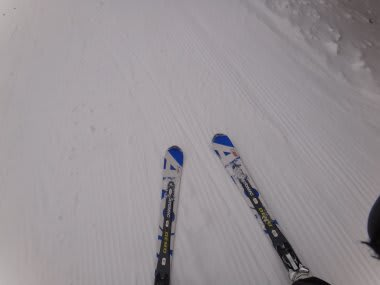
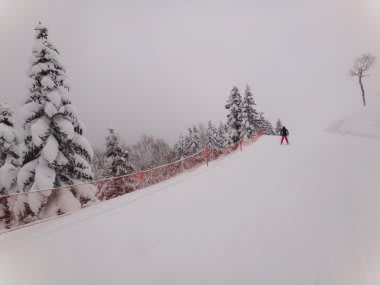
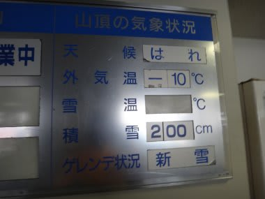
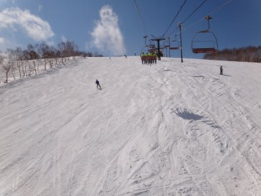
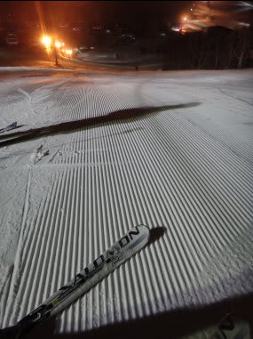
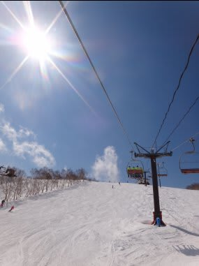

# 4月7日の志賀高原は…最高っ！！

📅 投稿日時: 2012-04-07 21:42:44

🏷️ カテゴリ: [2012スキー滑走日記](cca3a0e9524e0203150f790b1fc3c71ad.md)

あー．

予想通りですね．

本日は冷えました．

雪は最高でした．

4月ではありえないコンディション．

雨が多かった3月より良かった気が…

朝は小雪が舞い散る天気で，気温もマイナス10度と，

桜が咲く時期と思えない寒さ．

ゲレンデは，やわらかい，トップシーズンの雪がしっかり圧雪された，

超最高バーン．

いいの？

この時期に，こんなゲレンデが滑れていいの？？？

前日からの冷え込み＋積雪で，信じられない最高の状況．

これが4月のゲレンデの写真と信じられない…

人もそれほど多くなく，焼額は第2ゴンドラが

ピークで2-3分待ったけど，ゲレンデの人口密度は低め．

昼間も気温が上がらず，午後も山頂はマイナス10度だったようで…．

午後になっても，まったくちっともこれっぽちも

雪はゆるまず，ずっとパウダースノー．

さらに．午後は時折日もさし，もう，この時期にこれ以上何を望むの？

っていう最高のスキー日和でしたね～．

＃ちょっと人口密度は高かったけど

＃あー．あと，むちゃくちゃ寒かったです．

4月にこんなに恵まれてていいんですかね～．

今，結構雪が降ってます．

明日の朝は最高に違いない！！

